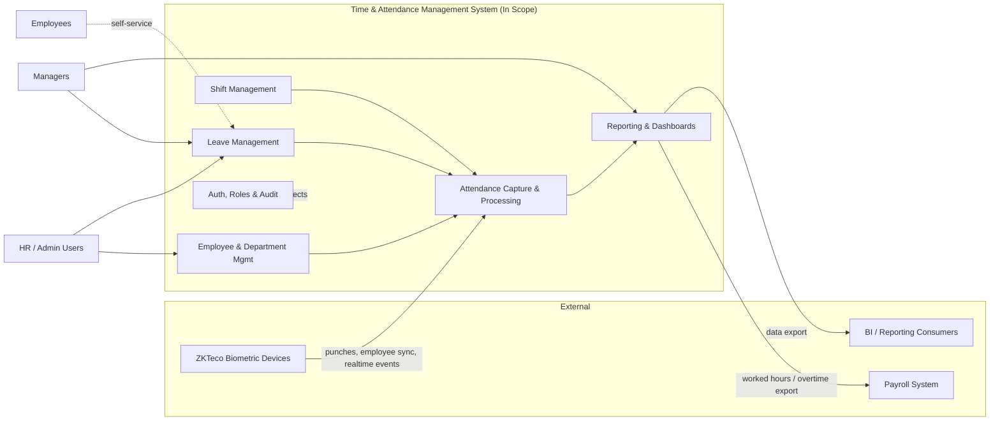
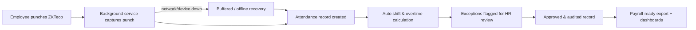
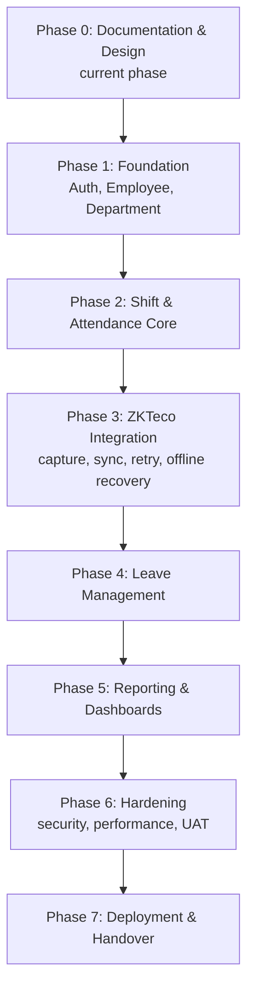

# 01 — Business Requirements Document (BRD)

## Enterprise Time & Attendance Management System

| Field | Value |
|---|---|
| **Document Title** | Business Requirements Document (BRD) |
| **Project** | Enterprise Time & Attendance Management System (TAMS) |
| **Document ID** | TAMS-BRD-001 |
| **Version** | 1.0 (Draft for Approval) |
| **Status** | Awaiting Approval |
| **Author** | Principal Software Architect (AI) |
| **Owner** | Project Sponsor / Business Stakeholders |
| **Date** | 2026-07-09 |
| **Classification** | Internal — Confidential |
| **Related Standards** | IEEE 830-1998 (context), IEEE 29148-2018 (Requirements Engineering), BABOK v3 |
| **Predecessor Doc** | `00_PROJECT_CONTEXT.md` |
| **Successor Doc** | `02_SRS.md` (Software Requirements Specification) |

> **Scope note on standards.** A BRD captures *business* needs (the "why" and "what for"), not detailed software behaviour. Per IEEE 29148-2018, business requirements belong to the **StRS/BRD layer** and feed the SRS. Where this document uses requirement identifiers, testability language and traceability, it deliberately borrows the rigour of IEEE 29148 so the BRD flows cleanly into `02_SRS.md`. Detailed functional specifications are intentionally **deferred to the SRS** to avoid premature design — this is called out explicitly in each relevant section.

---

## Document Control

### Revision History

| Version | Date | Author | Description |
|---|---|---|---|
| 0.1 | 2026-07-09 | AI Architect | Initial skeleton |
| 1.0 | 2026-07-09 | AI Architect | First complete draft submitted for stakeholder approval |

### Approval Sign-off

| Role | Name | Signature | Date |
|---|---|---|---|
| Project Sponsor | _TBD_ | | |
| HR Director (Business Owner) | _TBD_ | | |
| IT / Security Lead | _TBD_ | | |
| Solution Architect | _TBD_ | | |

### Distribution List

| Audience | Purpose |
|---|---|
| Executive Sponsor | Funding & scope authority |
| HR & Payroll Departments | Primary business users |
| IT Operations & Security | Infrastructure, compliance |
| Development Team | Input to SRS & architecture |
| QA Team | Basis for acceptance criteria |

---

## Table of Contents

1. [Executive Summary](#1-executive-summary)
2. [Business Context & Problem Statement](#2-business-context--problem-statement)
3. [Project Vision, Goals & Objectives](#3-project-vision-goals--objectives)
4. [Stakeholder Analysis](#4-stakeholder-analysis)
5. [Scope Definition](#5-scope-definition)
6. [Business Process Overview (As-Is → To-Be)](#6-business-process-overview-as-is--to-be)
7. [Business Requirements](#7-business-requirements)
8. [Business Rules](#8-business-rules)
9. [Non-Functional Business Expectations](#9-non-functional-business-expectations)
10. [Assumptions, Constraints & Dependencies](#10-assumptions-constraints--dependencies)
11. [Risk Analysis](#11-risk-analysis)
12. [Success Criteria & KPIs](#12-success-criteria--kpis)
13. [Cost–Benefit & ROI Rationale](#13-costbenefit--roi-rationale)
14. [High-Level Roadmap](#14-high-level-roadmap)
15. [Requirements Traceability Seed](#15-requirements-traceability-seed)
16. [Glossary](#16-glossary)
17. [Open Questions (To Resolve Before SRS)](#17-open-questions-to-resolve-before-srs)
18. [Documentation Review Checklist](#18-documentation-review-checklist)

---

## 1. Executive Summary

The organisation requires a modern, enterprise-grade **Time & Attendance Management System (TAMS)** to replace manual and fragmented attendance tracking. The system will automate the full attendance lifecycle — from biometric capture at **ZKTeco** devices through to processed, auditable attendance records ready for payroll and workforce analytics.

**Why now.** Manual timesheets and disconnected biometric exports create payroll errors, compliance exposure, and significant administrative overhead. Leadership lacks reliable, real-time visibility of workforce presence. A single, secure, cloud-ready platform will reduce cost, improve accuracy, and provide a governed audit trail.

**What we will build (business framing).** A web-based platform where:

- Biometric punches from ZKTeco devices are captured automatically and reliably (including recovery after device/network outages).
- HR and managers manage employees, departments, shifts, and leave through a clean, responsive web application.
- Attendance is computed against shift rules, producing accurate worked hours, late arrivals, early departures, and overtime.
- Leaders access dashboards and export-ready reports.
- Every action is secured (JWT-based access, role-based permissions) and audited.

**Architectural intent (business-relevant only).** The solution adopts **Clean Architecture** with a decoupled **ASP.NET Core 8** backend and a **React 19** frontend, so the business can evolve rules and migrate to the cloud later **without rewrites**. Deep technical design is deferred to `03_ARCHITECTURE.md`.

This BRD defines *what the business needs and why*. It does **not** define screens, endpoints, or schemas — those follow in the SRS and later documents.

---

## 2. Business Context & Problem Statement

### 2.1 Current Situation (As-Is)

| Area | Current State | Business Pain |
|---|---|---|
| Attendance capture | Biometric devices export to files / handled manually | Data loss, delays, manual re-keying |
| Consolidation | Spreadsheets per department | Inconsistent, error-prone, no single source of truth |
| Shift & overtime calculation | Manual interpretation of rules | Payroll disputes, inconsistent policy application |
| Leave management | Email / paper forms | No real-time balance, poor visibility |
| Reporting | Ad-hoc spreadsheets | Slow, unreliable, not audit-ready |
| Security & audit | Minimal access control, no audit trail | Compliance and data-integrity risk |
| Visibility | No real-time dashboard | Management decisions on stale data |

### 2.2 Problem Statement

> The organisation cannot reliably, securely, and efficiently capture, process, and report employee time and attendance. Manual and fragmented processes cause **payroll inaccuracies, compliance risk, high administrative cost, and poor workforce visibility**, with **no trustworthy audit trail** and **no resilience** when biometric devices or networks fail.

### 2.3 Opportunity

A unified TAMS will: eliminate manual re-keying, enforce attendance/shift/leave policy consistently, deliver real-time visibility, guarantee data capture even during outages (offline recovery), and produce audit-ready, payroll-ready outputs — while remaining **secure by design** and **cloud-migration ready**.

---

## 3. Project Vision, Goals & Objectives

### 3.1 Vision Statement

> *To provide a single, secure, and reliable source of truth for workforce time and attendance that is accurate, auditable, real-time, and ready to scale to the cloud.*

### 3.2 Business Goals → Objectives → Measures

Each goal is stated so it can be measured (IEEE 29148 verifiability principle applied at the business level).

| Goal ID | Business Goal | Objective (SMART) | Success Measure |
|---|---|---|---|
| **G-01** | Accurate attendance | Achieve ≥ 99% attendance-record accuracy vs. source punches | Payroll adjustment volume ↓ ; audit reconciliation pass rate |
| **G-02** | Reduce admin effort | Cut manual attendance administration time by ≥ 70% | Admin hours/month before vs. after |
| **G-03** | Real-time visibility | Provide near-real-time presence dashboards | Dashboard latency; management adoption |
| **G-04** | Reliable device capture | Zero permanent data loss from ZKTeco devices despite outages | Missed-punch incidents; successful offline recoveries |
| **G-05** | Compliance & audit | Full, immutable audit trail of attendance-affecting actions | Audit findings; % actions logged |
| **G-06** | Security | Enforce least-privilege, JWT-secured access | Security review pass; unauthorized-access incidents = 0 |
| **G-07** | Cloud readiness | Architecture supports later cloud migration without rewrite | Migration effort estimate; 12-Factor conformance |
| **G-08** | Payroll enablement | Produce payroll-ready worked-hours/overtime outputs | Payroll cycle time; dispute count |

**Decision — why measurable goals in a BRD?** Un-measurable goals ("improve attendance") cannot be validated at UAT and cannot seed acceptance criteria. Making every goal measurable now means the SRS and `10_TESTING_STRATEGY.md` inherit testable targets directly.

---

## 4. Stakeholder Analysis

### 4.1 Stakeholder Register

| ID | Stakeholder | Interest / Need | Influence | Engagement |
|---|---|---|---|---|
| SH-01 | Executive Sponsor | ROI, cost control, compliance | High | Approve scope & budget |
| SH-02 | HR Director (Business Owner) | Accurate records, policy enforcement | High | Own requirements, approve UAT |
| SH-03 | HR / Attendance Officers | Daily employee, leave, correction handling | Medium | Primary daily users |
| SH-04 | Department Managers | Team presence, approvals, reports | Medium | Approvers & report consumers |
| SH-05 | Employees | Fair, transparent attendance & leave | Low–Med | End beneficiaries; self-service (phase-dependent) |
| SH-06 | Payroll Team | Reliable worked-hours/overtime feed | High | Downstream consumer |
| SH-07 | IT Operations | Deployable, maintainable, monitored system | Medium | Run & support |
| SH-08 | Security / Compliance | OWASP, data protection, audit | High | Gatekeeper |
| SH-09 | System Administrator | Config, roles, device management | Medium | Operate the system |
| SH-10 | Development & QA | Clear, testable requirements | Medium | Build & verify |

### 4.2 User Personas (Business View)

| Persona | Goals | Frustrations Today |
|---|---|---|
| **HR Officer "Nadia"** | Fast corrections, accurate monthly close | Chasing spreadsheets, manual fixes |
| **Manager "Roshan"** | See who's in, approve leave quickly | No live view, email approvals |
| **Admin "Kasun"** | Reliable devices, correct roles | Device exports fail silently |
| **Executive "Priya"** | Trustworthy KPIs | Reports are late and inconsistent |

**Decision — personas in the BRD.** Personas keep later UX (`08_UI_UX.md`) grounded in real business motivations, not invented features.

---

## 5. Scope Definition

### 5.1 In Scope (Business Capabilities)

| Ref | Capability | Notes |
|---|---|---|
| SC-01 | Employee management | Core employee records & lifecycle |
| SC-02 | Department / organisational structure | Grouping, hierarchy |
| SC-03 | Shift management | Shift definitions, assignment, rules |
| SC-04 | Attendance capture & processing | From ZKTeco punches to computed records |
| SC-05 | Leave management | Requests, approvals, balances |
| SC-06 | ZKTeco device integration | Download, sync, realtime, retry, offline recovery |
| SC-07 | Reporting & dashboards | Operational & management reporting, exports |
| SC-08 | Authentication & authorization | JWT, role-based access |
| SC-09 | Audit & logging | Traceability of key actions |
| SC-10 | Administration & configuration | Roles, devices, rules, master data |

### 5.2 Out of Scope (This Programme)

| Ref | Item | Rationale |
|---|---|---|
| OOS-01 | Full **payroll processing** engine | TAMS **feeds** payroll; salary calculation is a separate system |
| OOS-02 | Full **HRIS / recruitment / performance** | Distinct domain; only employee master needed |
| OOS-03 | Mobile native apps | Web is responsive; native deferred to future roadmap |
| OOS-04 | Facial/GPS/mobile-punch capture | Only **ZKTeco** biometric integration is in scope now |
| OOS-05 | Third-party BI platform build-out | Exports provided; BI tooling is downstream |
| OOS-06 | Multi-currency / multi-country payroll rules | Not required for initial regions |

**Decision — explicit exclusions.** Naming exclusions prevents scope creep and payroll-vs-attendance confusion. TAMS is deliberately an **attendance system that enables payroll**, not a payroll system (see OOS-01).

### 5.3 Scope Context Diagram

---

## 6. Business Process Overview (As-Is → To-Be)

### 6.1 As-Is (Attendance Cycle)

*Pain: manual steps B–E introduce delay, error, and no audit trail.*

### 6.2 To-Be (Attendance Cycle with TAMS)

**Decision — show offline recovery in the To-Be flow.** Resilience (G-04) is a headline business requirement due to real device/network outages; making it visible in the process model ensures it is treated as a first-class requirement, not an afterthought.

---

## 7. Business Requirements

> **Convention.** IDs are `BR-nnn`. Priority uses **MoSCoW** (M=Must, S=Should, C=Could, W=Won't-now). Each requirement is written to be *verifiable* (IEEE 29148). Detailed acceptance criteria and field-level behaviour are **deferred to `02_SRS.md`**; the "SRS Seed" column names the future functional area.

### 7.1 Employee & Organisation

| ID | Business Requirement | Priority | Source | SRS Seed |
|---|---|---|---|---|
| BR-001 | The business must maintain accurate, centralised employee records as the single source of truth. | M | SH-02, SH-03 | Employee Module |
| BR-002 | The business must organise employees into departments/organisational units. | M | SH-04 | Department Module |
| BR-003 | The business must track employee status changes (e.g., active/inactive) over time. | S | SH-02 | Employee lifecycle |
| BR-004 | Employee identities must be linkable to biometric device enrolment. | M | SH-09 | Device/Employee sync |

### 7.2 Shift Management

| ID | Business Requirement | Priority | Source | SRS Seed |
|---|---|---|---|---|
| BR-010 | The business must define shifts (working windows, breaks, tolerances). | M | SH-02 | Shift Module |
| BR-011 | The business must assign shifts to employees/departments. | M | SH-03 | Shift assignment |
| BR-012 | The business must support overtime and late/early rules driven by shift definitions. | M | SH-06 | Attendance calc rules |
| BR-013 | The business should support multiple shift patterns (e.g., rotating). | S | SH-04 | Shift patterns |

### 7.3 Attendance Capture & Processing

| ID | Business Requirement | Priority | Source | SRS Seed |
|---|---|---|---|---|
| BR-020 | The system must automatically capture punches from ZKTeco devices. | M | SH-09, G-04 | ZKTeco Integration |
| BR-021 | The system must compute worked hours, late arrival, early departure and overtime against shift rules. | M | SH-06, G-08 | Attendance Module |
| BR-022 | The system must flag attendance exceptions for review (missing punch, anomalies). | M | SH-03 | Attendance exceptions |
| BR-023 | Authorised users must be able to correct attendance with full audit trail. | M | SH-03, G-05 | Attendance correction + Audit |
| BR-024 | The system must not permanently lose punches during device/network outages (offline recovery). | M | G-04 | ZKTeco resilience |
| BR-025 | The system should support near-real-time attendance events. | S | SH-04, G-03 | Realtime events |

### 7.4 Leave Management

| ID | Business Requirement | Priority | Source | SRS Seed |
|---|---|---|---|---|
| BR-030 | The business must record and track leave requests and approvals. | M | SH-02, SH-04 | Leave Module |
| BR-031 | The business must maintain leave balances by leave type. | M | SH-02 | Leave balances |
| BR-032 | Leave must correctly influence attendance/worked-day calculations. | M | SH-06 | Leave↔Attendance |
| BR-033 | Employees should be able to self-service leave requests. | S | SH-05 | Self-service (phased) |

### 7.5 Reporting & Visibility

| ID | Business Requirement | Priority | Source | SRS Seed |
|---|---|---|---|---|
| BR-040 | Management must have real-time/near-real-time attendance dashboards. | M | SH-04, G-03 | Dashboards |
| BR-041 | The business must produce payroll-ready worked-hours/overtime output. | M | SH-06, G-08 | Payroll export |
| BR-042 | The business must export operational and management reports (e.g., CSV/Excel/PDF). | M | SH-02 | Reporting |
| BR-043 | Reports must be filterable by department, employee, date range, shift. | S | SH-04 | Report filters |

### 7.6 Security, Access & Audit

| ID | Business Requirement | Priority | Source | SRS Seed |
|---|---|---|---|---|
| BR-050 | Access must be authenticated (JWT) and role-based (least privilege). | M | SH-08, G-06 | AuthN/AuthZ |
| BR-051 | All attendance-affecting actions must be audited (who/what/when). | M | SH-08, G-05 | Audit log |
| BR-052 | The system must comply with OWASP Top 10 and secure-by-design practices. | M | SH-08 | Security (Doc 06) |
| BR-053 | Personal data must be protected and access-controlled. | M | SH-08 | Data protection |

### 7.7 Administration & Configuration

| ID | Business Requirement | Priority | Source | SRS Seed |
|---|---|---|---|---|
| BR-060 | Admins must manage users, roles and permissions. | M | SH-09 | Admin/RBAC |
| BR-061 | Admins must register and manage ZKTeco devices. | M | SH-09 | Device management |
| BR-062 | Admins must configure business rules (shifts, tolerances, leave types). | M | SH-02 | Configuration |
| BR-063 | The system must log operational events for diagnostics (Serilog). | M | SH-07 | Observability |

**Decision — MoSCoW over numeric priority.** MoSCoW communicates *release intent* to business stakeholders more clearly than 1–5 scales and maps directly to the phased roadmap in §14.

---

## 8. Business Rules

Business rules are policy statements independent of implementation; they constrain requirements and will be enforced in the SRS/domain model.

| ID | Business Rule |
|---|---|
| BRULE-01 | An employee must belong to exactly one primary department at any point in time. |
| BRULE-02 | Worked hours are always computed relative to the employee's assigned shift for that date. |
| BRULE-03 | A punch outside a defined shift window is handled per shift tolerance/overtime rules, never silently discarded. |
| BRULE-04 | Overtime is only valid when it conforms to configured overtime policy. |
| BRULE-05 | Any manual correction to attendance must be attributed to a user and time-stamped (audit). |
| BRULE-06 | Approved leave overrides an absence for the covered period in attendance calculations. |
| BRULE-07 | Leave cannot be approved beyond the available balance unless an explicit override policy allows it. |
| BRULE-08 | A user may only access data permitted by their role (least privilege). |
| BRULE-09 | Biometric punches must be uniquely attributable to a single employee enrolment. |
| BRULE-10 | No attendance-affecting action bypasses the audit trail. |

**Decision — separate business rules from requirements.** Rules change less often than features and are reused across modules; isolating them (DDD-aligned) prevents duplication and keeps the SRS/domain model consistent.

---

## 9. Non-Functional Business Expectations

> Detailed, quantified NFRs (targets, test methods) are specified in `02_SRS.md` and `06_SECURITY.md`. Here we record **business-level expectations** that justify them.

| ID | Quality Attribute | Business Expectation | Downstream Doc |
|---|---|---|---|
| NFR-B-01 | Performance | Screens and reports respond promptly under normal load | SRS |
| NFR-B-02 | Scalability | Support organisational growth (more employees/devices) without redesign | Architecture |
| NFR-B-03 | Availability | Attendance capture is resilient to device/network outages | Architecture / ZKTeco |
| NFR-B-04 | Security | OWASP Top 10, JWT, least privilege, data protection | Security |
| NFR-B-05 | Auditability | Complete, tamper-evident audit of key actions | Security / DB |
| NFR-B-06 | Maintainability | Clean Architecture enabling low-cost change | Architecture / Standards |
| NFR-B-07 | Usability | Clean, responsive, role-appropriate UX | UI/UX |
| NFR-B-08 | Portability / Cloud readiness | 12-Factor alignment for later cloud migration | Architecture / Deployment |
| NFR-B-09 | Observability | Centralised logging/diagnostics (Serilog) | Deployment / Maintenance |
| NFR-B-10 | Testability | Requirements are verifiable; system is test-friendly | Testing Strategy |

---

## 10. Assumptions, Constraints & Dependencies

### 10.1 Assumptions

| ID | Assumption |
|---|---|
| AS-01 | ZKTeco devices are available on the network and support programmatic access (SDK/protocol). |
| AS-02 | Master employee data can be sourced/entered and kept reasonably accurate. |
| AS-03 | Payroll system will consume TAMS exports (no bidirectional payroll processing required). |
| AS-04 | Stakeholders will be available to approve documents and participate in UAT. |
| AS-05 | Initial deployment target is on-premises / single-region, with cloud migration later. |

### 10.2 Constraints

| ID | Constraint | Type |
|---|---|---|
| CON-01 | Technology stack fixed: ASP.NET Core 8, React 19/TS, SQL Server, JWT, Clean Architecture. | Technical (mandated) |
| CON-02 | Biometric integration limited to **ZKTeco**. | Technical |
| CON-03 | Must follow SOLID, OWASP Top 10, 12-Factor, Microsoft coding guidelines. | Process/Quality |
| CON-04 | Documentation-first delivery; no code before approved docs. | Process |
| CON-05 | Must remain cloud-migration ready (no cloud-proprietary lock-in at core). | Architectural |

### 10.3 Dependencies

| ID | Dependency | Impact if unmet |
|---|---|---|
| DEP-01 | ZKTeco SDK/API access & documentation | Blocks device integration (SC-06) |
| DEP-02 | SQL Server environment | Blocks persistence |
| DEP-03 | Network/firewall access between app and devices | Blocks capture/realtime |
| DEP-04 | Stakeholder sign-off cadence | Blocks documentation sequence |

**Decision — record the fixed stack as a constraint (CON-01), not a requirement.** The stack is *mandated* by `00_PROJECT_CONTEXT.md`; classifying it as a constraint keeps the requirements technology-neutral and traceable, which is correct BRD practice.

---

## 11. Risk Analysis

Scoring: Likelihood (L) × Impact (I), each 1–5; Exposure = L×I.

| ID | Risk | L | I | Exposure | Mitigation |
|---|---|---|---|---|---|
| RK-01 | ZKTeco connectivity/SDK issues cause data gaps | 4 | 5 | 20 | Offline recovery, retry, buffering (BR-024); early integration spike |
| RK-02 | Device/network outage loses punches | 3 | 5 | 15 | Resilient background service, buffering, reconciliation |
| RK-03 | Attendance/OT rules misinterpreted | 3 | 4 | 12 | Business rules (§8) validated in SRS & UAT |
| RK-04 | Security breach / data exposure | 2 | 5 | 10 | OWASP, JWT, RBAC, audit, security review (Doc 06) |
| RK-05 | Scope creep toward full payroll/HRIS | 3 | 3 | 9 | Explicit exclusions (§5.2), change control |
| RK-06 | Payroll integration mismatch | 3 | 4 | 12 | Define export contract early with Payroll (SH-06) |
| RK-07 | Poor data quality in employee master | 3 | 3 | 9 | Validation, sync rules, data-cleanup step |
| RK-08 | Stakeholder unavailability delays approvals | 3 | 3 | 9 | Agreed review cadence, this checklist |
| RK-09 | Cloud-migration assumptions violated | 2 | 3 | 6 | 12-Factor, no cloud lock-in (CON-05) |

**Decision — quantify exposure.** Ranking by L×I focuses mitigation on the ZKTeco resilience risks (RK-01/02), which is exactly where the architecture must invest first.

---

## 12. Success Criteria & KPIs

| KPI ID | Metric | Baseline (As-Is) | Target (To-Be) | Linked Goal |
|---|---|---|---|---|
| KPI-01 | Attendance-record accuracy | ~unknown/low | ≥ 99% | G-01 |
| KPI-02 | Manual admin time / month | High | ↓ ≥ 70% | G-02 |
| KPI-03 | Payroll adjustments / cycle | High | ↓ significantly | G-01, G-08 |
| KPI-04 | Permanent punch data loss | Occurs | 0 | G-04 |
| KPI-05 | % attendance actions audited | Low | 100% | G-05 |
| KPI-06 | Unauthorized-access incidents | Unknown | 0 | G-06 |
| KPI-07 | Report generation time | Slow | Near-instant/on-demand | G-03 |
| KPI-08 | Management dashboard adoption | None | Broad adoption | G-03 |

**Project acceptance is achieved when** all **Must** requirements are delivered, verified against the SRS, and KPIs KPI-01, KPI-04, KPI-05, KPI-06 meet target in UAT.

---

## 13. Cost–Benefit & ROI Rationale

| Benefit Category | Description | Value Type |
|---|---|---|
| Labour savings | Eliminate manual re-keying and reconciliation | Quantifiable (KPI-02) |
| Payroll accuracy | Fewer disputes/adjustments | Quantifiable (KPI-03) |
| Compliance | Audit-ready trail reduces regulatory/dispute risk | Risk reduction |
| Visibility | Real-time decisions | Strategic |
| Resilience | No lost punches → trustworthy data | Risk reduction |
| Future-proofing | Cloud-ready, maintainable → lower TCO | Strategic |

| Cost Category | Description |
|---|---|
| Build | Design, development, testing (this programme) |
| Integration | ZKTeco device integration effort |
| Infrastructure | SQL Server / servers (on-prem now, cloud later) |
| Change management | Training, rollout, data cleanup |
| Run/Maintain | Ongoing support & monitoring |

**Rationale.** The dominant recurring cost today is *manual labour and payroll error correction*. Automating capture→processing→export directly attacks that cost while removing compliance risk — the ROI case rests primarily on KPI-02, KPI-03, and KPI-04. Precise financial figures are a sponsor input (see Open Questions §17).

---

## 14. High-Level Roadmap

> Indicative business-phase sequencing (detailed plan in `09_DEVELOPMENT_PLAN.md`). Ordering follows dependency: foundation → capture → value → resilience/insight.

| Phase | Business Outcome | Key BRs |
|---|---|---|
| P1 | Secure system with core master data | BR-001/002/050/060 |
| P2 | Shifts defined; attendance computable | BR-010–013, BR-021 |
| P3 | Automated, resilient capture from devices | BR-020/024/025, BR-061 |
| P4 | Leave integrated with attendance | BR-030–033 |
| P5 | Visibility & payroll-ready output | BR-040–043, BR-041 |
| P6 | Secure, performant, business-accepted | NFRs, BR-051/052 |
| P7 | Live & supported | Deployment/Maintenance docs |

**Decision — deliver ZKTeco (P3) after core attendance (P2).** Building the attendance calculation core before wiring devices lets us validate rules with controlled data, de-risking the highest-exposure item (RK-01) against a known-good baseline.

---

## 15. Requirements Traceability Seed

This seeds the **Requirements Traceability Matrix (RTM)** that `02_SRS.md` will expand (business → functional → design → test).

| Business Goal | Business Requirements | Forward Trace (future docs) |
|---|---|---|
| G-01 Accuracy | BR-021, BR-022, BR-023 | SRS functional reqs → Test cases |
| G-02 Admin reduction | BR-020, BR-040, BR-042 | SRS → UAT |
| G-03 Visibility | BR-025, BR-040 | SRS dashboards → UI/UX |
| G-04 Reliable capture | BR-020, BR-024 | Architecture (resilience) → Tests |
| G-05 Audit | BR-023, BR-051 | DB design (audit) → Security |
| G-06 Security | BR-050, BR-052, BR-053 | Security doc → Tests |
| G-07 Cloud readiness | (NFR-B-08) | Architecture / Deployment |
| G-08 Payroll enablement | BR-021, BR-041 | SRS export contract → Tests |

**Decision — start traceability at the BRD.** Establishing forward links now guarantees no business goal is orphaned later and gives QA an unbroken chain to test against (IEEE 29148 bidirectional traceability).

---

## 16. Glossary

| Term | Definition |
|---|---|
| **TAMS** | Time & Attendance Management System (this project). |
| **BRD** | Business Requirements Document. |
| **SRS** | Software Requirements Specification (`02_SRS.md`). |
| **ZKTeco** | Biometric attendance device vendor to be integrated. |
| **Punch** | A single biometric check-in/out event. |
| **Shift** | Defined working window with rules (breaks, tolerances, OT). |
| **Overtime (OT)** | Work beyond shift-defined normal hours, per policy. |
| **Offline Recovery** | Reliable capture/reconciliation of punches after device/network outage. |
| **RBAC** | Role-Based Access Control. |
| **JWT** | JSON Web Token used for authenticated, stateless access. |
| **Clean Architecture** | Layered, dependency-inverted architecture isolating domain from infrastructure. |
| **MoSCoW** | Prioritisation: Must / Should / Could / Won't-now. |
| **RTM** | Requirements Traceability Matrix. |
| **NFR** | Non-Functional Requirement. |
| **KPI** | Key Performance Indicator. |
| **UAT** | User Acceptance Testing. |

---

## 17. Open Questions (To Resolve Before SRS)

These do **not** block BRD approval but must be answered to write a complete SRS.

| ID | Question | Owner | Needed for |
|---|---|---|---|
| OQ-01 | Exact ZKTeco model(s), SDK/protocol, firmware? | SH-09 | ZKTeco integration design |
| OQ-02 | Precise overtime, tolerance and rounding policies? | SH-02/SH-06 | Attendance calc rules |
| OQ-03 | Leave types, accrual and carry-over policy? | SH-02 | Leave module |
| OQ-04 | Payroll export format/contract? | SH-06 | Payroll export (BR-041) |
| OQ-05 | Data-protection/regulatory regime & retention periods? | SH-08 | Security/audit |
| OQ-06 | Number of employees, devices, sites (sizing)? | SH-01/SH-07 | Scalability targets |
| OQ-07 | Is employee self-service (BR-033) in initial release? | SH-02 | Scope of Phase 4 |
| OQ-08 | Target UAT KPIs' exact numeric thresholds & baselines? | SH-01/SH-02 | Success criteria |

---

## 18. Documentation Review Checklist

**Reviewer instructions:** mark each item ✅ Pass / ⚠️ Needs change / ❌ Fail. BRD is approved when all **Mandatory** items pass.

### 18.1 Completeness

| # | Check | Mandatory | Status |
|---|---|---|---|
| C-01 | Executive summary present and clear | ✔ | ☐ |
| C-02 | Problem statement clearly defined | ✔ | ☐ |
| C-03 | Vision, goals & measurable objectives included | ✔ | ☐ |
| C-04 | Stakeholders identified with roles | ✔ | ☐ |
| C-05 | Scope in/out explicitly defined | ✔ | ☐ |
| C-06 | As-Is / To-Be processes shown | ✔ | ☐ |
| C-07 | Business requirements listed with IDs & priority | ✔ | ☐ |
| C-08 | Business rules captured | ✔ | ☐ |
| C-09 | NFR business expectations captured | ✔ | ☐ |
| C-10 | Assumptions, constraints, dependencies listed | ✔ | ☐ |
| C-11 | Risks analysed with mitigation | ✔ | ☐ |
| C-12 | Success criteria / KPIs defined | ✔ | ☐ |
| C-13 | Roadmap provided | ✔ | ☐ |
| C-14 | Traceability seed established | ✔ | ☐ |
| C-15 | Glossary provided | ✔ | ☐ |
| C-16 | Open questions captured | ✔ | ☐ |

### 18.2 Quality (IEEE 29148 attributes)

| # | Check | Mandatory | Status |
|---|---|---|---|
| Q-01 | Requirements are **verifiable** (testable) | ✔ | ☐ |
| Q-02 | Requirements are **unambiguous** | ✔ | ☐ |
| Q-03 | Requirements are **consistent** (no conflicts) | ✔ | ☐ |
| Q-04 | Requirements are **traceable** (IDs, sources) | ✔ | ☐ |
| Q-05 | No premature design/implementation detail | ✔ | ☐ |
| Q-06 | Priorities assigned (MoSCoW) | ✔ | ☐ |
| Q-07 | Language is business-oriented, not technical jargon | ✔ | ☐ |

### 18.3 Alignment

| # | Check | Mandatory | Status |
|---|---|---|---|
| A-01 | Consistent with `00_PROJECT_CONTEXT.md` (stack, principles) | ✔ | ☐ |
| A-02 | ZKTeco resilience requirements reflected | ✔ | ☐ |
| A-03 | Security & audit expectations reflected | ✔ | ☐ |
| A-04 | Cloud-readiness expectation reflected | ✔ | ☐ |
| A-05 | Payroll boundary (feed, not process) correct | ✔ | ☐ |

### 18.4 Governance

| # | Check | Mandatory | Status |
|---|---|---|---|
| G-01 | Document control & versioning present | ✔ | ☐ |
| G-02 | Approval sign-off section present | ✔ | ☐ |
| G-03 | Ready to proceed to `02_SRS.md` upon approval | ✔ | ☐ |

---

### ✅ Approval Gate

> **This BRD (v1.0) is submitted for your approval.**
> Per the agreed process, I will **not** begin `02_SRS.md` (or any other document) until you approve this BRD or request changes.

**Please respond with one of:**
1. **Approved** → I proceed to `02_SRS.md`.
2. **Approved with changes** → list changes; I revise then proceed.
3. **Changes required** → list changes; I revise and resubmit the BRD only.

*End of Document — TAMS-BRD-001 v1.0*
