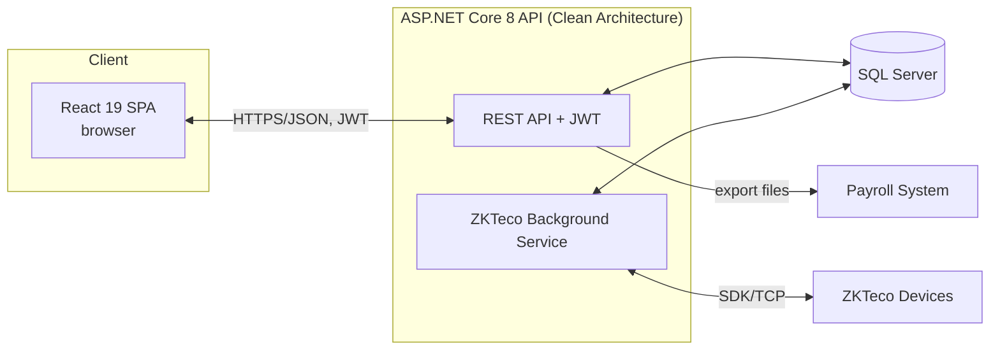
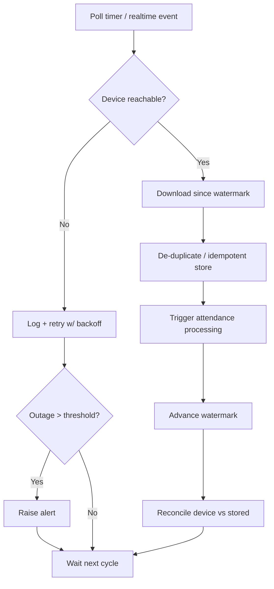
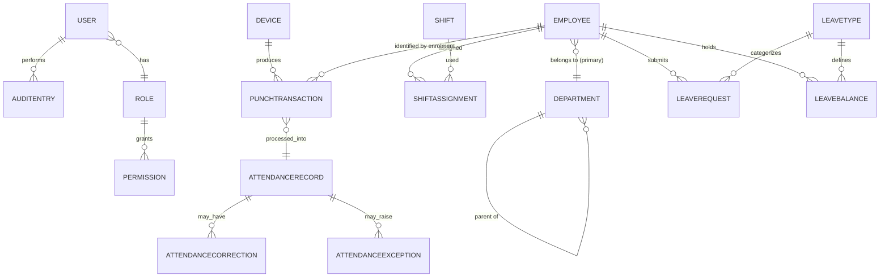
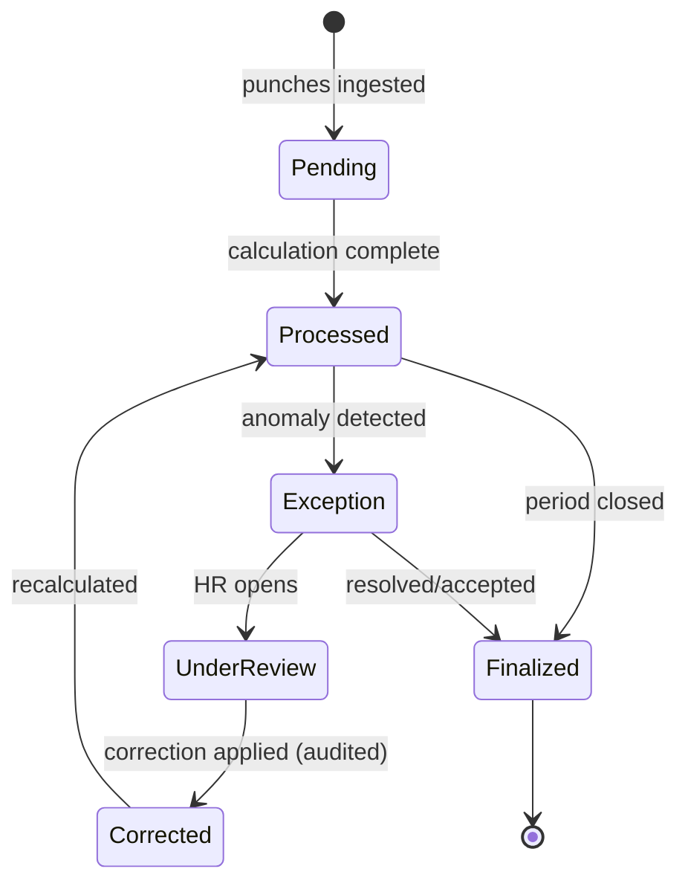
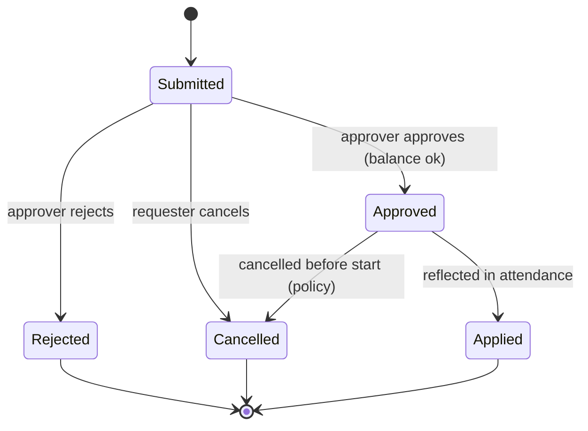
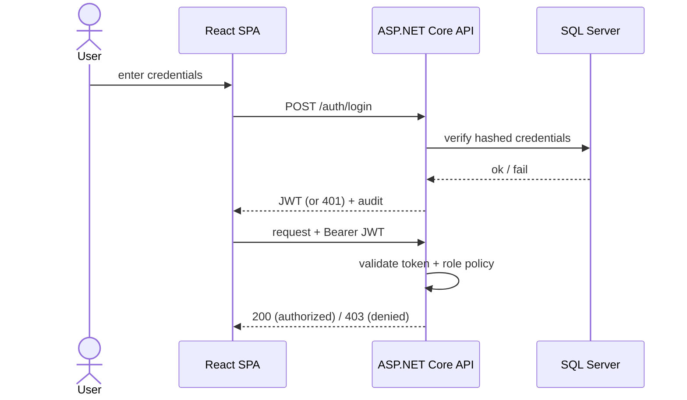

# 02 — Software Requirements Specification (SRS)

## Enterprise Time & Attendance Management System

| Field | Value |
|---|---|
| **Document Title** | Software Requirements Specification (SRS) |
| **Project** | Enterprise Time & Attendance Management System (TAMS) |
| **Document ID** | TAMS-SRS-002 |
| **Version** | 1.0 (Draft for Approval) |
| **Status** | Awaiting Approval |
| **Author** | Principal Software Architect (AI) |
| **Owner** | Solution Architect / Development Lead |
| **Date** | 2026-07-09 |
| **Classification** | Internal — Confidential |
| **Standard** | **IEEE 830-1998** (SRS structure) + **IEEE/ISO/IEC 29148-2018** (quality attributes & traceability) |
| **Predecessor Doc** | `01_BRD.md` (approved v1.0) |
| **Successor Doc** | `03_ARCHITECTURE.md` |

> **Standards note.** This document follows the **IEEE 830-1998** clause structure (Introduction / Overall Description / Specific Requirements / Appendices) and applies **IEEE 29148-2018** requirement-quality rules: every requirement is **uniquely identified, verifiable, unambiguous, consistent, and traceable** back to a BRD business requirement (`BR-nnn`) and forward to design/tests.
>
> **Boundary with other docs.** The SRS defines *what the software must do and how well* — it does **not** specify database schemas (→ `04_DATABASE_DESIGN.md`), endpoint contracts (→ `05_API_SPECIFICATION.md`), layer internals (→ `03_ARCHITECTURE.md`), or screens (→ `08_UI_UX.md`). Where those overlap, this SRS states the *requirement* and defers the *specification* with an explicit forward reference.

---

## Document Control

### Revision History

| Version | Date | Author | Description |
|---|---|---|---|
| 1.0 | 2026-07-09 | AI Architect | First complete SRS derived from approved BRD v1.0 |

### Approval Sign-off

| Role | Name | Signature | Date |
|---|---|---|---|
| Business Owner (HR Director) | _TBD_ | | |
| Solution Architect | _TBD_ | | |
| Development Lead | _TBD_ | | |
| QA Lead | _TBD_ | | |
| Security Lead | _TBD_ | | |

---

## Table of Contents

**1. Introduction**
&nbsp;&nbsp;1.1 Purpose · 1.2 Scope · 1.3 Definitions & Acronyms · 1.4 References · 1.5 Overview

**2. Overall Description**
&nbsp;&nbsp;2.1 Product Perspective · 2.2 Product Functions · 2.3 User Classes & Characteristics · 2.4 Operating Environment · 2.5 Design & Implementation Constraints · 2.6 Assumptions & Dependencies · 2.7 Apportioning of Requirements (phasing)

**3. External Interface Requirements**
&nbsp;&nbsp;3.1 User Interfaces · 3.2 Hardware Interfaces (ZKTeco) · 3.3 Software Interfaces · 3.4 Communication Interfaces

**4. System Features (Functional Requirements)**
&nbsp;&nbsp;4.1 Authentication & Authorization · 4.2 Employee Management · 4.3 Department Management · 4.4 Shift Management · 4.5 Attendance Capture & Processing · 4.6 ZKTeco Device Integration · 4.7 Leave Management · 4.8 Reporting & Dashboards · 4.9 Administration & Configuration · 4.10 Audit & Logging

**5. Data Requirements** (logical, entity-level)

**6. Nonfunctional Requirements**
&nbsp;&nbsp;6.1 Performance · 6.2 Scalability · 6.3 Reliability & Availability · 6.4 Security · 6.5 Maintainability · 6.6 Usability · 6.7 Portability/Cloud · 6.8 Observability · 6.9 Compliance

**7. State & Workflow Models**

**8. Requirements Traceability Matrix (RTM)**

**9. Appendices** (Open items, Glossary)

**10. Documentation Review Checklist**

---

# 1. Introduction

## 1.1 Purpose

This SRS specifies the functional and nonfunctional requirements for the **Time & Attendance Management System (TAMS)**. It translates the approved business requirements (`01_BRD.md`) into precise, verifiable software requirements that the architecture, database, API, and test artefacts will implement and validate.

**Intended audience:** Solution Architect, Development & QA teams, Security Lead, Business Owner (for validation).

## 1.2 Scope

**Software product:** TAMS — a web application (React 19 SPA) backed by an ASP.NET Core 8 REST API and SQL Server database, integrating with **ZKTeco** biometric devices to capture, process, report, and audit employee time and attendance.

**In scope (per BRD §5.1):** Authentication/RBAC, Employee, Department, Shift, Attendance capture & processing, ZKTeco integration (download, sync, realtime, retry, offline recovery), Leave, Reporting/Dashboards, Administration/Configuration, Audit/Logging.

**Out of scope (per BRD §5.2):** Payroll processing engine, full HRIS, native mobile apps, non-ZKTeco capture, third-party BI build-out, multi-country payroll rules. TAMS **feeds** payroll via export; it does not compute salary.

## 1.3 Definitions & Acronyms

Terms carry over from `01_BRD.md §16`. SRS-specific additions:

| Term | Definition |
|---|---|
| **SPA** | Single-Page Application (React frontend). |
| **DTO** | Data Transfer Object (API boundary shape). |
| **Punch / Transaction** | A raw biometric event (device log record). |
| **Attendance Record** | A processed daily result per employee (in/out, worked hours, exceptions). |
| **Exception** | An attendance anomaly requiring review (missing punch, out-of-shift, etc.). |
| **Correlation ID** | Unique id threaded through logs for one request/operation. |
| **Idempotency** | Property whereby re-processing the same punch produces no duplicate. |
| **Watermark** | Last successfully synced device pointer, used for incremental download. |

## 1.4 References

| Ref | Document |
|---|---|
| R1 | `00_PROJECT_CONTEXT.md` — mandated stack & principles |
| R2 | `01_BRD.md` v1.0 — business requirements (approved) |
| R3 | IEEE 830-1998 — Recommended Practice for SRS |
| R4 | IEEE/ISO/IEC 29148-2018 — Requirements Engineering |
| R5 | OWASP Top 10 (2021) — security baseline |
| R6 | The Twelve-Factor App — cloud-readiness |
| R7 | ZKTeco device SDK/protocol docs *(pending — OQ-01)* |

## 1.5 Overview

Section 2 gives the overall product context; Section 3 defines external interfaces; Section 4 specifies functional features (the bulk of the document); Sections 5–6 cover data and nonfunctional requirements; Section 7 models key states/workflows; Section 8 provides the RTM; Sections 9–10 are appendices and the review checklist.

---

# 2. Overall Description

## 2.1 Product Perspective

TAMS is a **new, self-contained** system (not a replacement of an existing software product) that integrates with external ZKTeco hardware and provides an export feed to the external Payroll system.

**Decision.** The **background service is a distinct process concern** from the request/response API because device polling, retry and offline recovery must run independently of user traffic (supports NFR reliability and the resilience risks RK-01/02). Physical hosting/topology is elaborated in `03_ARCHITECTURE.md` and `11_DEPLOYMENT.md`.

## 2.2 Product Functions (Summary)

| Function group | Summary | BRD trace |
|---|---|---|
| AuthN/AuthZ | JWT login, role-based access | BR-050 |
| Employee | CRUD, lifecycle, device linkage | BR-001/003/004 |
| Department | CRUD, hierarchy, assignment | BR-002 |
| Shift | Define/assign shifts & rules | BR-010–013 |
| Attendance | Capture, compute, exceptions, corrections | BR-020–025 |
| ZKTeco | Download, sync, realtime, retry, offline recovery | BR-020/024/025, BR-061 |
| Leave | Requests, approvals, balances | BR-030–033 |
| Reporting | Dashboards, exports, payroll feed | BR-040–043 |
| Admin/Config | Users/roles, devices, rules | BR-060–062 |
| Audit/Logging | Immutable audit + diagnostics | BR-051/063 |

## 2.3 User Classes & Characteristics

| User class | Description | Technical skill | Key permissions (indicative) |
|---|---|---|---|
| **System Administrator** | Configures system, roles, devices | High | Full config, user/role mgmt, device mgmt |
| **HR Officer** | Daily attendance/leave operations | Medium | Employee CRUD, corrections, leave, reports |
| **Department Manager** | Team oversight & approvals | Medium | View team, approve leave, team reports |
| **Employee** | Self-service (phase-dependent) | Low | View own attendance, request leave |
| **Auditor (read-only)** | Compliance review | Medium | Read audit logs & reports |

> Concrete permission matrix is specified in **§4.1** and enforced per `06_SECURITY.md`.

## 2.4 Operating Environment

| Element | Requirement |
|---|---|
| Client | Modern evergreen browsers (Chromium/Edge/Firefox/Safari, current − 1) |
| Server | ASP.NET Core 8 runtime; Windows or Linux host |
| Database | SQL Server (supported edition) |
| Devices | ZKTeco biometric terminals on reachable network |
| Protocols | HTTPS (client↔API); device SDK/TCP (service↔ZKTeco) |

## 2.5 Design & Implementation Constraints

| ID | Constraint | Source |
|---|---|---|
| CONS-01 | Stack fixed: ASP.NET Core 8, EF Core, MediatR, FluentValidation, AutoMapper, Serilog; React 19/TS/Tailwind/React Query/RHF/Router/Axios; SQL Server; JWT | BRD CON-01 |
| CONS-02 | Clean Architecture, Repository, CQRS-where-appropriate, DI, DDD | BRD/R1 |
| CONS-03 | OWASP Top 10, Secure-by-Design, 12-Factor | BRD CON-03 |
| CONS-04 | Biometric integration limited to ZKTeco | BRD CON-02 |
| CONS-05 | No cloud-proprietary lock-in in core | BRD CON-05 |
| CONS-06 | All validation/logging/exception handling mandatory (no skipping) | R1 |

## 2.6 Assumptions & Dependencies

Inherited from BRD §10 (AS-01…AS-05, DEP-01…DEP-04). Critically, **DEP-01 (ZKTeco SDK access)** and open items **OQ-01…OQ-08** must be resolved for full detailing of §4.5–4.7 and §6.

## 2.7 Apportioning of Requirements (Release Phasing)

Per BRD §14 roadmap. Each functional requirement below carries a **Phase** tag (P1–P6).

| Phase | Delivered features |
|---|---|
| P1 | §4.1 Auth, §4.2 Employee, §4.3 Department, §4.9/§4.10 base |
| P2 | §4.4 Shift, §4.5 Attendance core (with manual/test data) |
| P3 | §4.6 ZKTeco integration |
| P4 | §4.7 Leave |
| P5 | §4.8 Reporting & Dashboards, payroll export |
| P6 | NFR hardening, security, UAT |

---

# 3. External Interface Requirements

## 3.1 User Interfaces (UI)

| ID | Requirement | Priority | Trace |
|---|---|---|---|
| UI-01 | The system shall provide a responsive web UI (desktop-first, usable on tablet). | M | BR-040, NFR-B-07 |
| UI-02 | The UI shall present only actions/data permitted by the user's role. | M | BR-050 |
| UI-03 | The UI shall surface validation errors inline and clearly. | M | CONS-06 |
| UI-04 | The UI shall provide dashboards, list/detail views, and export controls. | M | BR-040/042 |
| UI-05 | The UI shall indicate system/async states (loading, retry, offline sync) where relevant. | S | BR-024 |

> Visual/interaction design deferred to `08_UI_UX.md`.

## 3.2 Hardware Interfaces — ZKTeco

| ID | Requirement | Priority | Trace |
|---|---|---|---|
| HW-01 | The system shall communicate with ZKTeco terminals via their SDK/protocol over TCP/IP. | M | BR-020 |
| HW-02 | The system shall read attendance transactions (punches) from devices. | M | BR-020 |
| HW-03 | The system shall synchronise employee enrolment identifiers with devices. | M | BR-004 |
| HW-04 | The system shall subscribe to / poll for realtime events where the device supports it. | S | BR-025 |
| HW-05 | The system shall tolerate device unavailability without data loss. | M | BR-024 |

> Exact model/SDK pending **OQ-01**; detailed behaviour in §4.6.

## 3.3 Software Interfaces

| ID | Requirement | Priority | Trace |
|---|---|---|---|
| SW-01 | The system shall expose a versioned REST API over HTTPS with JSON payloads. | M | BR-050 |
| SW-02 | The system shall authenticate API calls via JWT bearer tokens. | M | BR-050 |
| SW-03 | The system shall produce payroll export files in an agreed format (CSV/Excel). | M | BR-041 |
| SW-04 | The system shall persist all data in SQL Server via EF Core. | M | CONS-01 |
| SW-05 | The system shall emit structured logs via Serilog to a configurable sink. | M | BR-063 |

> API contract → `05_API_SPECIFICATION.md`; export format pending **OQ-04**.

## 3.4 Communication Interfaces

| ID | Requirement | Priority | Trace |
|---|---|---|---|
| CM-01 | All client-server traffic shall use HTTPS (TLS). | M | BR-052 |
| CM-02 | Device communication shall occur over the internal network with retry/backoff. | M | BR-024 |
| CM-03 | The system shall support configurable timeouts for all external calls. | M | NFR reliability |

---

# 4. System Features (Functional Requirements)

> **Convention.** Functional requirement IDs are `FR-<area>-nnn`. Each feature block states: description, priority (MoSCoW), phase, preconditions, functional requirements (with acceptance criteria), and BRD trace. Acceptance criteria are written to be directly convertible into test cases (`10_TESTING_STRATEGY.md`).

---

## 4.1 Authentication & Authorization

**Description.** Secure, JWT-based authentication and role-based authorization enforcing least privilege.
**Priority:** Must · **Phase:** P1 · **Trace:** BR-050, BR-053, BRULE-08.

| ID | Requirement | Acceptance Criteria |
|---|---|---|
| FR-AUTH-001 | The system shall authenticate users with credentials and issue a signed JWT access token. | Valid credentials → 200 + token; invalid → 401, no token. |
| FR-AUTH-002 | The system shall support token expiry and refresh. | Expired access token rejected; refresh yields new token per policy. |
| FR-AUTH-003 | The system shall enforce role-based authorization on every protected operation. | Action outside role → 403; within role → allowed. |
| FR-AUTH-004 | The system shall store credentials using a strong one-way hash (never plaintext). | No plaintext/ reversible secrets in DB or logs. |
| FR-AUTH-005 | The system shall lock/limit after repeated failed logins (brute-force protection). | After N failures, further attempts throttled/locked per policy. |
| FR-AUTH-006 | The system shall log all authentication events (success/failure) to audit. | Each attempt produces an audit entry (§4.10). |

**RBAC — indicative permission matrix** (final matrix governed by `06_SECURITY.md`):

| Capability | Admin | HR Officer | Manager | Employee | Auditor |
|---|:--:|:--:|:--:|:--:|:--:|
| Manage users/roles | ✔ | | | | |
| Manage devices | ✔ | | | | |
| Employee CRUD | ✔ | ✔ | | | |
| Department CRUD | ✔ | ✔ | | | |
| Shift define/assign | ✔ | ✔ | | | |
| View own attendance | ✔ | ✔ | ✔ | ✔ | ✔ |
| View team attendance | ✔ | ✔ | ✔ (own team) | | ✔ |
| Correct attendance | ✔ | ✔ | | | |
| Approve leave | ✔ | ✔ | ✔ (own team) | | |
| Request leave | ✔ | ✔ | ✔ | ✔ | |
| Run/export reports | ✔ | ✔ | ✔ (own team) | | ✔ |
| View audit log | ✔ | | | | ✔ |

**Decision.** Authorization is expressed as a **capability matrix** rather than hard-coded per-endpoint checks, so the SRS stays stable while `06_SECURITY.md` chooses the enforcement mechanism (policy-based authorization). This satisfies the Open/Closed principle at requirement level.

---

## 4.2 Employee Management

**Description.** Maintain the authoritative employee master.
**Priority:** Must · **Phase:** P1 · **Trace:** BR-001/003/004, BRULE-01/09.

| ID | Requirement | Acceptance Criteria |
|---|---|---|
| FR-EMP-001 | The system shall create, read, update and deactivate employee records. | CRUD operations succeed with validation; deactivate is soft (status), not hard delete. |
| FR-EMP-002 | The system shall enforce a unique employee identifier. | Duplicate identifier rejected with clear error. |
| FR-EMP-003 | The system shall associate each employee with exactly one primary department. | Save without valid primary department rejected (BRULE-01). |
| FR-EMP-004 | The system shall link an employee to one or more device enrolment identifiers. | Enrolment id maps uniquely to one employee (BRULE-09). |
| FR-EMP-005 | The system shall track employee status changes over time. | Status history retained and viewable. |
| FR-EMP-006 | The system shall validate all employee inputs (required, format, ranges). | Invalid input → 400 with field-level messages (CONS-06). |
| FR-EMP-007 | The system shall audit all employee create/update/deactivate actions. | Audit entry with actor, timestamp, before/after (§4.10). |

---

## 4.3 Department Management

**Description.** Maintain organisational structure.
**Priority:** Must · **Phase:** P1 · **Trace:** BR-002.

| ID | Requirement | Acceptance Criteria |
|---|---|---|
| FR-DEP-001 | The system shall create, read, update and deactivate departments. | CRUD with validation; deactivate is soft. |
| FR-DEP-002 | The system shall support a department hierarchy (parent/child). | Hierarchy stored; cycles prevented. |
| FR-DEP-003 | The system shall prevent deactivation of a department with active employees, or require reassignment. | Blocked/guided per rule; no orphaned employees. |
| FR-DEP-004 | The system shall audit department changes. | Audit entry produced. |

---

## 4.4 Shift Management

**Description.** Define working windows and rules; assign to employees/departments.
**Priority:** Must · **Phase:** P2 · **Trace:** BR-010–013, BRULE-02/03/04.

| ID | Requirement | Acceptance Criteria |
|---|---|---|
| FR-SFT-001 | The system shall define shifts with start/end times, break(s), and grace/tolerance windows. | Shift saved with all parameters; validation enforced. |
| FR-SFT-002 | The system shall define late-arrival, early-departure and overtime rules per shift. | Rules configurable and applied in attendance calc (§4.5). |
| FR-SFT-003 | The system shall assign shifts to employees and/or departments, effective-dated. | Assignment has effective date; overlapping conflicts rejected. |
| FR-SFT-004 | The system should support multiple/rotating shift patterns. | Pattern definable and resolvable to a daily shift. |
| FR-SFT-005 | The system shall support overnight shifts crossing midnight. | End < start interpreted as next-day; worked hours correct. |
| FR-SFT-006 | The system shall audit shift definition and assignment changes. | Audit entry produced. |

**Decision.** Shift assignment is **effective-dated** (FR-SFT-003) so historical attendance recomputes against the shift that was in force on the date — essential for correct payroll history and audit. Exact tolerance/OT/rounding math is pending **OQ-02**; the SRS fixes the *behaviour*, the config values are data.

---

## 4.5 Attendance Capture & Processing

**Description.** Turn raw punches into processed, auditable daily attendance.
**Priority:** Must · **Phase:** P2 (core) / P3 (device-fed) · **Trace:** BR-020/021/022/023, BRULE-02/03/05/06.

| ID | Requirement | Acceptance Criteria |
|---|---|---|
| FR-ATT-001 | The system shall ingest punches (from devices or authorised entry) and store them immutably as raw transactions. | Raw punch never altered; corrections are separate records. |
| FR-ATT-002 | The system shall process punches into a daily attendance record per employee per date, resolving first-in/last-out and pairs. | Record shows in/out, worked hours per shift rules. |
| FR-ATT-003 | The system shall compute late arrival, early departure, and overtime against the effective shift. | Values match configured rules for representative cases. |
| FR-ATT-004 | The system shall handle overnight shifts and midnight-crossing punches correctly. | Worked hours correct across midnight. |
| FR-ATT-005 | The system shall flag exceptions (missing in/out, out-of-shift punch, duplicate, anomaly). | Each anomaly produces a typed exception for review (BR-022). |
| FR-ATT-006 | The system shall allow authorised users to correct/adjust attendance, retaining original values. | Correction stored with actor, reason, timestamp; original preserved (BRULE-05). |
| FR-ATT-007 | Approved leave shall override absence for covered periods in calculation. | Leave-covered day not flagged absent (BRULE-06). |
| FR-ATT-008 | Punch processing shall be idempotent (no duplicate attendance from re-ingested punches). | Re-ingesting same punch yields no duplicate/side effect. |
| FR-ATT-009 | The system shall support recalculation when shift/leave/correction inputs change. | Recalc produces consistent, audited result. |
| FR-ATT-010 | The system shall audit all corrections and recalculations. | Audit entries produced (§4.10). |

**Decision — raw vs processed separation (FR-ATT-001/002).** Storing the immutable raw punch stream separately from computed attendance records is a deliberate DDD/audit choice: it makes recomputation (FR-ATT-009) safe, corrections traceable (BRULE-05), and idempotency (FR-ATT-008) achievable. This directly serves accuracy (G-01) and audit (G-05).

---

## 4.6 ZKTeco Device Integration

**Description.** Reliable, resilient capture from ZKTeco terminals via a background service.
**Priority:** Must · **Phase:** P3 · **Trace:** BR-020/024/025, BR-061, RK-01/02.

| ID | Requirement | Acceptance Criteria |
|---|---|---|
| FR-ZK-001 | The system shall run a background service to download attendance transactions from each registered device. | Service polls on schedule; new punches ingested. |
| FR-ZK-002 | Download shall be **incremental** using a per-device watermark. | Only new-since-watermark records fetched; no full re-scan each cycle. |
| FR-ZK-003 | The service shall synchronise employee enrolments to/from devices. | Enrolment ids consistent between system and device. |
| FR-ZK-004 | The service shall support realtime events where the device supports them. | Realtime punch reflected without waiting for next poll (BR-025). |
| FR-ZK-005 | The service shall retry failed device operations with backoff. | Transient failure retried per policy; no crash. |
| FR-ZK-006 | The service shall **buffer and recover** punches after device/network outage (offline recovery). | After outage, all missed punches ingested exactly once; zero permanent loss (KPI-04). |
| FR-ZK-007 | The service shall reconcile device logs against ingested data to detect gaps. | Reconciliation reports/clears discrepancies. |
| FR-ZK-008 | Ingestion shall be idempotent and de-duplicating. | Repeated download of same record → single stored punch (FR-ATT-008). |
| FR-ZK-009 | The service shall log every device operation with correlation id and outcome. | Structured logs for each cycle/device (Serilog). |
| FR-ZK-010 | Admins shall register/configure/enable/disable devices. | Device CRUD + connection test available (BR-061). |
| FR-ZK-011 | The service shall raise alerts/flags when a device is unreachable beyond threshold. | Prolonged outage surfaces an operational alert. |

**Decision — watermark + idempotency + reconciliation (FR-ZK-002/006/007/008).** These four requirements together are the concrete answer to the highest-exposure risks (RK-01/02). Incremental watermarking keeps polling cheap; idempotent de-dup makes retries safe; buffering guarantees no loss; reconciliation *proves* no loss. This is why KPI-04 (zero permanent loss) is achievable and testable. Detailed SDK behaviour pending **OQ-01**.

---

## 4.7 Leave Management

**Description.** Record, approve, and balance employee leave; integrate with attendance.
**Priority:** Must · **Phase:** P4 · **Trace:** BR-030–033, BRULE-06/07.

| ID | Requirement | Acceptance Criteria |
|---|---|---|
| FR-LV-001 | The system shall record leave requests with type, dates, and reason. | Request stored with validation. |
| FR-LV-002 | The system shall route requests for approval to authorised approvers. | Approver can approve/reject; requester notified of outcome. |
| FR-LV-003 | The system shall maintain leave balances per employee per leave type. | Balance reflects approvals/accruals correctly. |
| FR-LV-004 | The system shall prevent approval beyond available balance unless override policy applies. | Over-balance blocked or explicitly overridden (BRULE-07). |
| FR-LV-005 | Approved leave shall integrate with attendance calculation. | Covered days handled per FR-ATT-007 (BRULE-06). |
| FR-LV-006 | Employees should self-service submit/view leave (phase/scope per OQ-07). | If enabled: employee can submit & see status/balance. |
| FR-LV-007 | The system shall audit leave submissions and approvals. | Audit entries produced. |

> Leave types, accrual and carry-over rules pending **OQ-03**.

---

## 4.8 Reporting & Dashboards

**Description.** Operational/management visibility and payroll-ready export.
**Priority:** Must · **Phase:** P5 · **Trace:** BR-040–043, BR-041, G-03/G-08.

| ID | Requirement | Acceptance Criteria |
|---|---|---|
| FR-RPT-001 | The system shall present near-real-time attendance dashboards (present/absent/late by department). | Dashboard reflects current data within defined latency (NFR-01). |
| FR-RPT-002 | The system shall generate operational reports (daily attendance, exceptions, corrections). | Report data matches underlying records. |
| FR-RPT-003 | The system shall support filtering by department, employee, date range, and shift. | Filters apply correctly and combine. |
| FR-RPT-004 | The system shall export reports to CSV/Excel (and PDF where specified). | Export matches on-screen data; opens in target tools. |
| FR-RPT-005 | The system shall produce a payroll-ready worked-hours/overtime export in the agreed contract. | Export conforms to agreed format (OQ-04); reconciles to records. |
| FR-RPT-006 | Report access shall respect role scope (e.g., manager sees own team only). | Out-of-scope data not returned (BR-050). |
| FR-RPT-007 | Report generation and exports shall be audited. | Export action logged (who/what/when). |

**Decision — payroll export is a report, not a live integration.** Per BRD boundary (OOS-01) TAMS *feeds* payroll. Modelling FR-RPT-005 as an export contract (not a coupled API) keeps the systems decoupled and lets payroll evolve independently. Format pending **OQ-04**.

---

## 4.9 Administration & Configuration

**Description.** Operate and configure the system.
**Priority:** Must · **Phase:** P1 (base) → ongoing · **Trace:** BR-060–062.

| ID | Requirement | Acceptance Criteria |
|---|---|---|
| FR-ADM-001 | Admins shall manage users, roles and permissions. | User/role CRUD; permission changes take effect on next auth. |
| FR-ADM-002 | Admins shall manage devices (register/edit/enable/disable/test). | Device lifecycle managed; test-connection available. |
| FR-ADM-003 | Admins shall configure business rules (shift tolerances, OT, leave types) as data. | Config changes apply without code change (Open/Closed). |
| FR-ADM-004 | The system shall validate configuration and prevent unsafe values. | Invalid config rejected with guidance. |
| FR-ADM-005 | All administrative/config changes shall be audited. | Audit entries produced. |

**Decision — rules as configuration data (FR-ADM-003).** Encoding tolerances/OT/leave types as data (not code) honours **Open/Closed** and **YAGNI**: policy changes require no redeploy, and the domain stays clean. This is the software-level realisation of BRD business rules §8.

---

## 4.10 Audit & Logging

**Description.** Immutable audit of business-significant actions + operational diagnostics.
**Priority:** Must · **Phase:** P1 (framework) → all · **Trace:** BR-051/063, BRULE-05/10, G-05.

| ID | Requirement | Acceptance Criteria |
|---|---|---|
| FR-AUD-001 | The system shall record an immutable audit entry for every attendance-affecting and administrative action. | Entry: actor, action, entity, timestamp, before/after where applicable. |
| FR-AUD-002 | Audit entries shall not be editable or deletable through the application. | No app path mutates/deletes audit rows. |
| FR-AUD-003 | The system shall emit structured operational logs (Serilog) with correlation ids. | Logs include correlation id; configurable sink/level. |
| FR-AUD-004 | Logs shall never contain secrets or plaintext credentials/PII beyond policy. | Sensitive data masked/absent (BR-053). |
| FR-AUD-005 | Authorised auditors shall query/report on the audit trail. | Auditor role can read audit; others cannot (§4.1). |

**Decision — audit is append-only and separate from diagnostic logs.** Business audit (FR-AUD-001/002, tamper-evident) answers *"who changed attendance"* (compliance, G-05); Serilog diagnostics (FR-AUD-003) answers *"what did the system do"* (operability). Conflating them would let operational log rotation destroy compliance evidence — hence they are distinct requirements.

---

# 5. Data Requirements (Logical)

> Logical entities only — **physical schema, keys, indexes and constraints are specified in `04_DATABASE_DESIGN.md`.**

## 5.1 Core Logical Entities

| Entity | Purpose | Key relationships |
|---|---|---|
| User | Login identity & role | belongs to Employee (optional) |
| Role / Permission | RBAC | User ↔ Role ↔ Permission |
| Employee | Workforce master | 1 primary Department; ↔ Device enrolment(s) |
| Department | Org structure | self-referencing hierarchy; 1..* Employees |
| Shift | Working rules | assigned to Employee/Department (effective-dated) |
| ShiftAssignment | Effective-dated link | Employee/Department ↔ Shift |
| Device | ZKTeco terminal | 1..* enrolments; has watermark |
| PunchTransaction (raw) | Immutable device event | ↔ Employee (via enrolment), Device |
| AttendanceRecord (processed) | Daily computed result | derived from Punches + Shift + Leave |
| AttendanceException | Anomaly for review | ↔ AttendanceRecord |
| AttendanceCorrection | Manual adjustment | ↔ AttendanceRecord, User (actor) |
| LeaveType | Category & policy | ↔ LeaveBalance/Request |
| LeaveRequest | Request & approval | ↔ Employee, Approver |
| LeaveBalance | Per type per employee | ↔ Employee, LeaveType |
| AuditEntry (append-only) | Compliance trail | references actor + entity |
| ConfigurationItem | Rules as data | global/scoped |

## 5.2 Conceptual Entity-Relationship Overview

## 5.3 Data Quality & Retention Requirements

| ID | Requirement | Trace |
|---|---|---|
| DR-01 | Raw punches shall be retained immutably for the retention period (OQ-05). | FR-ATT-001 |
| DR-02 | Audit entries shall be retained per compliance policy and be tamper-evident. | FR-AUD-001/002 |
| DR-03 | Personal data shall be stored per data-protection policy (masking/encryption as required). | BR-053 |
| DR-04 | Referential integrity shall be enforced for all relationships. | §5.1 |

---

# 6. Nonfunctional Requirements (NFR)

> **Verifiability.** Where a numeric target is *pending stakeholder input* (sizing OQ-06, KPI thresholds OQ-08), the requirement fixes the **attribute and test method**; the target is marked *(TBD)* and must be set before P6 UAT. This keeps each NFR testable in principle now, exact at UAT.

## 6.1 Performance

| ID | Requirement | Target | Verification |
|---|---|---|---|
| NFR-01 | Interactive API responses under normal load | ≤ 500 ms P95 *(confirm at OQ-06)* | Load test |
| NFR-02 | Standard report generation | ≤ 5 s typical range *(TBD)* | Perf test |
| NFR-03 | Dashboard data freshness | ≤ 60 s (near-real-time) *(TBD)* | Observed latency |
| NFR-04 | Device poll cycle completes within its interval | No overlap/backlog under normal volume | Load/soak test |

## 6.2 Scalability

| ID | Requirement | Target | Verification |
|---|---|---|---|
| NFR-05 | Support target employee count without redesign | *(TBD OQ-06)* | Capacity test |
| NFR-06 | Support target device count | *(TBD OQ-06)* | Capacity test |
| NFR-07 | Horizontal-scale-friendly (stateless API) | API holds no session state (12-Factor) | Architecture review |

## 6.3 Reliability & Availability

| ID | Requirement | Target | Verification |
|---|---|---|---|
| NFR-08 | No permanent loss of punches during outages | 0 lost (KPI-04) | Fault-injection test |
| NFR-09 | Device operations retried with backoff | Recovers from transient faults | Fault-injection |
| NFR-10 | Service availability target | *(TBD)* | Monitoring/SLO |
| NFR-11 | Graceful degradation when a device is down | Other devices unaffected; alert raised | Fault-injection |

## 6.4 Security

| ID | Requirement | Trace |
|---|---|---|
| NFR-12 | Enforce OWASP Top 10 mitigations. | BR-052 |
| NFR-13 | JWT-based auth; least-privilege RBAC. | BR-050 |
| NFR-14 | Encrypt data in transit (TLS); protect sensitive data at rest per policy. | BR-053 |
| NFR-15 | No secrets in code/logs; secure config management (12-Factor III). | CONS-03 |
| NFR-16 | Input validation on all external inputs (FluentValidation). | CONS-06 |

> Full controls in `06_SECURITY.md`.

## 6.5 Maintainability

| ID | Requirement | Trace |
|---|---|---|
| NFR-17 | Clean Architecture layering with dependency inversion. | CONS-02 |
| NFR-18 | Adhere to Microsoft coding guidelines & enterprise naming (Doc 07). | CONS-03 |
| NFR-19 | Business rules changeable via configuration, not code. | FR-ADM-003 |
| NFR-20 | Automated tests at unit/integration level (Doc 10). | R1 |

## 6.6 Usability

| ID | Requirement | Trace |
|---|---|---|
| NFR-21 | Responsive, role-appropriate, accessible UI (WCAG AA target). | BR-040, UI-01 |
| NFR-22 | Clear, actionable error and validation messaging. | UI-03 |

## 6.7 Portability / Cloud Readiness

| ID | Requirement | Trace |
|---|---|---|
| NFR-23 | 12-Factor conformance (config via environment, stateless processes, logs as streams). | CONS-05 |
| NFR-24 | No cloud-proprietary dependency in core domain/application layers. | CONS-05 |

## 6.8 Observability

| ID | Requirement | Trace |
|---|---|---|
| NFR-25 | Structured logging with correlation ids (Serilog). | BR-063 |
| NFR-26 | Health checks and key operational metrics exposed. | Doc 11/14 |

## 6.9 Compliance

| ID | Requirement | Trace |
|---|---|---|
| NFR-27 | Meet applicable data-protection/retention regime. | BR-053, OQ-05 |
| NFR-28 | Maintain tamper-evident audit for the required period. | FR-AUD-002 |

---

# 7. State & Workflow Models

## 7.1 Attendance Record — State Machine

**Decision.** An explicit attendance lifecycle makes exception handling (FR-ATT-005), correction (FR-ATT-006) and recalculation (FR-ATT-009) auditable transitions rather than ad-hoc updates — each transition is a logged event, reinforcing G-05.

## 7.2 Leave Request — State Machine

## 7.3 Login / Authorization Flow

---

# 8. Requirements Traceability Matrix (RTM)

> Bidirectional trace: **Business (BR) → Functional (FR) → forward doc → Test area**. Extends the BRD §15 seed. QA uses this to guarantee coverage.

| Business Req (BRD) | SRS Functional Reqs | Forward Design Doc | Test Area (Doc 10) |
|---|---|---|---|
| BR-001/003/004 Employee | FR-EMP-001…007 | 04 DB, 05 API | Employee CRUD, validation |
| BR-002 Department | FR-DEP-001…004 | 04, 05 | Department, hierarchy |
| BR-010–013 Shift | FR-SFT-001…006 | 03, 04, 05 | Shift rules, assignment |
| BR-020/021/022/023 Attendance | FR-ATT-001…010 | 03, 04, 05 | Calc, exceptions, correction |
| BR-024/025 Resilience/Realtime | FR-ZK-001…011 | 03, 11 | Fault-injection, offline recovery |
| BR-061 Device mgmt | FR-ZK-010, FR-ADM-002 | 05, 13 | Device lifecycle |
| BR-030–033 Leave | FR-LV-001…007 | 04, 05 | Leave flow, balances |
| BR-040/042/043 Reporting | FR-RPT-001…004/006/007 | 05, 08 | Reports, filters, scope |
| BR-041 Payroll export | FR-RPT-005 | 05 (contract) | Export format/reconcile |
| BR-050/053 Security | FR-AUTH-001…006, NFR-12…16 | 06 | AuthN/Z, security tests |
| BR-051 Audit | FR-AUD-001…005 | 04, 06 | Audit immutability |
| BR-060/062 Admin/Config | FR-ADM-001…005 | 05, 13 | Config, RBAC admin |
| BR-063 Observability | FR-AUD-003, NFR-25/26 | 11, 14 | Logging/health |
| NFR-B-01…10 Quality | NFR-01…28 | 03, 06, 11 | Perf/sec/reliability |

---

# 9. Appendices

## 9.1 Open Items Impacting the SRS

These carry forward from BRD §17 and **must be resolved before the affected requirements can be fully quantified**. None block SRS approval; they block *final numeric targets*.

| ID | Item | Blocks |
|---|---|---|
| OQ-01 | ZKTeco model/SDK/protocol | §3.2, §4.6 detail |
| OQ-02 | OT/tolerance/rounding policy | §4.4/§4.5 config values |
| OQ-03 | Leave types/accrual/carry-over | §4.7 detail |
| OQ-04 | Payroll export contract | FR-RPT-005 |
| OQ-05 | Data-protection regime & retention | DR-01/02, NFR-27/28 |
| OQ-06 | Sizing (employees/devices/sites) | NFR-01/05/06 targets |
| OQ-07 | Self-service in initial release? | FR-LV-006 scope |
| OQ-08 | Numeric KPI thresholds | §6 targets, UAT |

## 9.2 Glossary

Inherits `01_BRD.md §16` plus §1.3 additions above.

---

# 10. Documentation Review Checklist

**Reviewer instructions:** mark ✅ Pass / ⚠️ Needs change / ❌ Fail. SRS is approved when all **Mandatory** items pass.

### 10.1 IEEE 830 Structural Completeness

| # | Check | Mandatory | Status |
|---|---|---|---|
| S-01 | Introduction (purpose, scope, defs, refs, overview) present | ✔ | ☐ |
| S-02 | Overall description (perspective, functions, users, environment, constraints, assumptions) present | ✔ | ☐ |
| S-03 | External interface requirements (UI, HW, SW, comms) present | ✔ | ☐ |
| S-04 | System features / functional requirements present | ✔ | ☐ |
| S-05 | Data requirements present | ✔ | ☐ |
| S-06 | Nonfunctional requirements present | ✔ | ☐ |
| S-07 | Appendices & glossary present | ✔ | ☐ |

### 10.2 Requirement Quality (IEEE 29148)

| # | Check | Mandatory | Status |
|---|---|---|---|
| Q-01 | Every requirement has a unique ID | ✔ | ☐ |
| Q-02 | Every requirement is verifiable (has acceptance criteria/target or test method) | ✔ | ☐ |
| Q-03 | Requirements are unambiguous | ✔ | ☐ |
| Q-04 | Requirements are internally consistent (no conflicts) | ✔ | ☐ |
| Q-05 | Requirements are traceable to BRD (`BR-nnn`) | ✔ | ☐ |
| Q-06 | Priorities (MoSCoW) and phases assigned | ✔ | ☐ |
| Q-07 | No premature low-level design (schema/endpoint/screen) included | ✔ | ☐ |

### 10.3 Coverage & Alignment

| # | Check | Mandatory | Status |
|---|---|---|---|
| A-01 | All BRD Must requirements have ≥1 functional requirement | ✔ | ☐ |
| A-02 | ZKTeco resilience fully specified (watermark, idempotency, offline recovery, reconciliation) | ✔ | ☐ |
| A-03 | Audit vs diagnostic logging clearly separated | ✔ | ☐ |
| A-04 | Payroll boundary preserved (export, not processing) | ✔ | ☐ |
| A-05 | Security/OWASP/JWT/RBAC reflected in FR + NFR | ✔ | ☐ |
| A-06 | Cloud-readiness (12-Factor, stateless) reflected | ✔ | ☐ |
| A-07 | RTM present and bidirectional | ✔ | ☐ |
| A-08 | Open items (OQ) that block numeric targets are flagged, not silently assumed | ✔ | ☐ |

### 10.4 Governance

| # | Check | Mandatory | Status |
|---|---|---|---|
| G-01 | Document control & versioning present | ✔ | ☐ |
| G-02 | Approval sign-off present | ✔ | ☐ |
| G-03 | Ready to proceed to `03_ARCHITECTURE.md` on approval | ✔ | ☐ |

---

### ✅ Approval Gate

> **This SRS (v1.0) is submitted for your approval.** I will **not** begin `03_ARCHITECTURE.md` until you approve or request changes.

**Please respond with one of:**
1. **Approved** → I proceed to `03_ARCHITECTURE.md`.
2. **Approved with changes** → list changes; I revise then proceed.
3. **Changes required** → list changes; I revise and resubmit the SRS only.

*End of Document — TAMS-SRS-002 v1.0*
