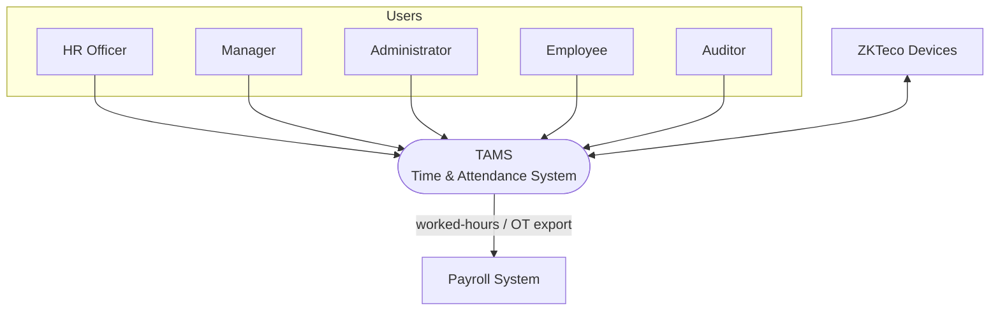
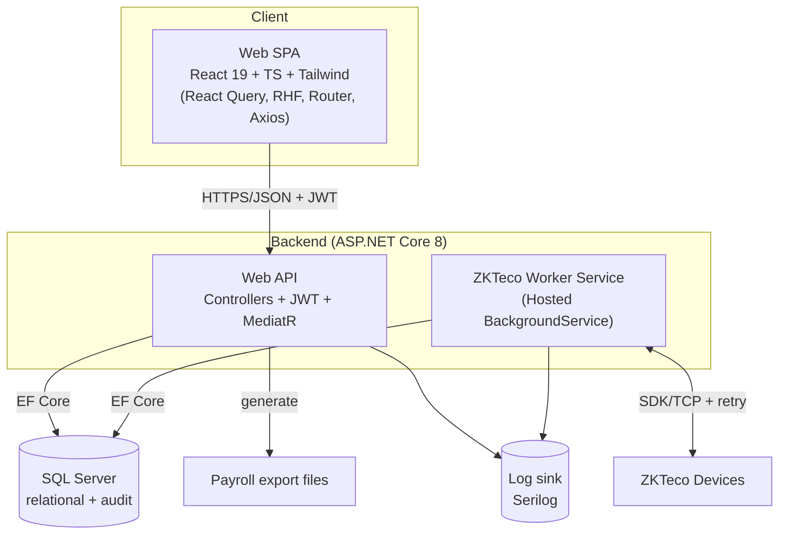
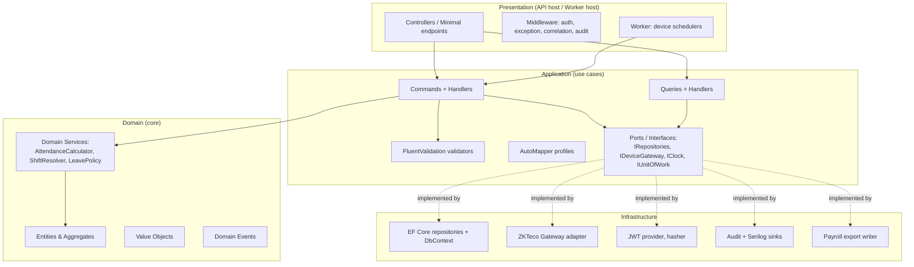
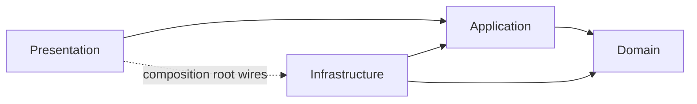
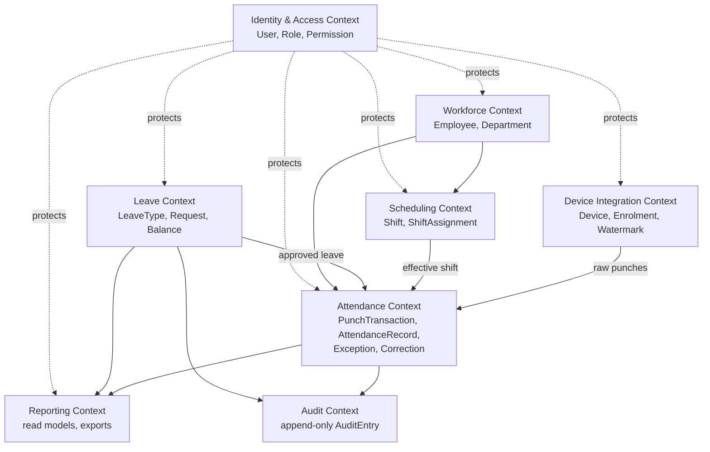
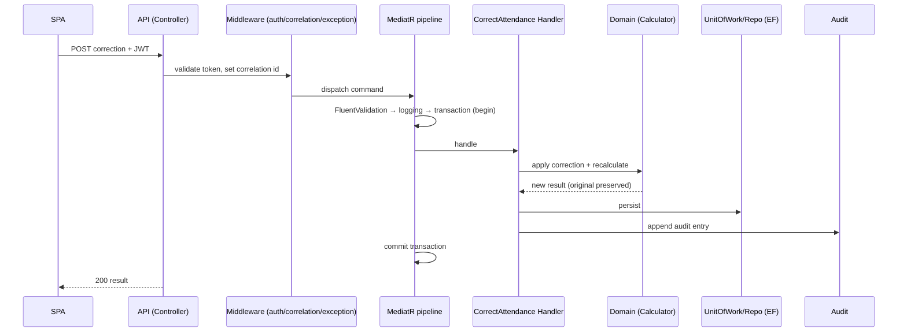
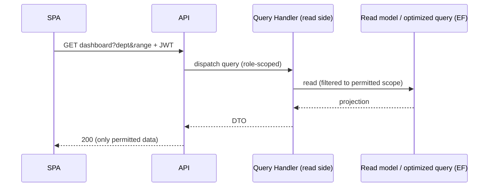
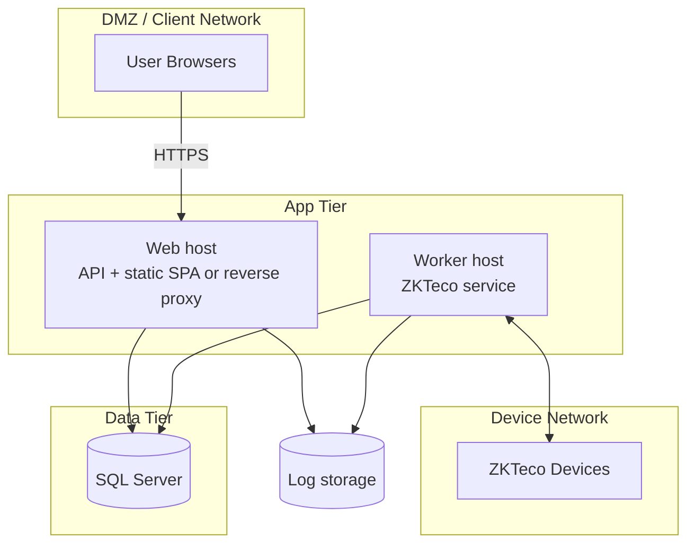

# 03 — Software Architecture Document (SAD)

## Enterprise Time & Attendance Management System

| Field | Value |
|---|---|
| **Document Title** | Software Architecture Document (SAD) |
| **Project** | Enterprise Time & Attendance Management System (TAMS) |
| **Document ID** | TAMS-ARC-003 |
| **Version** | 1.0 (Draft for Approval) |
| **Status** | Awaiting Approval |
| **Author** | Principal Software Architect (AI) |
| **Owner** | Solution Architect |
| **Date** | 2026-07-09 |
| **Classification** | Internal — Confidential |
| **Standards** | **ISO/IEC/IEEE 42010:2011** (architecture description), **C4 model** (views), **Clean Architecture**, **DDD**, **12-Factor** |
| **Predecessor Docs** | `01_BRD.md` (approved), `02_SRS.md` (approved) |
| **Successor Docs** | `04_DATABASE_DESIGN.md`, `05_API_SPECIFICATION.md`, `06_SECURITY.md`, `07_CODING_STANDARDS.md` |

> **Standards note.** The architecture is described per **ISO/IEC/IEEE 42010** — identifying stakeholders, their concerns, and a set of **architectural views** that address those concerns. Views use the **C4 model** (Context → Container → Component) plus supplementary runtime, deployment, and data-flow views. Every significant decision is captured as an **Architecture Decision Record (ADR)** in §12.
>
> **Boundary with other docs.** This SAD defines *structure, boundaries, and the reasons for them*. It does **not** define the physical database schema (→ `04`), endpoint contracts (→ `05`), the full security control set (→ `06`), or code conventions (→ `07`). Those are forward-referenced where relevant.

---

## Document Control

### Revision History

| Version | Date | Author | Description |
|---|---|---|---|
| 1.0 | 2026-07-09 | AI Architect | First complete architecture derived from approved SRS v1.0 |

### Approval Sign-off

| Role | Name | Signature | Date |
|---|---|---|---|
| Solution Architect | _TBD_ | | |
| Development Lead | _TBD_ | | |
| Security Lead | _TBD_ | | |
| IT Operations Lead | _TBD_ | | |

---

## Table of Contents

1. [Introduction & Goals](#1-introduction--goals)
2. [Architectural Drivers](#2-architectural-drivers)
3. [Stakeholders & Concerns (42010)](#3-stakeholders--concerns-42010)
4. [Architecture Principles & Constraints](#4-architecture-principles--constraints)
5. [Architectural Style & Rationale](#5-architectural-style--rationale)
6. [C4 Views](#6-c4-views)
7. [Clean Architecture Layering](#7-clean-architecture-layering)
8. [Domain Model & Bounded Contexts (DDD)](#8-domain-model--bounded-contexts-ddd)
9. [Cross-Cutting Concerns](#9-cross-cutting-concerns)
10. [Runtime Views (Key Scenarios)](#10-runtime-views-key-scenarios)
11. [Deployment & Infrastructure View](#11-deployment--infrastructure-view)
12. [Architecture Decision Records (ADRs)](#12-architecture-decision-records-adrs)
13. [Quality Attribute Realisation](#13-quality-attribute-realisation)
14. [Project Structure (Solution Layout)](#14-project-structure-solution-layout)
15. [Risks & Technical Debt](#15-risks--technical-debt)
16. [Traceability (SRS → Architecture)](#16-traceability-srs--architecture)
17. [Glossary](#17-glossary)
18. [Documentation Review Checklist](#18-documentation-review-checklist)

---

# 1. Introduction & Goals

This document describes the software architecture of TAMS: the high-level structure, the boundaries between parts, how they interact at runtime and deployment, and — most importantly — **why** each significant choice was made and which quality attribute it serves.

**Top architectural goals** (in priority order, derived from SRS NFRs and BRD risks):

| # | Goal | Driven by |
|---|---|---|
| 1 | **Reliability of attendance capture** — zero permanent punch loss | RK-01/02, KPI-04, NFR-08 |
| 2 | **Security by design** — OWASP, JWT, RBAC, audit | BR-050/052, NFR-12…16 |
| 3 | **Maintainability** — isolate domain from frameworks/devices | CONS-02, NFR-17 |
| 4 | **Testability** — pure domain, mockable boundaries | NFR-20 |
| 5 | **Cloud readiness** — 12-Factor, stateless API | CONS-05, NFR-23/24 |
| 6 | **Performance & scalability** — responsive, horizontally scalable | NFR-01/05/07 |

---

# 2. Architectural Drivers

Architecture is shaped by four categories of driver. Listing them explicitly (per attribute-driven design) ensures the structure is justified by requirements, not preference.

### 2.1 Functional drivers (shape structure)

| Driver | Architectural implication |
|---|---|
| Attendance = raw punches → processed records (FR-ATT-001/002) | Separate ingestion from processing; immutable raw store |
| Resilient ZKTeco capture (FR-ZK-*) | Independent **background worker** with retry/buffer/reconcile |
| Effective-dated shift rules (FR-SFT-003) | Temporal domain logic; recompute capability |
| Configurable business rules (FR-ADM-003) | Rules as data; strategy-style domain services |

### 2.2 Quality drivers (see §13)

Reliability, Security, Maintainability, Testability, Performance, Scalability, Portability, Observability.

### 2.3 Constraints (fixed — SRS §2.5)

ASP.NET Core 8 stack, React 19, SQL Server, JWT, Clean Architecture, Repository, CQRS-where-appropriate, DDD, OWASP, 12-Factor, ZKTeco-only.

### 2.4 Priority conflict resolution

| Conflict | Resolution | Rationale |
|---|---|---|
| Reliability vs simplicity of ingestion | Favour reliability (buffer/reconcile) | KPI-04 zero-loss is a business acceptance gate |
| Performance vs strict layering | Favour layering; optimise with read models where measured | Maintainability is a top-3 goal; optimise on evidence (YAGNI) |
| Rich domain vs CRUD speed | CQRS **only where it earns its keep** (attendance/reporting) | Avoid over-engineering simple master data (KISS/YAGNI) |

---

# 3. Stakeholders & Concerns (ISO/IEC/IEEE 42010)

| Stakeholder | Key concerns | Addressing view(s) |
|---|---|---|
| Business Owner / HR | Accuracy, auditability, correct rules | Domain (§8), Runtime (§10) |
| Security Lead | AuthN/Z, OWASP, data protection, audit | Cross-cutting (§9), ADRs, →Doc 06 |
| Development Lead | Layering, testability, clear boundaries | Clean Architecture (§7), Structure (§14) |
| QA Lead | Testable seams, deterministic flows | §7, §10, →Doc 10 |
| IT Operations | Deploy, monitor, recover | Deployment (§11), Observability (§9) |
| Solution Architect | Coherence, evolvability, cloud path | All views + ADRs (§12) |

---

# 4. Architecture Principles & Constraints

| ID | Principle | Consequence |
|---|---|---|
| AP-01 | **Dependency Rule** — dependencies point inward toward the domain | Domain has zero framework/infrastructure references |
| AP-02 | **Explicit boundaries** — every external system behind an abstraction | ZKTeco, SQL, payroll export all behind interfaces |
| AP-03 | **CQRS where valuable** — separate commands from queries in complex areas | Applied to attendance & reporting; not to trivial CRUD |
| AP-04 | **Rules as data** — configurable policy, not hard-coded | Open/Closed; no redeploy for policy change |
| AP-05 | **Fail-safe capture** — never lose a punch | Buffer + idempotency + reconciliation |
| AP-06 | **Stateless application tier** — no server session state | 12-Factor; horizontal scale |
| AP-07 | **Secure & audited by default** — deny by default, log by default | OWASP; append-only audit |
| AP-08 | **Automate quality** — validation, logging, tests are non-optional | CONS-06 |

---

# 5. Architectural Style & Rationale

## 5.1 Chosen style

**Layered Clean Architecture (modular monolith)** with a **CQRS-flavoured application layer (MediatR)** and a **separate hosted background worker** for device integration.

## 5.2 Why a modular monolith (not microservices) now

| Option | Pros | Cons | Verdict |
|---|---|---|---|
| **Modular monolith (chosen)** | Simple deploy/ops, transactional consistency, fast to build, still cleanly layered & cloud-ready | Single deployable unit | ✅ Fits current scale & team; honours KISS/YAGNI |
| Microservices | Independent scaling/deploy | Distributed complexity, ops overhead, premature for this scale | ❌ Not justified by drivers (OQ-06 sizing modest) |

**Decision (ADR-001).** A well-modularised monolith gives us Clean-Architecture benefits (testability, maintainability) **without** distributed-systems cost. Because boundaries are explicit (AP-02), a future extraction to services — if scale demands — is low-cost. This is the pragmatic 12-Factor-ready choice.

## 5.3 Why a separate background worker for ZKTeco

Device polling, retry, buffering and reconciliation must run **independently of user request traffic** and survive/resume across restarts. Coupling this to the request pipeline would make reliability depend on user activity — unacceptable for KPI-04. Hence a dedicated **.NET Hosted/Worker Service** (ADR-002).

---

# 6. C4 Views

## 6.1 Level 1 — System Context



## 6.2 Level 2 — Container View



**Decision (ADR-003).** API and Worker **share the same database and domain/application libraries** but run as **separate processes**. Shared libraries prevent logic duplication (DRY); separate processes give the worker independent lifecycle and resilience.

## 6.3 Level 3 — Component View (Backend, Clean Architecture)



The dashed "implemented by" arrows visualise the **Dependency Rule (AP-01)**: Application defines **ports** (interfaces); Infrastructure provides **adapters**. Dependencies point inward.

---

# 7. Clean Architecture Layering

## 7.1 Layers & responsibilities

| Layer | Responsibility | Depends on | Must NOT depend on |
|---|---|---|---|
| **Domain** | Entities, value objects, domain services, domain events, business invariants | *(nothing)* | EF, ASP.NET, ZKTeco, any framework |
| **Application** | Use cases (CQRS commands/queries via MediatR), validation, orchestration, **ports (interfaces)** | Domain | Infrastructure/Presentation concretes |
| **Infrastructure** | EF Core persistence, ZKTeco adapter, JWT/hashing, Serilog, export writers — **adapters implementing ports** | Application, Domain | Presentation |
| **Presentation** | API controllers/middleware; Worker host; composition root (DI) | Application (+ Infra at composition root only) | Domain internals |

## 7.2 The Dependency Rule (why it matters)



**Decision (ADR-004).** The **domain has no outward dependencies**. This is the single most important structural rule: it makes business logic **unit-testable without a database or device**, protects rules from framework churn, and is what actually delivers "cloud migration without rewrite" — infrastructure can be swapped behind ports (AP-01/02).

## 7.3 CQRS with MediatR — applied selectively

| Area | Command/Query split? | Why |
|---|---|---|
| Attendance processing, corrections, recalculation | ✅ Yes | Complex writes; benefits from explicit handlers + pipeline behaviours |
| Reporting/dashboards | ✅ Query side | Read-optimised, possibly denormalised read models |
| Employee/Department master data | ➖ Light CQRS (handlers, no separate read store) | CRUD is simple; full CQRS would over-engineer (YAGNI) |

**MediatR pipeline behaviours** provide cross-cutting concerns uniformly: **validation → logging → performance → transaction → audit**. This centralises CONS-06 mandates (no request skips validation/logging).

---

# 8. Domain Model & Bounded Contexts (DDD)

## 8.1 Bounded contexts



**Decision (ADR-005).** Contexts are **modules within the monolith**, not services. They give us DDD's conceptual clarity and low coupling (each owns its aggregates) while keeping a single transactional store. The **Attendance context is the core domain** — it receives from Device, Scheduling and Leave and feeds Reporting; it gets the richest modelling investment.

## 8.2 Key aggregates & invariants

| Aggregate | Invariants (enforced in domain) | SRS trace |
|---|---|---|
| **Employee** | Exactly one primary department; unique identifier; enrolment maps to one employee | BRULE-01/09, FR-EMP-002/003/004 |
| **Shift / ShiftAssignment** | No overlapping active assignment; effective-dated; overnight handled | FR-SFT-003/005 |
| **AttendanceRecord** | Derived from immutable raw punches; corrections preserve original; recompute deterministic | FR-ATT-001/006/008/009 |
| **LeaveRequest** | No approval beyond balance unless override; valid state transitions | BRULE-07, FR-LV-004 |
| **AuditEntry** | Append-only; never mutated/deleted via app | FR-AUD-002 |

## 8.3 Core domain services

| Service | Responsibility | Notes |
|---|---|---|
| `ShiftResolver` | Resolve the effective shift for an employee on a date | Handles patterns/effective-dating |
| `AttendanceCalculator` | Compute worked hours, late/early/OT from punches + shift + leave | Pure function of inputs → deterministic, testable |
| `LeavePolicy` | Validate balance/accrual/override rules | Rules-as-data driven |
| `ExceptionDetector` | Classify anomalies (missing/duplicate/out-of-shift) | Feeds review workflow |

**Decision (ADR-006).** `AttendanceCalculator` is a **pure domain service** (no I/O): given punches, shift and leave, it returns a result. Purity makes the most business-critical, dispute-prone logic **exhaustively unit-testable** and **recomputable** (FR-ATT-009) — directly serving accuracy (G-01) and payroll trust (G-08).

---

# 9. Cross-Cutting Concerns

| Concern | Approach | Where | Trace |
|---|---|---|---|
| **Authentication** | JWT bearer; token issuance/refresh | Middleware + Infra security | FR-AUTH-001/002 |
| **Authorization** | Policy/role-based, deny-by-default | Authorization policies | FR-AUTH-003, RBAC matrix |
| **Validation** | FluentValidation in MediatR pipeline | Application | CONS-06 |
| **Exception handling** | Global exception middleware → problem-details, no leaks | Presentation | CONS-06, OWASP |
| **Logging/diagnostics** | Serilog structured logs + correlation id per request/cycle | Middleware + worker | FR-AUD-003, NFR-25 |
| **Audit (business)** | Append-only audit via pipeline behaviour/domain events | Application/Infra | FR-AUD-001/002 |
| **Transactions/UoW** | Unit-of-Work per command; atomic writes | Infra behind port | data integrity |
| **Mapping** | AutoMapper entity↔DTO at boundaries only | Application/Presentation | maintainability |
| **Configuration** | Environment-based (12-Factor III); no secrets in code | Host | NFR-15/23 |
| **Idempotency** | De-dup key on punch ingestion | Attendance/Device | FR-ATT-008, FR-ZK-008 |
| **Resilience** | Retry + backoff + circuit-style guard for device calls | Worker/Infra | FR-ZK-005, NFR-09 |
| **Health/metrics** | Health checks + operational metrics | Presentation | NFR-26 |

**Decision (ADR-007).** Cross-cutting concerns are implemented as **MediatR pipeline behaviours and middleware**, not scattered in handlers. One place enforces validation/logging/audit/transaction ordering for *every* request — this is how the "never skip validation/logging/exception handling" mandate (CONS-06) becomes structurally guaranteed rather than reliant on developer discipline.

---

# 10. Runtime Views (Key Scenarios)

## 10.1 Scenario A — Command request (correct attendance)



## 10.2 Scenario B — Resilient device capture (the critical path)

```mermaid
sequenceDiagram
    participant TMR as Scheduler (Worker)
    participant GW as ZKTeco Gateway (adapter)
    participant DEV as Device
    participant ING as Ingestion (idempotent)
    participant PROC as Attendance Processing
    participant WM as Watermark store

    loop each device, each cycle
      TMR->>GW: download since watermark
      alt device reachable
        GW->>DEV: fetch transactions
        DEV-->>GW: punches
        GW->>ING: store (de-dup by key)
        ING->>PROC: trigger processing
        ING->>WM: advance watermark
        GW->>GW: reconcile device vs stored
      else device unreachable
        GW->>GW: retry w/ backoff, buffer intent
        Note over GW: outage > threshold → raise alert;<br/>no watermark advance → nothing lost
      end
    end
```

**This is the architecture's most important scenario.** Watermark-gated download + idempotent store + reconciliation means: a failure at any step never advances the watermark past un-ingested data, and re-runs never duplicate — **zero permanent loss (KPI-04, NFR-08)** by construction.

## 10.3 Scenario C — Report/dashboard query



---

# 11. Deployment & Infrastructure View

## 11.1 Initial deployment (on-premises, per AS-05)



## 11.2 Cloud-migration target (future, per CONS-05)

Because the API is **stateless (AP-06)** and config is **environment-based (12-Factor)**, migration maps cleanly:

| On-prem now | Cloud later (illustrative, no lock-in in core) |
|---|---|
| Web host | Container service / App service (scale-out) |
| Worker host | Container/worker instance or scheduled job |
| SQL Server | Managed SQL |
| Log storage | Managed log/observability service |
| File export | Object storage |

**Decision (ADR-008).** No cloud-proprietary API appears in Domain/Application layers; only Infrastructure adapters touch platform specifics. Migration therefore changes **adapters and hosting**, not business logic — this is the concrete meaning of "cloud-ready without rewrite" (G-07). Detailed topology → `11_DEPLOYMENT.md`.

## 11.3 12-Factor conformance

| Factor | Conformance |
|---|---|
| III Config | Environment variables; no secrets in source |
| VI Processes | Stateless API; state in SQL |
| VIII Concurrency | Scale API horizontally; worker scaled per device partition |
| XI Logs | Serilog streams to sink |
| IX Disposability | Fast startup/shutdown; worker resumes via watermark |

---

# 12. Architecture Decision Records (ADRs)

> Each ADR: **Context → Decision → Alternatives → Consequences.** ADRs are the auditable record of *why* the architecture is as it is.

| ADR | Title | Decision (summary) | Key consequence |
|---|---|---|---|
| **ADR-001** | Modular monolith over microservices | Single deployable, cleanly modularised | Simple ops; easy future extraction |
| **ADR-002** | Dedicated background worker for ZKTeco | Separate hosted process | Reliability independent of user traffic |
| **ADR-003** | Shared domain libs, separate processes | API & Worker share Application/Domain | DRY + independent lifecycle |
| **ADR-004** | Enforce Dependency Rule | Domain has zero outward deps | Testability + cloud portability |
| **ADR-005** | DDD bounded contexts as modules | Contexts, not services | Clarity + low coupling, one transaction |
| **ADR-006** | Pure `AttendanceCalculator` | No I/O in core calc | Exhaustively testable + recomputable |
| **ADR-007** | Cross-cutting via pipeline/middleware | Central behaviours | CONS-06 guaranteed structurally |
| **ADR-008** | No cloud lock-in in core | Platform only in Infra adapters | Migration = swap adapters |
| **ADR-009** | Selective CQRS | Full CQRS only for attendance/reporting | Avoids over-engineering (YAGNI) |
| **ADR-010** | Immutable raw punch + append-only audit | Separate raw store & audit | Accuracy + tamper-evident compliance |
| **ADR-011** | Idempotent, watermark-gated ingestion | De-dup key + per-device watermark | Zero permanent loss (KPI-04) |
| **ADR-012** | React Query as server-state layer | Cache/retry/invalidation on client | Resilient, responsive UI; less bespoke state |

### ADR detail example — ADR-011 (the highest-value decision)

- **Context.** ZKTeco/network outages (RK-01/02) and retries can drop or duplicate punches; KPI-04 demands zero permanent loss and no duplicates.
- **Decision.** Download **incrementally per-device using a persisted watermark**; store punches through an **idempotent, de-duplicating** ingestion keyed by (device, enrolment, timestamp, direction); **advance the watermark only after successful store**; **reconcile** device logs vs stored data each cycle.
- **Alternatives.** (a) Full re-download each cycle — wasteful, still needs de-dup. (b) Fire-and-forget realtime only — loses punches during outages. (c) At-least-once without de-dup — creates duplicates → wrong hours.
- **Consequences.** Safe retries; crash-safe resume; provable completeness via reconciliation; slightly more storage/logic. Accepted — reliability is goal #1.

---

# 13. Quality Attribute Realisation

| Quality attribute | Architectural mechanism | Trace |
|---|---|---|
| **Reliability** | Worker isolation, retry/backoff, buffering, idempotency, watermark, reconciliation | NFR-08/09/11, ADR-002/011 |
| **Security** | JWT, deny-by-default policies, global exception handling, no secret leakage, append-only audit, TLS | NFR-12…16, ADR-007/010 |
| **Maintainability** | Clean layering, Dependency Rule, DDD modules, rules-as-data | NFR-17/19, ADR-004/005 |
| **Testability** | Pure domain services, ports/adapters, MediatR handlers | NFR-20, ADR-004/006 |
| **Performance** | Async I/O throughout, read-optimised queries/read models, EF tuning where measured | NFR-01/02, §7.3 |
| **Scalability** | Stateless API (scale-out), worker partitioned per device set | NFR-05/07, AP-06 |
| **Portability/Cloud** | 12-Factor, no cloud lock-in in core | NFR-23/24, ADR-008 |
| **Observability** | Serilog + correlation ids, health checks, metrics | NFR-25/26, ADR-007 |

---

# 14. Project Structure (Solution Layout)

> Physical folder/namespace conventions are finalised in `07_CODING_STANDARDS.md`. This is the architectural intent.

```text
TAMS.sln
│
├── src/
│   ├── TAMS.Domain/            # Entities, VOs, domain services, events (NO deps)
│   ├── TAMS.Application/       # CQRS handlers, ports (interfaces), validators, mappings
│   ├── TAMS.Infrastructure/    # EF Core, ZKTeco adapter, JWT/hashing, Serilog, exports
│   ├── TAMS.Api/               # ASP.NET Core Web API host (composition root #1)
│   └── TAMS.Worker/            # ZKTeco BackgroundService host (composition root #2)
│
├── client/                     # React 19 + TS SPA (React Query, RHF, Router, Axios, Tailwind)
│
└── tests/
    ├── TAMS.Domain.Tests/          # pure unit tests (fast, no I/O)
    ├── TAMS.Application.Tests/     # handler + validation tests (mocked ports)
    ├── TAMS.Integration.Tests/     # EF + API + device-adapter (test doubles)
    └── TAMS.Architecture.Tests/    # enforce Dependency Rule automatically
```

**Decision.** Two hosts (`Api`, `Worker`) share `Domain`/`Application`/`Infrastructure` (ADR-003). An **architecture test project** mechanically enforces the Dependency Rule (AP-01) in CI, so violations fail the build rather than relying on review.

---

# 15. Risks & Technical Debt

| ID | Risk / debt | Mitigation | Owner |
|---|---|---|---|
| AR-01 | ZKTeco SDK behaviour unknown (OQ-01) | Early integration spike behind `IDeviceGateway`; adapter isolates surprises | Dev Lead |
| AR-02 | Read-model/denormalisation may be needed for reporting perf | Defer until measured (YAGNI); design leaves room | Architect |
| AR-03 | Monolith could grow coupled if module boundaries erode | Architecture tests + code review guard boundaries | Architect |
| AR-04 | Worker scaling for many devices | Partition devices across worker instances | Ops |
| AR-05 | Recompute cost on rule changes | Batch/async recompute; scope to affected range | Dev Lead |

---

# 16. Traceability (SRS → Architecture)

| SRS area | Architectural realisation | ADR/§ |
|---|---|---|
| FR-AUTH-* | JWT + policy authz + auth middleware | §9, ADR-007 |
| FR-EMP/DEP-* | Workforce context, EF repositories | §8, §7 |
| FR-SFT-* | Scheduling context, `ShiftResolver`, effective-dating | §8.3 |
| FR-ATT-* | Attendance context, immutable raw store, `AttendanceCalculator`, state machine | ADR-006/010, §8, §10.1 |
| FR-ZK-* | Worker + `IDeviceGateway` adapter, watermark, idempotency, reconcile | ADR-002/011, §10.2 |
| FR-LV-* | Leave context, `LeavePolicy` | §8 |
| FR-RPT-* | Reporting context, query side, export writer | §7.3, §10.3 |
| FR-ADM-* | Rules-as-data config, admin use cases | AP-04 |
| FR-AUD-* | Append-only audit, pipeline behaviour, Serilog | ADR-007/010 |
| NFR-* | §13 quality realisation | §13 |

---

# 17. Glossary

Inherits `01_BRD.md §16` and `02_SRS.md §1.3`. Architecture-specific additions:

| Term | Definition |
|---|---|
| **Port** | An interface defined by the Application layer describing a needed capability. |
| **Adapter** | An Infrastructure implementation of a port (e.g., EF repository, ZKTeco gateway). |
| **Dependency Rule** | Source-code dependencies point only inward, toward the domain. |
| **Bounded Context** | A DDD boundary within which a model is consistent; here, a module. |
| **CQRS** | Command Query Responsibility Segregation. |
| **Pipeline behaviour** | MediatR interceptor applying cross-cutting logic to every request. |
| **Watermark** | Per-device pointer to last successfully ingested transaction. |
| **ADR** | Architecture Decision Record. |
| **C4** | Context/Container/Component/Code model for architecture diagrams. |

---

# 18. Documentation Review Checklist

**Reviewer instructions:** mark ✅ Pass / ⚠️ Needs change / ❌ Fail. Approved when all **Mandatory** items pass.

### 18.1 Completeness (42010 / C4)

| # | Check | Mandatory | Status |
|---|---|---|---|
| C-01 | Architectural goals & drivers stated | ✔ | ☐ |
| C-02 | Stakeholders & concerns identified (42010) | ✔ | ☐ |
| C-03 | Principles & constraints listed | ✔ | ☐ |
| C-04 | Style chosen with rationale & alternatives | ✔ | ☐ |
| C-05 | C4 Context, Container, Component views present | ✔ | ☐ |
| C-06 | Clean Architecture layering & Dependency Rule described | ✔ | ☐ |
| C-07 | DDD bounded contexts & core aggregates defined | ✔ | ☐ |
| C-08 | Cross-cutting concerns addressed | ✔ | ☐ |
| C-09 | Runtime views for key scenarios (incl. device capture) | ✔ | ☐ |
| C-10 | Deployment view + cloud path | ✔ | ☐ |
| C-11 | ADRs captured with rationale | ✔ | ☐ |
| C-12 | Project structure defined | ✔ | ☐ |

### 18.2 Quality & Soundness

| # | Check | Mandatory | Status |
|---|---|---|---|
| Q-01 | Every significant decision explained (not asserted) | ✔ | ☐ |
| Q-02 | Reliability path (zero punch loss) architecturally guaranteed | ✔ | ☐ |
| Q-03 | Security-by-design reflected structurally | ✔ | ☐ |
| Q-04 | Domain isolated from frameworks (testable) | ✔ | ☐ |
| Q-05 | Over-engineering avoided (selective CQRS, monolith) | ✔ | ☐ |
| Q-06 | Cloud-readiness without lock-in demonstrated | ✔ | ☐ |
| Q-07 | No premature schema/endpoint/screen detail | ✔ | ☐ |

### 18.3 Alignment & Traceability

| # | Check | Mandatory | Status |
|---|---|---|---|
| A-01 | Consistent with `00_PROJECT_CONTEXT.md` stack & principles | ✔ | ☐ |
| A-02 | Every SRS functional area has architectural realisation | ✔ | ☐ |
| A-03 | Quality attributes mapped to mechanisms (§13) | ✔ | ☐ |
| A-04 | Forward references to Docs 04/05/06/07/11 correct | ✔ | ☐ |
| A-05 | Open items (OQ-01…) acknowledged, not silently assumed | ✔ | ☐ |

### 18.4 Governance

| # | Check | Mandatory | Status |
|---|---|---|---|
| G-01 | Document control & versioning present | ✔ | ☐ |
| G-02 | Approval sign-off present | ✔ | ☐ |
| G-03 | Ready to proceed to `04_DATABASE_DESIGN.md` on approval | ✔ | ☐ |

---

### ✅ Approval Gate

> **This Architecture Document (v1.0) is submitted for your approval.** I will **not** begin `04_DATABASE_DESIGN.md` until you approve or request changes.

**Please respond with one of:**
1. **Approved** → I proceed to `04_DATABASE_DESIGN.md`.
2. **Approved with changes** → list changes; I revise then proceed.
3. **Changes required** → list changes; I revise and resubmit the architecture only.

*End of Document — TAMS-ARC-003 v1.0*
