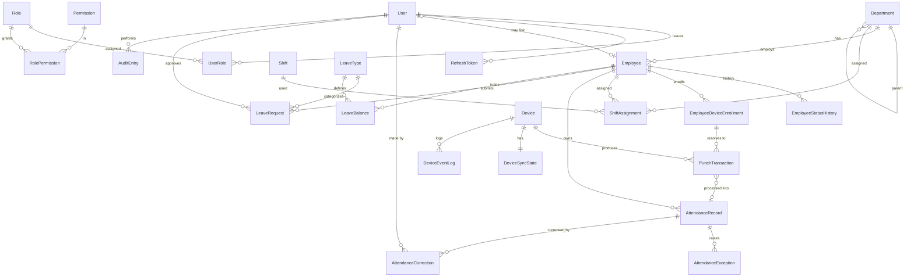

# 04 — Database Design Document (DDD)

## Enterprise Time & Attendance Management System

| Field | Value |
|---|---|
| **Document Title** | Database Design Document |
| **Project** | Enterprise Time & Attendance Management System (TAMS) |
| **Document ID** | TAMS-DBD-004 |
| **Version** | 1.0 (Draft for Approval) |
| **Status** | Awaiting Approval |
| **Author** | Principal Software Architect (AI) |
| **Owner** | Solution Architect / Database Lead |
| **Date** | 2026-07-09 |
| **Classification** | Internal — Confidential |
| **Target DBMS** | **Microsoft SQL Server** (supported edition) |
| **ORM** | **Entity Framework Core 8** (code-first migrations) |
| **Standards** | Relational normalisation (3NF baseline), ISO SQL data types, enterprise naming standards |
| **Predecessor Docs** | `01_BRD.md`, `02_SRS.md`, `03_ARCHITECTURE.md` (all approved) |
| **Successor Docs** | `05_API_SPECIFICATION.md`, `06_SECURITY.md` |

> **Scope of this document.** This is the **logical + physical data design** for TAMS. It specifies tables, columns, data types, keys, relationships, constraints, indexes, and the data-integrity/audit/temporal strategies — realising the logical entities from `02_SRS.md §5` and the bounded contexts from `03_ARCHITECTURE.md §8`.
>
> **Boundary with other docs.** SQL data types and column definitions here are **authoritative**. EF Core mapping *conventions* and repository patterns are governed by `07_CODING_STANDARDS.md`; column-level encryption/masking policy and key management are finalised in `06_SECURITY.md` (this doc marks *where* protection applies). Row-level performance tuning beyond the baseline indexes is a runtime/ops concern (`14_MAINTENANCE_GUIDE.md`).
>
> **Values pending stakeholder input** (OQ items) are shown as configuration/reference data, not hard-coded schema, so the schema is stable regardless of those answers.

---

## Document Control

### Revision History

| Version | Date | Author | Description |
|---|---|---|---|
| 1.0 | 2026-07-09 | AI Architect | First complete database design derived from approved Architecture v1.0 |

### Approval Sign-off

| Role | Name | Signature | Date |
|---|---|---|---|
| Solution Architect | _TBD_ | | |
| Database Lead | _TBD_ | | |
| Development Lead | _TBD_ | | |
| Security Lead | _TBD_ | | |

---

## Table of Contents

1. [Design Principles & Conventions](#1-design-principles--conventions)
2. [Naming Standards](#2-naming-standards)
3. [Common Column Standards & Data Types](#3-common-column-standards--data-types)
4. [Schema Organisation (by Bounded Context)](#4-schema-organisation-by-bounded-context)
5. [Logical Data Model (ERD)](#5-logical-data-model-erd)
6. [Physical Table Specifications](#6-physical-table-specifications)
7. [Relationships & Referential Integrity](#7-relationships--referential-integrity)
8. [Indexing Strategy](#8-indexing-strategy)
9. [Data Integrity: Constraints & Rules](#9-data-integrity-constraints--rules)
10. [Auditing & Temporal Strategy](#10-auditing--temporal-strategy)
11. [Idempotency & Concurrency](#11-idempotency--concurrency)
12. [Reference / Seed Data](#12-reference--seed-data)
13. [Security at the Data Layer](#13-security-at-the-data-layer)
14. [Migration & Versioning Strategy](#14-migration--versioning-strategy)
15. [Retention, Archival & Sizing](#15-retention-archival--sizing)
16. [Traceability (SRS/Arch → Schema)](#16-traceability-srsarch--schema)
17. [Glossary](#17-glossary)
18. [Documentation Review Checklist](#18-documentation-review-checklist)

---

# 1. Design Principles & Conventions

| ID | Principle | Rationale |
|---|---|---|
| DP-01 | **Normalise to 3NF by default**; denormalise only for measured read needs | Integrity first; avoid anomalies (accuracy G-01) |
| DP-02 | **Surrogate primary keys** (`BIGINT IDENTITY` or `UNIQUEIDENTIFIER`) | Stable keys independent of business values |
| DP-03 | **Natural/business keys enforced via UNIQUE constraints**, not as PKs | Business codes can change; surrogate stays stable |
| DP-04 | **Soft delete** (`IsActive`/`IsDeleted` + timestamp) for master data | Preserve history; deactivate not destroy (FR-EMP-001) |
| DP-05 | **Immutable fact tables** for raw punches & audit — insert-only | Accuracy + tamper-evidence (ADR-010) |
| DP-06 | **Effective-dated** temporal rows where policy changes over time | Recompute against historically-correct rules (FR-SFT-003) |
| DP-07 | **UTC everywhere** (`DATETIME2` in UTC); convert at presentation | Cross-site correctness; overnight/midnight math (FR-ATT-004) |
| DP-08 | **Explicit FK constraints** + chosen delete behaviour | Referential integrity (DR-04) |
| DP-09 | **Optimistic concurrency** via `RowVersion` on mutable aggregates | Safe concurrent edits (FR-ATT-006) |
| DP-10 | **Idempotency keys** on ingestion tables | Zero-duplicate capture (FR-ZK-008, ADR-011) |
| DP-11 | Money/hours stored as `DECIMAL`, never `FLOAT` | Deterministic payroll math (G-08) |
| DP-12 | Every table carries standard audit columns (§3) | Uniform traceability |

**Decision — surrogate PK + unique business key (DP-02/03).** Employee numbers, department codes and device serials are *business* identifiers that can be corrected or reissued. Using them as primary keys would cascade churn through every FK. A stable surrogate PK with a `UNIQUE` business key gives both integrity and flexibility — a core enterprise data-modelling standard.

**Decision — UTC storage (DP-07).** Attendance correctness depends on unambiguous time, especially for overnight shifts (FR-ATT-004) and any future multi-site (OQ-06). Storing UTC in `DATETIME2` and converting only at the edge eliminates timezone/DST ambiguity from all calculations.

---

# 2. Naming Standards

| Element | Convention | Example |
|---|---|---|
| Schema | `PascalCase` by context | `Attendance`, `Workforce`, `Identity` |
| Table | `PascalCase`, **singular** | `Employee`, `AttendanceRecord` |
| Column | `PascalCase` | `EmployeeId`, `WorkedMinutes` |
| Primary key | `Id` (or `<Table>Id` on FK) | `Id`, `EmployeeId` |
| Foreign key column | `<ReferencedTable>Id` | `DepartmentId` |
| FK constraint | `FK_<Child>_<Parent>` | `FK_Employee_Department` |
| Unique constraint | `UQ_<Table>_<Cols>` | `UQ_Employee_EmployeeNo` |
| Check constraint | `CK_<Table>_<Rule>` | `CK_Shift_EndAfterStart` |
| Index | `IX_<Table>_<Cols>` | `IX_PunchTransaction_DeviceId_PunchedAtUtc` |
| Default constraint | `DF_<Table>_<Col>` | `DF_Employee_IsActive` |

**Decision — singular table names + schema-per-context.** Singular table names read naturally as entity types (matching EF `DbSet<Employee>` conventions). Schema-per-bounded-context (§4) mirrors the architecture's modular boundaries in the database itself, keeping the physical model aligned with the domain (`03 §8`).

---

# 3. Common Column Standards & Data Types

## 3.1 Standard audit columns (on every persistent table)

| Column | Type | Null | Notes |
|---|---|---|---|
| `CreatedAtUtc` | `DATETIME2(3)` | NOT NULL | Default `SYSUTCDATETIME()` |
| `CreatedBy` | `NVARCHAR(128)` | NOT NULL | User/service principal |
| `ModifiedAtUtc` | `DATETIME2(3)` | NULL | Set on update |
| `ModifiedBy` | `NVARCHAR(128)` | NULL | |
| `RowVersion` | `ROWVERSION` | NOT NULL | Optimistic concurrency (DP-09) |

> Immutable tables (`PunchTransaction`, `AuditEntry`) carry `CreatedAtUtc`/`CreatedBy` only — no `Modified*`/`RowVersion`, because they are never updated (DP-05).

## 3.2 Canonical data-type choices

| Concept | SQL type | Rationale |
|---|---|---|
| Surrogate PK | `BIGINT IDENTITY(1,1)` | Compact, fast, ample range for high-volume punch data |
| External/interop id | `UNIQUEIDENTIFIER` | Where a stable public id is needed |
| Timestamp | `DATETIME2(3)` (UTC) | Millisecond precision; timezone-neutral (DP-07) |
| Date-only | `DATE` | Attendance day, effective dates |
| Time-of-day | `TIME(0)` | Shift start/end |
| Duration | `INT` (minutes) or `DECIMAL(9,2)` (hours) | Deterministic; minutes for storage, hours for reports (DP-11) |
| Boolean flag | `BIT` | |
| Short code | `NVARCHAR(32)` | Business codes |
| Name/description | `NVARCHAR(200)` / `NVARCHAR(1000)` | Unicode for i18n |
| Enum/status | `TINYINT` + CHECK / lookup table | Small, indexed, documented |
| Money/rate | `DECIMAL(18,4)` | Never `FLOAT` (DP-11) |

**Decision — `BIGINT` PKs for high-volume tables.** `PunchTransaction` and `AuditEntry` grow fastest. `BIGINT` avoids the exhaustion and index-fragmentation concerns of `INT` at scale while staying narrower and more index-friendly than `UNIQUEIDENTIFIER` — important for the busiest write paths.

**Decision — status as `TINYINT` + CHECK, backed by documented enums.** Statuses (attendance state, leave state) are enforced by CHECK constraints and documented enum tables where user-facing. This keeps them compact and indexable while remaining self-describing — a balance between a rigid lookup FK and an opaque magic number.

---

# 4. Schema Organisation (by Bounded Context)

Physical SQL schemas mirror the architecture's bounded contexts (`03 §8`):

| SQL Schema | Bounded Context | Tables (summary) |
|---|---|---|
| `Identity` | Identity & Access | `User`, `Role`, `Permission`, `RolePermission`, `UserRole`, `RefreshToken` |
| `Workforce` | Workforce | `Employee`, `Department`, `EmployeeStatusHistory`, `EmployeeDeviceEnrollment` |
| `Scheduling` | Scheduling | `Shift`, `ShiftAssignment` |
| `Attendance` | Attendance (core) | `PunchTransaction`, `AttendanceRecord`, `AttendanceException`, `AttendanceCorrection` |
| `Devices` | Device Integration | `Device`, `DeviceSyncState`, `DeviceEventLog` |
| `Leave` | Leave | `LeaveType`, `LeaveRequest`, `LeaveBalance` |
| `Config` | Configuration | `ConfigurationItem` |
| `Audit` | Audit | `AuditEntry` |

**Decision — schema-per-context.** Grouping tables into SQL schemas that match bounded contexts enforces conceptual boundaries at the storage layer, simplifies permission grants per module (least privilege, §13), and makes ownership obvious.

---

# 5. Logical Data Model (ERD)

---

# 6. Physical Table Specifications

> Every table also carries the **standard audit columns (§3.1)** unless noted immutable. PK = Primary Key, FK = Foreign Key, UQ = Unique.

## 6.1 `Identity` schema

### `Identity.User`

| Column | Type | Null | Key | Notes |
|---|---|---|---|---|
| `Id` | BIGINT IDENTITY | NOT NULL | PK | |
| `UserName` | NVARCHAR(128) | NOT NULL | UQ | `UQ_User_UserName` |
| `Email` | NVARCHAR(256) | NOT NULL | UQ | `UQ_User_Email` |
| `PasswordHash` | NVARCHAR(512) | NOT NULL | | Strong one-way hash (FR-AUTH-004); never plaintext |
| `EmployeeId` | BIGINT | NULL | FK→Workforce.Employee | Optional link |
| `IsActive` | BIT | NOT NULL | | DF 1 |
| `FailedLoginCount` | INT | NOT NULL | | DF 0 (FR-AUTH-005) |
| `LockoutEndUtc` | DATETIME2(3) | NULL | | Brute-force lockout |
| `LastLoginUtc` | DATETIME2(3) | NULL | | |

### `Identity.Role`

| Column | Type | Null | Key | Notes |
|---|---|---|---|---|
| `Id` | BIGINT IDENTITY | NOT NULL | PK | |
| `Name` | NVARCHAR(64) | NOT NULL | UQ | Admin, HROfficer, Manager, Employee, Auditor |
| `Description` | NVARCHAR(200) | NULL | | |

### `Identity.Permission`

| Column | Type | Null | Key | Notes |
|---|---|---|---|---|
| `Id` | BIGINT IDENTITY | NOT NULL | PK | |
| `Code` | NVARCHAR(128) | NOT NULL | UQ | e.g. `Attendance.Correct` |
| `Description` | NVARCHAR(200) | NULL | | |

### `Identity.RolePermission` (junction)

| Column | Type | Null | Key |
|---|---|---|---|
| `RoleId` | BIGINT | NOT NULL | PK, FK→Role |
| `PermissionId` | BIGINT | NOT NULL | PK, FK→Permission |

### `Identity.UserRole` (junction)

| Column | Type | Null | Key |
|---|---|---|---|
| `UserId` | BIGINT | NOT NULL | PK, FK→User |
| `RoleId` | BIGINT | NOT NULL | PK, FK→Role |

### `Identity.RefreshToken`

| Column | Type | Null | Key | Notes |
|---|---|---|---|---|
| `Id` | BIGINT IDENTITY | NOT NULL | PK | |
| `UserId` | BIGINT | NOT NULL | FK→User | |
| `TokenHash` | NVARCHAR(512) | NOT NULL | | Store **hash**, not token (§13) |
| `ExpiresAtUtc` | DATETIME2(3) | NOT NULL | | |
| `RevokedAtUtc` | DATETIME2(3) | NULL | | Rotation/revocation (FR-AUTH-002) |

**Decision — permission-based RBAC (User→Role→Permission).** Roles group permissions; authorization policies check *permissions*, not role names. This realises the capability matrix (SRS §4.1) and Open/Closed: new capabilities add permission rows, not code branches.

## 6.2 `Workforce` schema

### `Workforce.Department`

| Column | Type | Null | Key | Notes |
|---|---|---|---|---|
| `Id` | BIGINT IDENTITY | NOT NULL | PK | |
| `Code` | NVARCHAR(32) | NOT NULL | UQ | `UQ_Department_Code` |
| `Name` | NVARCHAR(200) | NOT NULL | | |
| `ParentDepartmentId` | BIGINT | NULL | FK→Department (self) | Hierarchy (FR-DEP-002) |
| `IsActive` | BIT | NOT NULL | | DF 1 (soft delete) |

### `Workforce.Employee`

| Column | Type | Null | Key | Notes |
|---|---|---|---|---|
| `Id` | BIGINT IDENTITY | NOT NULL | PK | |
| `EmployeeNo` | NVARCHAR(32) | NOT NULL | UQ | Business key (FR-EMP-002) |
| `FirstName` | NVARCHAR(100) | NOT NULL | | |
| `LastName` | NVARCHAR(100) | NOT NULL | | |
| `Email` | NVARCHAR(256) | NULL | UQ (filtered) | |
| `PrimaryDepartmentId` | BIGINT | NOT NULL | FK→Department | Exactly one (BRULE-01) |
| `HireDateUtc` | DATE | NULL | | |
| `Status` | TINYINT | NOT NULL | | 1=Active,2=Inactive,3=Suspended,4=Terminated |
| `IsActive` | BIT | NOT NULL | | DF 1 |

### `Workforce.EmployeeStatusHistory` (temporal, insert-only)

| Column | Type | Null | Key | Notes |
|---|---|---|---|---|
| `Id` | BIGINT IDENTITY | NOT NULL | PK | |
| `EmployeeId` | BIGINT | NOT NULL | FK→Employee | |
| `Status` | TINYINT | NOT NULL | | |
| `EffectiveFromUtc` | DATETIME2(3) | NOT NULL | | |
| `Reason` | NVARCHAR(200) | NULL | | (FR-EMP-005) |

### `Workforce.EmployeeDeviceEnrollment`

| Column | Type | Null | Key | Notes |
|---|---|---|---|---|
| `Id` | BIGINT IDENTITY | NOT NULL | PK | |
| `EmployeeId` | BIGINT | NOT NULL | FK→Employee | |
| `DeviceId` | BIGINT | NOT NULL | FK→Devices.Device | |
| `DeviceUserId` | NVARCHAR(64) | NOT NULL | | Id **on the device** |
| `IsActive` | BIT | NOT NULL | | DF 1 |
| | | | UQ | `UQ_Enroll_Device_DeviceUserId` (DeviceId, DeviceUserId) — one employee per device slot (BRULE-09) |

**Decision — enrolment as its own table.** An employee may enrol on multiple devices, and a device user-id must map to exactly one employee (BRULE-09). A dedicated table with a `(DeviceId, DeviceUserId)` unique constraint is the only clean way to guarantee that punches resolve to a single, correct employee.

## 6.3 `Scheduling` schema

### `Scheduling.Shift`

| Column | Type | Null | Key | Notes |
|---|---|---|---|---|
| `Id` | BIGINT IDENTITY | NOT NULL | PK | |
| `Code` | NVARCHAR(32) | NOT NULL | UQ | |
| `Name` | NVARCHAR(200) | NOT NULL | | |
| `StartTime` | TIME(0) | NOT NULL | | |
| `EndTime` | TIME(0) | NOT NULL | | End<Start ⇒ overnight (FR-SFT-005) |
| `BreakMinutes` | INT | NOT NULL | | DF 0 |
| `GraceInMinutes` | INT | NOT NULL | | DF 0 (tolerance) |
| `GraceOutMinutes` | INT | NOT NULL | | DF 0 |
| `OvertimePolicyJson` | NVARCHAR(MAX) | NULL | | Rules-as-data (OQ-02) |
| `IsActive` | BIT | NOT NULL | | DF 1 |

### `Scheduling.ShiftAssignment` (effective-dated, DP-06)

| Column | Type | Null | Key | Notes |
|---|---|---|---|---|
| `Id` | BIGINT IDENTITY | NOT NULL | PK | |
| `ShiftId` | BIGINT | NOT NULL | FK→Shift | |
| `EmployeeId` | BIGINT | NULL | FK→Employee | Either employee… |
| `DepartmentId` | BIGINT | NULL | FK→Department | …or department (CHECK: exactly one) |
| `EffectiveFromUtc` | DATE | NOT NULL | | |
| `EffectiveToUtc` | DATE | NULL | | NULL = open-ended |

**Decision — effective-dated assignment (FR-SFT-003).** By recording `EffectiveFrom/To`, attendance for any past date resolves against the shift **in force on that date**, so historical records and recomputation (FR-ATT-009) stay correct even after shift changes — essential for payroll audit (G-08). A CHECK enforces exactly one of employee/department.

## 6.4 `Devices` schema

### `Devices.Device`

| Column | Type | Null | Key | Notes |
|---|---|---|---|---|
| `Id` | BIGINT IDENTITY | NOT NULL | PK | |
| `SerialNo` | NVARCHAR(64) | NOT NULL | UQ | |
| `Name` | NVARCHAR(200) | NOT NULL | | |
| `IpAddress` | NVARCHAR(64) | NULL | | |
| `Port` | INT | NULL | | |
| `Model` | NVARCHAR(64) | NULL | | (OQ-01) |
| `IsEnabled` | BIT | NOT NULL | | DF 1 (FR-ZK-010) |
| `LastSeenUtc` | DATETIME2(3) | NULL | | For unreachable alerting (FR-ZK-011) |

### `Devices.DeviceSyncState` (one per device — watermark, ADR-011)

| Column | Type | Null | Key | Notes |
|---|---|---|---|---|
| `DeviceId` | BIGINT | NOT NULL | PK, FK→Device | 1:1 |
| `LastWatermarkUtc` | DATETIME2(3) | NULL | | Last ingested pointer (FR-ZK-002) |
| `LastSyncStartedUtc` | DATETIME2(3) | NULL | | |
| `LastSyncSucceededUtc` | DATETIME2(3) | NULL | | |
| `ConsecutiveFailureCount` | INT | NOT NULL | | DF 0 (alert threshold) |

### `Devices.DeviceEventLog` (insert-only diagnostics)

| Column | Type | Null | Key | Notes |
|---|---|---|---|---|
| `Id` | BIGINT IDENTITY | NOT NULL | PK | |
| `DeviceId` | BIGINT | NOT NULL | FK→Device | |
| `EventType` | TINYINT | NOT NULL | | Sync/Download/Error/Reconcile |
| `Outcome` | TINYINT | NOT NULL | | Success/Failure/Retry |
| `CorrelationId` | UNIQUEIDENTIFIER | NOT NULL | | Ties to Serilog (FR-ZK-009) |
| `Message` | NVARCHAR(1000) | NULL | | |
| `OccurredAtUtc` | DATETIME2(3) | NOT NULL | | |

**Decision — watermark in its own 1:1 table.** Keeping `DeviceSyncState` separate from `Device` isolates the frequently-updated sync pointer from the rarely-changed device configuration, reducing write contention on the config row and making the crash-safe resume logic (ADR-011) explicit and auditable.

## 6.5 `Attendance` schema (core)

### `Attendance.PunchTransaction` (immutable fact, insert-only, DP-05)

| Column | Type | Null | Key | Notes |
|---|---|---|---|---|
| `Id` | BIGINT IDENTITY | NOT NULL | PK | |
| `DeviceId` | BIGINT | NOT NULL | FK→Device | |
| `DeviceUserId` | NVARCHAR(64) | NOT NULL | | As reported by device |
| `EmployeeId` | BIGINT | NULL | FK→Employee | Resolved via enrolment (may be null if unresolved) |
| `PunchedAtUtc` | DATETIME2(3) | NOT NULL | | |
| `Direction` | TINYINT | NULL | | 1=In,2=Out,0=Unknown |
| `SourceType` | TINYINT | NOT NULL | | 1=Device,2=Realtime,3=ManualEntry |
| `IdempotencyKey` | NVARCHAR(128) | NOT NULL | UQ | De-dup (DP-10, FR-ZK-008) |
| `CreatedAtUtc` | DATETIME2(3) | NOT NULL | | *(no Modified/RowVersion — immutable)* |

### `Attendance.AttendanceRecord` (processed, mutable)

| Column | Type | Null | Key | Notes |
|---|---|---|---|---|
| `Id` | BIGINT IDENTITY | NOT NULL | PK | |
| `EmployeeId` | BIGINT | NOT NULL | FK→Employee | |
| `WorkDate` | DATE | NOT NULL | | The attendance day |
| `ResolvedShiftId` | BIGINT | NULL | FK→Shift | Shift in force that date |
| `FirstInUtc` | DATETIME2(3) | NULL | | |
| `LastOutUtc` | DATETIME2(3) | NULL | | |
| `WorkedMinutes` | INT | NULL | | Computed |
| `LateMinutes` | INT | NULL | | |
| `EarlyLeaveMinutes` | INT | NULL | | |
| `OvertimeMinutes` | INT | NULL | | |
| `Status` | TINYINT | NOT NULL | | 1=Pending,2=Processed,3=Exception,4=UnderReview,5=Corrected,6=Finalized |
| | | | UQ | `UQ_AttendanceRecord_Employee_WorkDate` (EmployeeId, WorkDate) |

### `Attendance.AttendanceException`

| Column | Type | Null | Key | Notes |
|---|---|---|---|---|
| `Id` | BIGINT IDENTITY | NOT NULL | PK | |
| `AttendanceRecordId` | BIGINT | NOT NULL | FK→AttendanceRecord | |
| `ExceptionType` | TINYINT | NOT NULL | | MissingIn/MissingOut/OutOfShift/Duplicate/Anomaly |
| `IsResolved` | BIT | NOT NULL | | DF 0 |
| `ResolvedByUserId` | BIGINT | NULL | FK→User | |
| `Notes` | NVARCHAR(1000) | NULL | | |

### `Attendance.AttendanceCorrection` (insert-only, preserves original)

| Column | Type | Null | Key | Notes |
|---|---|---|---|---|
| `Id` | BIGINT IDENTITY | NOT NULL | PK | |
| `AttendanceRecordId` | BIGINT | NOT NULL | FK→AttendanceRecord | |
| `CorrectedByUserId` | BIGINT | NOT NULL | FK→User | Actor (BRULE-05) |
| `FieldName` | NVARCHAR(64) | NOT NULL | | e.g. FirstInUtc |
| `OldValue` | NVARCHAR(256) | NULL | | Original preserved |
| `NewValue` | NVARCHAR(256) | NULL | | |
| `Reason` | NVARCHAR(500) | NOT NULL | | Mandatory justification |
| `CreatedAtUtc` | DATETIME2(3) | NOT NULL | | |

**Decision — raw fact vs processed record vs correction log (three tables).** This realises ADR-006/010. `PunchTransaction` is the immutable truth from devices; `AttendanceRecord` is the derived, recomputable result; `AttendanceCorrection` is an append-only trail of every manual change with old/new/reason/actor. This separation makes recomputation safe (FR-ATT-009), corrections auditable (BRULE-05), and disputes resolvable by replaying facts — the heart of accuracy (G-01) and payroll trust (G-08).

## 6.6 `Leave` schema

### `Leave.LeaveType`

| Column | Type | Null | Key | Notes |
|---|---|---|---|---|
| `Id` | BIGINT IDENTITY | NOT NULL | PK | |
| `Code` | NVARCHAR(32) | NOT NULL | UQ | Annual/Sick/… (OQ-03) |
| `Name` | NVARCHAR(200) | NOT NULL | | |
| `AccrualPolicyJson` | NVARCHAR(MAX) | NULL | | Rules-as-data (OQ-03) |
| `IsActive` | BIT | NOT NULL | | DF 1 |

### `Leave.LeaveRequest`

| Column | Type | Null | Key | Notes |
|---|---|---|---|---|
| `Id` | BIGINT IDENTITY | NOT NULL | PK | |
| `EmployeeId` | BIGINT | NOT NULL | FK→Employee | |
| `LeaveTypeId` | BIGINT | NOT NULL | FK→LeaveType | |
| `StartDate` | DATE | NOT NULL | | |
| `EndDate` | DATE | NOT NULL | | CK EndDate>=StartDate |
| `Status` | TINYINT | NOT NULL | | 1=Submitted,2=Approved,3=Rejected,4=Cancelled,5=Applied |
| `ApproverUserId` | BIGINT | NULL | FK→User | |
| `DecisionAtUtc` | DATETIME2(3) | NULL | | |
| `Reason` | NVARCHAR(500) | NULL | | |

### `Leave.LeaveBalance`

| Column | Type | Null | Key | Notes |
|---|---|---|---|---|
| `Id` | BIGINT IDENTITY | NOT NULL | PK | |
| `EmployeeId` | BIGINT | NOT NULL | FK→Employee | |
| `LeaveTypeId` | BIGINT | NOT NULL | FK→LeaveType | |
| `Year` | SMALLINT | NOT NULL | | |
| `EntitledDays` | DECIMAL(6,2) | NOT NULL | | |
| `UsedDays` | DECIMAL(6,2) | NOT NULL | | DF 0 |
| | | | UQ | `UQ_LeaveBalance_Emp_Type_Year` |

## 6.7 `Config` & `Audit` schemas

### `Config.ConfigurationItem` (rules-as-data, AP-04/FR-ADM-003)

| Column | Type | Null | Key | Notes |
|---|---|---|---|---|
| `Id` | BIGINT IDENTITY | NOT NULL | PK | |
| `Key` | NVARCHAR(128) | NOT NULL | UQ | |
| `Value` | NVARCHAR(MAX) | NOT NULL | | JSON/scalar |
| `Scope` | NVARCHAR(64) | NULL | | Global/Dept/… |
| `IsActive` | BIT | NOT NULL | | DF 1 |

### `Audit.AuditEntry` (append-only, tamper-evident, FR-AUD-001/002)

| Column | Type | Null | Key | Notes |
|---|---|---|---|---|
| `Id` | BIGINT IDENTITY | NOT NULL | PK | |
| `ActorUserId` | BIGINT | NULL | FK→User | Null for system actions |
| `Action` | NVARCHAR(128) | NOT NULL | | e.g. `Attendance.Corrected` |
| `EntityName` | NVARCHAR(128) | NOT NULL | | |
| `EntityId` | NVARCHAR(64) | NOT NULL | | |
| `OldValuesJson` | NVARCHAR(MAX) | NULL | | Before |
| `NewValuesJson` | NVARCHAR(MAX) | NULL | | After |
| `CorrelationId` | UNIQUEIDENTIFIER | NOT NULL | | |
| `OccurredAtUtc` | DATETIME2(3) | NOT NULL | | Default `SYSUTCDATETIME()` |

**Decision — audit is append-only at the schema level.** No `Modified*`/`RowVersion` columns exist on `AuditEntry`, and §13 grants the application principal **INSERT/SELECT only** (no UPDATE/DELETE). Tamper-evidence (FR-AUD-002) is thus enforced by the database permission model, not merely by application code.

---

# 7. Relationships & Referential Integrity

| Relationship | Type | ON DELETE | Rationale |
|---|---|---|---|
| Employee → Department (primary) | Many:1 | **NO ACTION / RESTRICT** | Prevent orphaning; deactivate instead (FR-DEP-003) |
| Department → Department (parent) | Self 1:M | NO ACTION | Avoid cascade cycles; guarded by CK/app |
| Employee → EmployeeDeviceEnrollment | 1:M | CASCADE | Enrolments meaningless without employee |
| Device → PunchTransaction | 1:M | **NO ACTION** | Never cascade-delete immutable facts |
| Employee → AttendanceRecord | 1:M | NO ACTION | Preserve history |
| AttendanceRecord → Exception/Correction | 1:M | CASCADE | Children belong to the record |
| ShiftAssignment → Shift/Employee/Department | M:1 | NO ACTION | Preserve referenced masters |
| LeaveRequest → Employee/LeaveType | M:1 | NO ACTION | Preserve masters |
| User → AuditEntry | 1:M | NO ACTION | Never delete audit |

**Decision — restrict deletes on facts and masters; cascade only to owned children.** Cascading deletes on `PunchTransaction`, `AttendanceRecord`, or `AuditEntry` would destroy the very evidence the system exists to protect. We cascade **only** where children are logically owned by, and worthless without, the parent (enrolments, exceptions, corrections). Everything else uses soft delete + RESTRICT.

---

# 8. Indexing Strategy

| Table | Index | Type | Purpose |
|---|---|---|---|
| PunchTransaction | `IX_Punch_DeviceId_PunchedAtUtc` | Nonclustered | Incremental download by watermark (FR-ZK-002) |
| PunchTransaction | `UQ_Punch_IdempotencyKey` | Unique | De-dup enforcement (DP-10) |
| PunchTransaction | `IX_Punch_EmployeeId_PunchedAtUtc` | Nonclustered | Processing per employee/day |
| AttendanceRecord | `UQ_AttRec_Employee_WorkDate` | Unique | One record per employee/day |
| AttendanceRecord | `IX_AttRec_WorkDate_Status` | Nonclustered | Dashboard/report queries (FR-RPT-*) |
| AttendanceException | `IX_Exc_IsResolved` | Filtered (IsResolved=0) | Open-exception worklist |
| Employee | `UQ_Employee_EmployeeNo` | Unique | Business key |
| Employee | `IX_Employee_PrimaryDepartmentId` | Nonclustered | Dept filtering |
| ShiftAssignment | `IX_ShiftAssign_Emp_Effective` | Nonclustered | Effective-shift resolution |
| LeaveRequest | `IX_Leave_Employee_Status` | Nonclustered | Approvals/self-service |
| AuditEntry | `IX_Audit_Entity_OccurredAt` | Nonclustered | Audit lookups |
| DeviceEventLog | `IX_DevLog_DeviceId_OccurredAt` | Nonclustered | Diagnostics |

**Decision — index the two hottest paths first.** The device-download path (`Device + PunchedAtUtc`) and the idempotency uniqueness check are on the critical high-volume write/read loop (ADR-011); the reporting path (`WorkDate + Status`) drives dashboards. These are indexed by design; further tuning is evidence-driven (`14_MAINTENANCE_GUIDE.md`), honouring YAGNI. Filtered indexes (open exceptions, active-email) keep hot worklists small.

---

# 9. Data Integrity: Constraints & Rules

| ID | Constraint | Table | Enforces |
|---|---|---|---|
| CK-01 | `CK_Shift_EndAfterStart_OrOvernight` allows End<Start (overnight) | Shift | FR-SFT-005 |
| CK-02 | `CK_ShiftAssign_OneTarget` — exactly one of EmployeeId/DepartmentId | ShiftAssignment | FR-SFT-003 |
| CK-03 | `CK_Leave_EndAfterStart` — EndDate ≥ StartDate | LeaveRequest | FR-LV-001 |
| CK-04 | `CK_LeaveBalance_UsedLEEntitled` (unless override policy) | LeaveBalance | BRULE-07/FR-LV-004 |
| CK-05 | `CK_Employee_Status_Valid` — status in domain set | Employee | data quality |
| CK-06 | `CK_AttRec_Status_Valid` — status in {1..6} | AttendanceRecord | §7.1 state machine |
| UQ-01 | `UQ_Enroll_Device_DeviceUserId` | EmployeeDeviceEnrollment | BRULE-09 |
| UQ-02 | `UQ_Punch_IdempotencyKey` | PunchTransaction | FR-ZK-008 |
| UQ-03 | `UQ_AttRec_Employee_WorkDate` | AttendanceRecord | one/day |
| FK-* | All FKs per §7 | all | DR-04 |
| NN-* | NOT NULL on all mandatory columns | all | completeness |

**Decision — enforce invariants in the database, not only in code.** Although the domain layer validates business rules (`03 §8`), the DB is the last line of defence and is shared by the API and Worker processes. Critical invariants (idempotency uniqueness, one-record-per-day, enrolment uniqueness, valid statuses) are enforced with DB constraints so no code path — present or future — can violate them. Defence in depth.

---

# 10. Auditing & Temporal Strategy

| Mechanism | Applied to | How |
|---|---|---|
| **Standard audit columns** | all mutable tables | Created/Modified who+when (§3.1) |
| **Append-only business audit** | `Audit.AuditEntry` | EF `SaveChanges` interceptor + domain events (ADR-007/010) |
| **Immutable fact tables** | `PunchTransaction`, correction/history/log tables | Insert-only; DB permissions block UPDATE/DELETE |
| **Effective-dated rows** | `ShiftAssignment`, `EmployeeStatusHistory` | Temporal validity via `EffectiveFrom/To` |
| **Correlation id** | logs + audit + device events | Trace one operation end-to-end |

**Optional enhancement (deferred, YAGNI):** SQL Server **system-versioned temporal tables** could auto-track history on selected tables. Deferred unless a concrete requirement emerges, to avoid complexity; the current explicit history tables satisfy today's requirements.

**Decision — capture audit via a `SaveChanges` interceptor.** Centralising audit generation in the EF interceptor (backed by domain events) guarantees that *every* persisted change produces an audit entry with old/new values — a developer cannot forget to write one. This is the data-layer realisation of "no action bypasses the audit trail" (BRULE-10).

---

# 11. Idempotency & Concurrency

## 11.1 Idempotent ingestion

`IdempotencyKey` is a deterministic composite hash of `(DeviceSerial, DeviceUserId, PunchedAtUtc, Direction)`. The `UNIQUE` constraint makes re-ingesting the same punch a **no-op** (insert violates uniqueness → skip), guaranteeing exactly-once storage despite retries/outage-replay (ADR-011, FR-ZK-008).

## 11.2 Optimistic concurrency

Mutable aggregates carry `RowVersion (ROWVERSION)`. EF Core includes it in `WHERE` on update; a concurrent modification raises `DbUpdateConcurrencyException`, surfaced to the caller — preventing lost updates on attendance corrections (FR-ATT-006).

**Decision — optimistic (not pessimistic) concurrency.** Attendance edits are infrequent and short; pessimistic locks would hurt throughput and risk deadlocks on the busy attendance tables. Optimistic concurrency via `RowVersion` matches the workload and EF Core's native support.

---

# 12. Reference / Seed Data

Seeded at migration time (idempotently):

| Table | Seed |
|---|---|
| `Identity.Role` | Admin, HROfficer, Manager, Employee, Auditor |
| `Identity.Permission` | Capability codes from SRS §4.1 matrix |
| `Identity.RolePermission` | Default mapping per capability matrix |
| `Leave.LeaveType` | Placeholder types pending OQ-03 (config-driven) |
| `Config.ConfigurationItem` | Default tolerances/OT placeholders pending OQ-02 |
| `Identity.User` | Single bootstrap admin (forced password change) |

**Decision — seed roles/permissions from the SRS matrix.** Seeding the exact capability matrix ensures the deployed system starts in a known, least-privilege state (§13). Business-policy seeds (leave types, tolerances) are placeholders pending OQ-02/03 and are config-driven, so answering those questions is a data update, not a migration.

---

# 13. Security at the Data Layer

| Control | Applied | Trace |
|---|---|---|
| **Least-privilege DB principals** | App principal: CRUD on operational tables; **INSERT/SELECT only** on `Audit.AuditEntry` and immutable facts | FR-AUD-002 |
| **No plaintext secrets** | `PasswordHash`, `RefreshToken.TokenHash` store hashes only | FR-AUTH-004 |
| **PII protection** | Sensitive employee columns flagged for column-level encryption/masking per `06_SECURITY.md` | BR-053, DR-03 |
| **Encryption at rest** | TDE (Transparent Data Encryption) recommended at instance level | NFR-14 |
| **Encryption in transit** | Encrypted DB connections (TLS) | CM-01/NFR-14 |
| **Separation of schemas** | Per-context grants (§4) | least privilege |
| **Audit immutability** | Enforced via revoked UPDATE/DELETE grants | FR-AUD-002 |

> Key management, exact masking rules, and the encryption algorithm choices are **owned by `06_SECURITY.md`**; this section records *where* protection is applied so the schema and security docs stay consistent.

**Decision — enforce audit immutability with DB grants.** Revoking UPDATE/DELETE on audit/fact tables at the database level means even a compromised application cannot alter compliance evidence — the strongest available guarantee for FR-AUD-002 short of write-once storage.

---

# 14. Migration & Versioning Strategy

| Aspect | Approach | Rationale |
|---|---|---|
| Tooling | **EF Core code-first migrations** | Stack-mandated; schema versioned in source (12-Factor, reproducible) |
| Environments | Dev → Test → Staging → Prod, same migration chain | Consistency |
| Application | Migrations applied by controlled deployment step, **not** silently at app startup in prod | Predictable, reviewable (Doc 11) |
| Rollback | Forward-fix preferred; down-migrations for reversible changes | Safety |
| Seed | Idempotent data seeding within migrations | §12 |
| Naming | `yyyyMMddHHmm_DescriptiveName` | Ordering & readability |

**Decision — code-first migrations, applied deliberately in production.** Code-first keeps the schema in version control alongside the domain (single source of truth, reviewable in PRs). Applying migrations as an explicit, gated deployment step — rather than auto-migrating on startup — prevents an accidental deploy from mutating production schema, aligning with the controlled deployment model in `11_DEPLOYMENT.md`.

---

# 15. Retention, Archival & Sizing

| Data | Retention | Archival | Depends on |
|---|---|---|---|
| `PunchTransaction` (raw) | Full retention period | Partition/archive old years | OQ-05 |
| `AttendanceRecord` | Full retention | Archive closed periods | OQ-05 |
| `AuditEntry` | Compliance-mandated period | Cold storage after period | OQ-05 |
| `DeviceEventLog` | Operational window (e.g. 90d) | Purge/rotate | ops policy |

**Sizing note.** High-volume tables are `PunchTransaction`, `AttendanceRecord`, `AuditEntry`, `DeviceEventLog`. Exact volumes depend on **OQ-06** (employee/device counts). The design is partition-ready (`PunchedAtUtc`/`WorkDate` are natural partition keys) but partitioning is **deferred until sizing justifies it** (YAGNI); the index and key choices already support it.

---

# 16. Traceability (SRS/Arch → Schema)

| SRS / Arch element | Schema realisation |
|---|---|
| FR-AUTH-* / RBAC matrix | `Identity.*` (User/Role/Permission/junctions/RefreshToken) |
| FR-EMP-* , BRULE-01/09 | `Workforce.Employee`, `EmployeeDeviceEnrollment`, `EmployeeStatusHistory` |
| FR-DEP-* | `Workforce.Department` (self-hierarchy) |
| FR-SFT-* , FR-SFT-003/005 | `Scheduling.Shift`, `ShiftAssignment` (effective-dated, overnight CK) |
| FR-ATT-001/002/006/008/009 | `Attendance.PunchTransaction` (immutable), `AttendanceRecord`, `AttendanceCorrection` |
| FR-ATT-005 | `Attendance.AttendanceException` |
| FR-ZK-002/008/011 , ADR-011 | `Devices.DeviceSyncState` (watermark), `UQ_Punch_IdempotencyKey`, `LastSeenUtc` |
| FR-ZK-009 | `Devices.DeviceEventLog` + CorrelationId |
| FR-LV-* , BRULE-07 | `Leave.LeaveType/LeaveRequest/LeaveBalance` (+ CK) |
| FR-ADM-003 / AP-04 | `Config.ConfigurationItem` |
| FR-AUD-001/002 , BRULE-10 | `Audit.AuditEntry` (append-only + DB grants) |
| DR-04 | All FK constraints (§7) |
| NFR-14 | TDE + TLS + hashing (§13) |

---

# 17. Glossary

Inherits prior docs. Data-specific additions:

| Term | Definition |
|---|---|
| **Surrogate key** | System-generated PK with no business meaning. |
| **Natural/business key** | Business identifier (e.g. `EmployeeNo`), enforced UNIQUE. |
| **Soft delete** | Mark inactive (`IsActive=0`) instead of physical delete. |
| **Effective-dated** | Row valid for a date range (`EffectiveFrom/To`). |
| **Idempotency key** | Deterministic key making repeated inserts a no-op. |
| **RowVersion** | SQL `ROWVERSION` used for optimistic concurrency. |
| **TDE** | Transparent Data Encryption (at-rest). |
| **Watermark** | Per-device last-ingested pointer. |
| **3NF** | Third Normal Form. |

---

# 18. Documentation Review Checklist

**Reviewer instructions:** mark ✅ Pass / ⚠️ Needs change / ❌ Fail. Approved when all **Mandatory** items pass.

### 18.1 Completeness

| # | Check | Mandatory | Status |
|---|---|---|---|
| C-01 | Design principles & conventions stated | ✔ | ☐ |
| C-02 | Naming standards defined | ✔ | ☐ |
| C-03 | Data types standardised & justified | ✔ | ☐ |
| C-04 | All SRS logical entities have physical tables | ✔ | ☐ |
| C-05 | ERD provided | ✔ | ☐ |
| C-06 | Every table fully specified (cols/types/keys) | ✔ | ☐ |
| C-07 | Relationships & delete behaviours defined | ✔ | ☐ |
| C-08 | Indexing strategy provided | ✔ | ☐ |
| C-09 | Constraints & integrity rules listed | ✔ | ☐ |
| C-10 | Audit/temporal strategy defined | ✔ | ☐ |
| C-11 | Idempotency & concurrency addressed | ✔ | ☐ |
| C-12 | Seed/reference data defined | ✔ | ☐ |
| C-13 | Data-layer security covered | ✔ | ☐ |
| C-14 | Migration & versioning strategy defined | ✔ | ☐ |
| C-15 | Retention/archival/sizing addressed | ✔ | ☐ |

### 18.2 Quality & Soundness

| # | Check | Mandatory | Status |
|---|---|---|---|
| Q-01 | Normalised (3NF) with justified exceptions | ✔ | ☐ |
| Q-02 | Immutable facts & append-only audit enforced structurally | ✔ | ☐ |
| Q-03 | Idempotency uniqueness guarantees zero duplicates | ✔ | ☐ |
| Q-04 | Effective-dating supports correct recomputation | ✔ | ☐ |
| Q-05 | UTC/time types support overnight/midnight correctly | ✔ | ☐ |
| Q-06 | Every significant choice explained | ✔ | ☐ |
| Q-07 | No over-engineering (partitioning/temporal deferred with reason) | ✔ | ☐ |

### 18.3 Alignment & Traceability

| # | Check | Mandatory | Status |
|---|---|---|---|
| A-01 | Schemas match bounded contexts (Arch §8) | ✔ | ☐ |
| A-02 | Realises ADR-010/011 (immutable facts, watermark, idempotency) | ✔ | ☐ |
| A-03 | Business rules (BRULE-*) enforced by constraints | ✔ | ☐ |
| A-04 | Security placement consistent with Doc 06 ownership | ✔ | ☐ |
| A-05 | OQ-dependent values kept as config/seed, not hard schema | ✔ | ☐ |
| A-06 | Traceability table complete | ✔ | ☐ |

### 18.4 Governance

| # | Check | Mandatory | Status |
|---|---|---|---|
| G-01 | Document control & versioning present | ✔ | ☐ |
| G-02 | Approval sign-off present | ✔ | ☐ |
| G-03 | Ready to proceed to `05_API_SPECIFICATION.md` on approval | ✔ | ☐ |

---

### ✅ Approval Gate

> **This Database Design Document (v1.0) is submitted for your approval.** I will **not** begin `05_API_SPECIFICATION.md` until you approve or request changes.

**Please respond with one of:**
1. **Approved** → I proceed to `05_API_SPECIFICATION.md`.
2. **Approved with changes** → list changes; I revise then proceed.
3. **Changes required** → list changes; I revise and resubmit this document only.

*End of Document — TAMS-DBD-004 v1.0*
