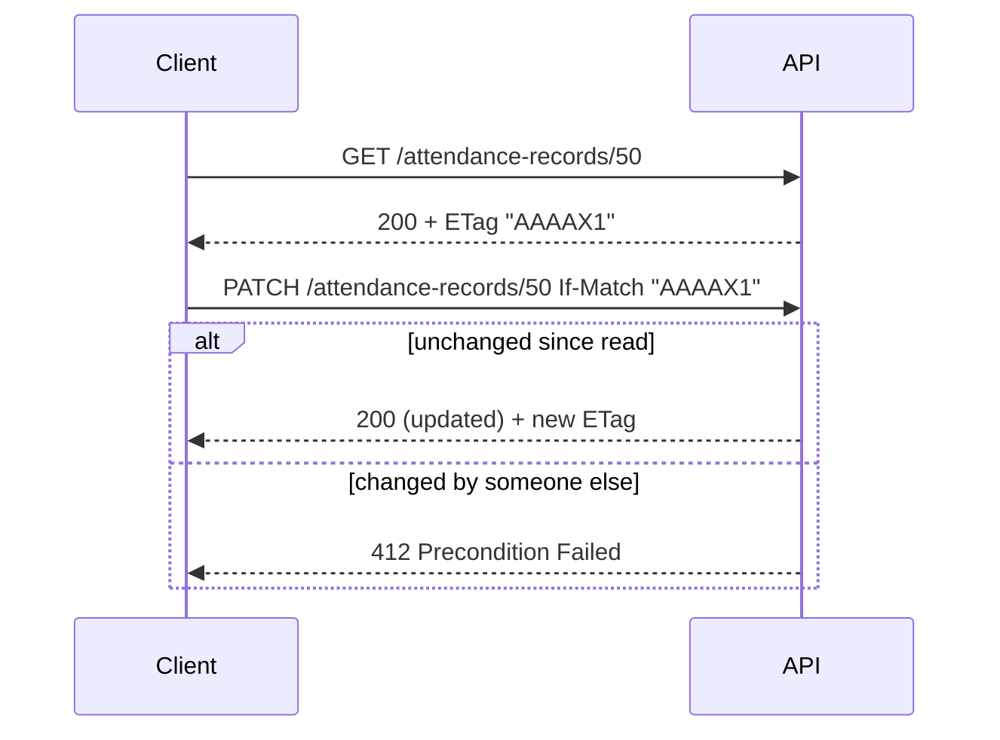

# 05 — API Specification

## Enterprise Time & Attendance Management System

| Field | Value |
|---|---|
| **Document Title** | API Specification |
| **Project** | Enterprise Time & Attendance Management System (TAMS) |
| **Document ID** | TAMS-API-005 |
| **Version** | 1.0 (Draft for Approval) |
| **Status** | Awaiting Approval |
| **Author** | Principal Software Architect (AI) |
| **Owner** | Solution Architect / Development Lead |
| **Date** | 2026-07-09 |
| **Classification** | Internal — Confidential |
| **Style** | RESTful HTTP/JSON over HTTPS |
| **Standards** | **REST (Richardson Maturity L2)**, **RFC 9110** (HTTP semantics), **RFC 7807 / RFC 9457** (Problem Details), **RFC 6749** (OAuth2 concepts) / JWT (RFC 7519), **OpenAPI 3.1** (machine contract), semantic versioning |
| **Predecessor Docs** | `01`–`04` (all approved) |
| **Successor Docs** | `06_SECURITY.md`, `07_CODING_STANDARDS.md`, `08_UI_UX.md` |

> **Scope of this document.** This is the **HTTP contract** between the React SPA (and any future client) and the ASP.NET Core 8 API — resources, URIs, methods, request/response shapes (DTOs), status codes, error format, auth, pagination, filtering, versioning, and idempotency. It realises the SRS functional requirements (`02 §4`) over the schema in `04`.
>
> **Boundary with other docs.** Endpoint *behaviour* and *contract* are authoritative here. The **security control set** (token lifetime policy, key management, threat mitigations) is owned by `06_SECURITY.md`; this doc states *what the client sends/receives*. Field-level validation *rules* trace to SRS acceptance criteria; the *implementation* (FluentValidation) is `07`. The canonical machine-readable contract is the **OpenAPI 3.1** document served by the API (`/swagger`); this markdown is the human specification and the two must stay in sync (§16).

---

## Document Control

### Revision History

| Version | Date | Author | Description |
|---|---|---|---|
| 1.0 | 2026-07-09 | AI Architect | First complete API specification derived from approved DB design v1.0 |

### Approval Sign-off

| Role | Name | Signature | Date |
|---|---|---|---|
| Solution Architect | _TBD_ | | |
| Development Lead | _TBD_ | | |
| Frontend Lead | _TBD_ | | |
| Security Lead | _TBD_ | | |

---

## Table of Contents

1. [API Design Principles](#1-api-design-principles)
2. [Conventions](#2-conventions)
3. [Versioning Strategy](#3-versioning-strategy)
4. [Authentication & Authorization](#4-authentication--authorization)
5. [Standard Request/Response Model](#5-standard-requestresponse-model)
6. [Error Handling (Problem Details)](#6-error-handling-problem-details)
7. [Pagination, Filtering, Sorting](#7-pagination-filtering-sorting)
8. [Idempotency & Concurrency](#8-idempotency--concurrency)
9. [Resource Catalogue (overview)](#9-resource-catalogue-overview)
10. [Endpoint Specifications](#10-endpoint-specifications)
11. [Rate Limiting & Throttling](#11-rate-limiting--throttling)
12. [Webhooks / Realtime (device events)](#12-webhooks--realtime-device-events)
13. [OpenAPI & Documentation](#13-openapi--documentation)
14. [Non-Functional API Requirements](#14-non-functional-api-requirements)
15. [Traceability (SRS → Endpoints)](#15-traceability-srs--endpoints)
16. [Glossary](#16-glossary)
17. [Documentation Review Checklist](#17-documentation-review-checklist)

---

# 1. API Design Principles

| ID | Principle | Consequence |
|---|---|---|
| API-01 | **Resource-oriented** — nouns, not verbs, in URIs | `/employees`, not `/getEmployees` |
| API-02 | **HTTP semantics honoured** (RFC 9110) — correct methods & status codes | GET safe/idempotent; POST creates; PUT/PATCH update; DELETE deactivates |
| API-03 | **Consistent envelope & errors** | One response shape family; RFC 9457 problem details |
| API-04 | **Secure by default** — deny unless authorized | Every endpoint requires JWT + permission unless explicitly public |
| API-05 | **Stateless** — no server session | JWT carries identity; 12-Factor (AP-06) |
| API-06 | **Versioned** — no breaking change without a new version | `/api/v1` |
| API-07 | **Predictable pagination/filtering** across all collections | Uniform query contract |
| API-08 | **Idempotent where it matters** — safe retries | Idempotency-Key on unsafe writes; concurrency via ETag |
| API-09 | **Least data** — DTOs expose only what's needed | No leaking internal columns/PII beyond policy |
| API-10 | **Documented** — OpenAPI 3.1 always current | Contract-first mindset |

**Decision — DTOs at the boundary, never entities.** The API exposes purpose-built request/response DTOs (mapped via AutoMapper), never EF entities. This decouples the contract from the schema (`04`), prevents over-posting/PII leakage (API-09), and lets the database evolve without breaking clients — the boundary discipline from `03 §7`.

---

# 2. Conventions

| Aspect | Convention | Example |
|---|---|---|
| Base URL | `https://{host}/api/v{n}` | `https://tams.local/api/v1` |
| Resource collection | plural, kebab where multi-word | `/employees`, `/attendance-records` |
| Resource item | `/collection/{id}` | `/employees/123` |
| Sub-resource | nested under parent | `/employees/123/enrollments` |
| Actions (non-CRUD) | sub-path verb sparingly | `/attendance-records/123:recalculate` |
| Media type | `application/json; charset=utf-8` | |
| Field casing | `camelCase` in JSON | `firstName`, `workedMinutes` |
| Timestamps | ISO 8601 **UTC** | `2026-07-09T08:30:00Z` |
| Dates | ISO date | `2026-07-09` |
| Durations | integer minutes (fields named `*Minutes`) | `workedMinutes: 480` |
| IDs | numeric string or number (surrogate PK) | `123` |
| Booleans | `true`/`false` | |
| Correlation | `X-Correlation-Id` request/response header | GUID |

**Decision — UTC on the wire, camelCase JSON.** The API transmits UTC (matching DB storage, `04 DP-07`); the client localises for display (`08_UI_UX.md`). camelCase JSON is the JavaScript/React norm and is applied uniformly so the frontend needs no per-endpoint casing logic.

---

# 3. Versioning Strategy

| Decision | Choice | Rationale |
|---|---|---|
| Scheme | **URI path versioning** `/api/v1` | Explicit, cache-friendly, unambiguous for clients |
| Change policy | Additive changes are non-breaking (no version bump); breaking changes → new version | Protects existing clients (API-06) |
| Breaking change examples | removing/renaming a field, changing a type, changing status-code semantics | |
| Deprecation | `Deprecation` + `Sunset` headers; documented lead time | Orderly migration |

**Decision — URI versioning over header versioning.** For an internal enterprise API consumed primarily by our own SPA, URI versioning is the most transparent and debuggable option (visible in logs, browser, curl). Header-based versioning adds indirection with no benefit at this scale (KISS).

---

# 4. Authentication & Authorization

## 4.1 Model

- **Authentication:** JWT **Bearer** access tokens (RFC 7519) + rotating **refresh tokens**. Access token short-lived; refresh token exchanged for new access token. (Exact lifetimes/keys → `06_SECURITY.md`.)
- **Authorization:** permission-based (SRS §4.1 capability matrix); the API enforces a **permission claim** per operation, deny-by-default (API-04).
- **Transport:** HTTPS/TLS only (CM-01).

## 4.2 Auth endpoints

| Method | Path | Purpose | Auth |
|---|---|---|---|
| POST | `/api/v1/auth/login` | Exchange credentials for tokens | Public |
| POST | `/api/v1/auth/refresh` | Exchange refresh token for new access token | Public (valid refresh token) |
| POST | `/api/v1/auth/logout` | Revoke refresh token | Bearer |
| GET | `/api/v1/auth/me` | Current user + permissions | Bearer |

### `POST /auth/login`

**Request**
```json
{ "userName": "nadia.hr", "password": "••••••••" }
```
**200 Response**
```json
{
  "accessToken": "eyJhbGciOi...",
  "tokenType": "Bearer",
  "expiresIn": 900,
  "refreshToken": "def502...",
  "user": { "id": 12, "userName": "nadia.hr", "roles": ["HROfficer"],
            "permissions": ["Employee.Read","Employee.Write","Attendance.Correct"] }
}
```
**401** on bad credentials (generic message — no user enumeration). **423/429** on lockout/throttle (FR-AUTH-005).

**Decision — return permissions to the client.** The SPA uses the permission list only to *hide/disable* UI it can't use (UX). Authorization is **still enforced server-side on every call** (API-04) — the client list is a convenience, never the security boundary. This prevents both a clumsy UX and the classic "trust the client" vulnerability.

## 4.3 Authorization behaviour

| Situation | Status |
|---|---|
| No/invalid token | `401 Unauthorized` |
| Valid token, missing permission | `403 Forbidden` |
| Valid token, out-of-scope data (e.g. manager other team) | `403` or filtered empty per rule (BR-050) |

---

# 5. Standard Request/Response Model

## 5.1 Single resource
Returned as the resource DTO directly (no redundant wrapper) with appropriate status + headers (`ETag`, `Location` on create).

## 5.2 Collection (paged) envelope
```json
{
  "items": [ { /* dto */ } ],
  "page": 1,
  "pageSize": 20,
  "totalCount": 137,
  "totalPages": 7
}
```

## 5.3 Standard status codes (RFC 9110)

| Code | Meaning | Used for |
|---|---|---|
| 200 OK | Success with body | GET, update, action |
| 201 Created | Resource created | POST create (+ `Location`) |
| 204 No Content | Success, no body | DELETE/deactivate, some actions |
| 400 Bad Request | Validation/semantic error | Invalid input (Problem Details) |
| 401 Unauthorized | Not authenticated | Missing/invalid token |
| 403 Forbidden | Authenticated, not permitted | Missing permission/scope |
| 404 Not Found | Resource absent | Unknown id |
| 409 Conflict | State/uniqueness conflict | Duplicate business key, concurrency |
| 412 Precondition Failed | ETag mismatch | Optimistic concurrency |
| 422 Unprocessable | Semantically invalid | Business-rule violation |
| 429 Too Many Requests | Throttled | Rate limit / brute force |
| 500 Internal Server Error | Unexpected | Never leaks details (§6) |
| 503 Service Unavailable | Dependency down | e.g. device subsystem |

**Decision — 409 vs 422 discipline.** `409 Conflict` is reserved for *state* conflicts (duplicate `EmployeeNo`, concurrency/ETag) and `422` for *business-rule* rejections (e.g. leave beyond balance). Distinguishing them lets the SPA respond meaningfully (retry vs. show rule message) instead of treating every non-400 the same.

---

# 6. Error Handling (Problem Details, RFC 9457)

All errors use **application/problem+json**. No stack traces or internal details ever leave the API (OWASP; `06`).

**400 validation example**
```json
{
  "type": "https://tams/errors/validation",
  "title": "One or more validation errors occurred.",
  "status": 400,
  "detail": "Request validation failed.",
  "instance": "/api/v1/employees",
  "correlationId": "6b1e...-...",
  "errors": {
    "employeeNo": ["EmployeeNo is required."],
    "primaryDepartmentId": ["Department 999 does not exist."]
  }
}
```

**409 conflict example**
```json
{
  "type": "https://tams/errors/conflict",
  "title": "Resource conflict.",
  "status": 409,
  "detail": "An employee with EmployeeNo 'E1001' already exists.",
  "instance": "/api/v1/employees",
  "correlationId": "6b1e...-..."
}
```

**Decision — RFC 9457 everywhere + correlation id.** A single, standard error shape means the SPA has exactly one error parser, and every error carries the `correlationId` that ties the client failure to the Serilog entry (`03 §9`) — turning "it broke" into a one-lookup diagnosis. The global exception middleware (ADR-007) produces this uniformly, so no handler can leak internals.

---

# 7. Pagination, Filtering, Sorting

| Concern | Contract | Default |
|---|---|---|
| Pagination | `?page={n}&pageSize={m}` | page=1, pageSize=20, max=100 |
| Sorting | `?sort=field,-field2` (`-` = desc) | resource-defined |
| Filtering | explicit named params per resource | none |
| Date range | `?fromDate=&toDate=` (ISO) | required for large fact queries |
| Search | `?q=` where supported | |

**Decision — explicit named filters, not a generic query language.** Rather than exposing an OData/arbitrary-filter surface, each collection documents specific filter params (e.g. attendance by `departmentId`, `employeeId`, `fromDate`, `toDate`, `status`). This keeps the API safe (no unbounded/injection-prone queries), performant (maps to the indexes in `04 §8`), and simple for the SPA (API-07/KISS). A hard `pageSize` cap protects the high-volume attendance/audit tables.

---

# 8. Idempotency & Concurrency

## 8.1 Idempotency-Key (unsafe writes)
Clients may send `Idempotency-Key: <guid>` on `POST` operations that create records (e.g. leave request, manual punch). Re-sending the same key returns the original result instead of creating a duplicate — safe retries over flaky networks (aligns with the DB idempotency in `04 §11`).

## 8.2 Optimistic concurrency (ETag)
Mutable resources return an `ETag` (from `RowVersion`, `04 DP-09`). Updates must send `If-Match: <etag>`. Mismatch → `412 Precondition Failed`, preventing lost updates on attendance corrections (FR-ATT-006).



**Decision — ETag/If-Match for concurrency, Idempotency-Key for retries.** These solve *different* problems: If-Match stops two users overwriting each other (correctness); Idempotency-Key stops one user's retried request creating duplicates (resilience). Both are needed because attendance is edited by humans *and* fed by an unreliable network.

---

# 9. Resource Catalogue (overview)

| Resource | Base path | Primary methods | SRS trace |
|---|---|---|---|
| Auth | `/auth/*` | POST/GET | FR-AUTH-* |
| Users | `/users` | CRUD + roles | FR-ADM-001 |
| Roles/Permissions | `/roles`, `/permissions` | GET/assign | FR-AUTH-003 |
| Employees | `/employees` | CRUD (soft) + enrollments | FR-EMP-* |
| Departments | `/departments` | CRUD (soft) | FR-DEP-* |
| Shifts | `/shifts` | CRUD | FR-SFT-001/002 |
| Shift Assignments | `/shift-assignments` | CRUD (effective-dated) | FR-SFT-003 |
| Devices | `/devices` | CRUD + test + sync | FR-ZK-010, FR-ADM-002 |
| Punches | `/punches` | GET, POST (manual) | FR-ATT-001 |
| Attendance Records | `/attendance-records` | GET, PATCH, recalc | FR-ATT-002/006/009 |
| Attendance Exceptions | `/attendance-exceptions` | GET, resolve | FR-ATT-005 |
| Leave Types | `/leave-types` | CRUD | FR-LV (config) |
| Leave Requests | `/leave-requests` | CRUD + approve/reject | FR-LV-001/002 |
| Leave Balances | `/leave-balances` | GET | FR-LV-003 |
| Reports | `/reports/*` | GET + export | FR-RPT-* |
| Dashboards | `/dashboards/*` | GET | FR-RPT-001 |
| Config | `/configuration` | GET/PUT | FR-ADM-003 |
| Audit | `/audit-entries` | GET (Auditor) | FR-AUD-005 |
| Health | `/health` | GET | NFR-26 |

---

# 10. Endpoint Specifications

> Representative endpoints per resource with method, permission, key request/response, and status codes. Full parameter lists live in the OpenAPI contract (§13). Every non-public endpoint requires a valid Bearer token; the **Permission** column names the required permission claim.

## 10.1 Employees (`FR-EMP-*`)

| Method | Path | Permission | Success | Errors |
|---|---|---|---|---|
| GET | `/employees` | `Employee.Read` | 200 (paged) | 401/403 |
| GET | `/employees/{id}` | `Employee.Read` | 200 + ETag | 401/403/404 |
| POST | `/employees` | `Employee.Write` | 201 + Location | 400/401/403/409 |
| PUT | `/employees/{id}` | `Employee.Write` | 200 | 400/403/404/409/412 |
| DELETE | `/employees/{id}` | `Employee.Write` | 204 (soft deactivate) | 403/404/409 |
| GET | `/employees/{id}/enrollments` | `Employee.Read` | 200 | 403/404 |
| POST | `/employees/{id}/enrollments` | `Employee.Write` | 201 | 400/403/404/409 |

**Create request**
```json
{ "employeeNo": "E1001", "firstName": "Ann", "lastName": "Silva",
  "email": "ann@corp.com", "primaryDepartmentId": 3, "hireDate": "2026-01-15" }
```
**201 response** (DTO + `Location: /api/v1/employees/123`, `ETag`)
```json
{ "id": 123, "employeeNo": "E1001", "firstName": "Ann", "lastName": "Silva",
  "email": "ann@corp.com", "primaryDepartmentId": 3, "status": "Active", "isActive": true }
```
- `409` if `employeeNo` exists (`UQ_Employee_EmployeeNo`).
- `400` if `primaryDepartmentId` invalid (BRULE-01).
- `DELETE` is **soft** (sets `IsActive=false`) — never physical (DP-04).

## 10.2 Departments (`FR-DEP-*`)

| Method | Path | Permission | Notes |
|---|---|---|---|
| GET | `/departments` | `Department.Read` | supports `?parentId=` |
| POST | `/departments` | `Department.Write` | 409 on dup `code`; cycle rejected |
| PUT | `/departments/{id}` | `Department.Write` | |
| DELETE | `/departments/{id}` | `Department.Write` | 409 if active employees (FR-DEP-003) |

## 10.3 Shifts & Assignments (`FR-SFT-*`)

| Method | Path | Permission | Notes |
|---|---|---|---|
| GET/POST/PUT | `/shifts` | `Shift.Read`/`Shift.Write` | overnight allowed (End<Start) |
| GET/POST | `/shift-assignments` | `Shift.Write` | effective-dated; overlap → 409 |

**Assignment request**
```json
{ "shiftId": 2, "employeeId": 123, "effectiveFrom": "2026-08-01", "effectiveTo": null }
```
- `422` if both `employeeId` and `departmentId` set (CK-02).

## 10.4 Devices (`FR-ZK-010`, `FR-ADM-002`)

| Method | Path | Permission | Purpose |
|---|---|---|---|
| GET | `/devices` | `Device.Read` | list + status/`lastSeenUtc` |
| POST | `/devices` | `Device.Manage` | register |
| PUT | `/devices/{id}` | `Device.Manage` | edit/enable/disable |
| POST | `/devices/{id}:test-connection` | `Device.Manage` | 200 ok / 503 unreachable |
| POST | `/devices/{id}:sync-now` | `Device.Manage` | trigger on-demand sync (worker) |
| GET | `/devices/{id}/sync-state` | `Device.Read` | watermark & failure count |

**Decision — device sync is *triggered*, not *performed*, by the API.** `:sync-now` enqueues/signals the background worker (ADR-002) rather than downloading synchronously in the request. This keeps the reliability-critical capture in the resilient worker (never blocking an HTTP request) and returns `202 Accepted` semantics — the API orchestrates, the worker executes.

## 10.5 Punches & Attendance (`FR-ATT-*`)

| Method | Path | Permission | Notes |
|---|---|---|---|
| GET | `/punches` | `Attendance.Read` | filter by employee/device/date range (required) |
| POST | `/punches` | `Attendance.Write` | **manual** punch entry; `Idempotency-Key` supported; raw+immutable |
| GET | `/attendance-records` | `Attendance.Read` | filter dept/employee/date/status; role-scoped |
| GET | `/attendance-records/{id}` | `Attendance.Read` | 200 + ETag |
| PATCH | `/attendance-records/{id}` | `Attendance.Correct` | correction; requires `If-Match`; **reason mandatory** |
| POST | `/attendance-records/{id}:recalculate` | `Attendance.Correct` | re-run calculation (FR-ATT-009) |
| GET | `/attendance-exceptions` | `Attendance.Read` | `?isResolved=false` worklist |
| POST | `/attendance-exceptions/{id}:resolve` | `Attendance.Correct` | mark resolved + notes |

**Correction (PATCH) request**
```json
{ "firstInUtc": "2026-07-09T08:05:00Z", "reason": "Employee forgot to punch in; CCTV confirmed 08:05." }
```
- `reason` is **required** (BRULE-05); original value preserved as an `AttendanceCorrection` row (`04 §6.5`).
- `412` if `If-Match` ETag stale.
- Raw `PunchTransaction` rows are **never** updated/deleted via any endpoint (immutability, DP-05) — corrections adjust the *record*, not the *fact*.

**Decision — corrections are PATCH-with-reason on the *record*, and raw punches have no PUT/DELETE.** The API surface physically prevents tampering with source facts: there is simply no endpoint to mutate a `PunchTransaction`. Corrections are auditable adjustments to the derived record, mandatorily justified. This is the API-level enforcement of accuracy (G-01) and audit (G-05).

## 10.6 Leave (`FR-LV-*`)

| Method | Path | Permission | Notes |
|---|---|---|---|
| GET | `/leave-requests` | `Leave.Read` | role-scoped (own / team / all) |
| POST | `/leave-requests` | `Leave.Request` | `Idempotency-Key` supported |
| POST | `/leave-requests/{id}:approve` | `Leave.Approve` | 422 if beyond balance (BRULE-07) |
| POST | `/leave-requests/{id}:reject` | `Leave.Approve` | reason |
| POST | `/leave-requests/{id}:cancel` | `Leave.Request` (owner) | state rules |
| GET | `/leave-balances` | `Leave.Read` | `?employeeId=&year=` |

## 10.7 Reports & Dashboards (`FR-RPT-*`)

| Method | Path | Permission | Notes |
|---|---|---|---|
| GET | `/dashboards/attendance-summary` | `Report.Read` | near-real-time; role-scoped |
| GET | `/reports/daily-attendance` | `Report.Read` | filters; paged |
| GET | `/reports/exceptions` | `Report.Read` | |
| GET | `/reports/payroll-export` | `Report.Export` | `?fromDate=&toDate=`; returns file (CSV/Excel) per OQ-04 |

- Export endpoints return a downloadable file (`Content-Disposition`) and are **audited** (FR-RPT-007).
- Role scoping enforced server-side (a manager cannot pull another team — API-04/BR-050).

## 10.8 Configuration & Audit

| Method | Path | Permission | Notes |
|---|---|---|---|
| GET | `/configuration` | `Config.Read` | rules-as-data |
| PUT | `/configuration/{key}` | `Config.Manage` | validated; audited (FR-ADM-004/005) |
| GET | `/audit-entries` | `Audit.Read` | Auditor/Admin only; filter entity/date; **read-only** (no write endpoints exist) |

**Decision — audit API is read-only by design.** There are deliberately **no** POST/PUT/DELETE endpoints on `/audit-entries`. Audit is written only internally by the `SaveChanges` interceptor (`04 §10`) and readable only by Auditor/Admin. Tamper-evidence (FR-AUD-002) is enforced by the *absence* of a mutation surface, not just by permissions.

## 10.9 Health

| Method | Path | Auth | Notes |
|---|---|---|---|
| GET | `/health/live` | Public | liveness |
| GET | `/health/ready` | Public/internal | readiness incl. DB + worker/device subsystem status (NFR-26) |

---

# 11. Rate Limiting & Throttling

| Scope | Policy | Rationale |
|---|---|---|
| `/auth/login` | Strict per-IP + per-account throttle | Brute-force defence (FR-AUTH-005) |
| Authenticated APIs | Per-principal fair-use limit | Protect backend/DB |
| Export/report | Lower concurrency limit | Heavy queries protected |
| Exceeded | `429` + `Retry-After` header | Standard client backoff |

**Decision — tiered limits, strictest on auth and exports.** Login is the primary attack surface (brute force) and exports are the heaviest queries; both get the tightest limits, while ordinary CRUD stays generous. This targets protection where risk/cost concentrate without harming normal use.

---

# 12. Webhooks / Realtime (device events)

Realtime device punches (FR-ZK-004) are ingested by the **worker**, not pushed to the API by devices. For pushing live updates to the **SPA dashboards** (FR-RPT-001), the API may expose a server-push channel:

| Option | Use | Note |
|---|---|---|
| **Polling** (GET dashboard) | Baseline, always available | Simple; honours pageSize/scope |
| **SignalR (WebSocket) channel** | Optional live dashboard | Auth via JWT; scoped to permitted data |

**Decision — polling first, SignalR as an additive enhancement.** Near-real-time (≤60s, NFR-03) is satisfiable by lightweight polling of the dashboard endpoint, which needs no extra infrastructure. A SignalR channel is offered as an *optional* upgrade for true live updates — added only if the freshness requirement tightens (YAGNI). Devices never call the API directly; the worker owns device I/O (ADR-002), preserving the security and reliability boundary.

---

# 13. OpenAPI & Documentation

| Item | Approach |
|---|---|
| Contract format | **OpenAPI 3.1** generated by the API |
| Interactive docs | Swagger UI at `/swagger` (non-prod; gated in prod) |
| Source of truth | OpenAPI doc is the machine contract; this markdown is the human spec |
| Sync | OpenAPI regenerated on build; PR review checks contract diffs |
| Examples | Request/response examples annotated on DTOs |
| Auth in docs | Bearer scheme documented; "Authorize" in Swagger |

**Decision — code-generated OpenAPI as the canonical machine contract.** Generating OpenAPI from the annotated API guarantees the machine contract never drifts from the running code, and lets the frontend generate a typed client (reducing integration bugs). This human document explains *intent and decisions*; the OpenAPI file is the *precise, testable* contract (`10_TESTING_STRATEGY.md` contract tests validate against it).

---

# 14. Non-Functional API Requirements

| ID | Requirement | Trace |
|---|---|---|
| NAPI-01 | HTTPS/TLS only; HSTS in prod | CM-01, NFR-14 |
| NAPI-02 | P95 response ≤ 500 ms under normal load (§ SRS NFR-01) | NFR-01 |
| NAPI-03 | All inputs validated; no over-posting | CONS-06, API-09 |
| NAPI-04 | No sensitive data in URLs, logs, or errors | OWASP, `06` |
| NAPI-05 | Correlation id on every request/response | FR-AUD-003 |
| NAPI-06 | Stateless; horizontally scalable | AP-06 |
| NAPI-07 | Consistent RFC 9457 errors | §6 |
| NAPI-08 | CORS restricted to known client origins | `06` |
| NAPI-09 | Structured request logging (Serilog), excluding secrets | NFR-25 |
| NAPI-10 | Backward compatibility within a major version | API-06 |

---

# 15. Traceability (SRS → Endpoints)

| SRS Functional Req | Endpoint(s) |
|---|---|
| FR-AUTH-001/002/005/006 | `/auth/login`,`/auth/refresh`,`/auth/logout`,`/auth/me` |
| FR-AUTH-003 (authz) | permission checks on every endpoint (§4.3) |
| FR-EMP-001…007 | `/employees*`, `/employees/{id}/enrollments` |
| FR-DEP-001…004 | `/departments*` |
| FR-SFT-001…006 | `/shifts*`, `/shift-assignments*` |
| FR-ATT-001 | `POST /punches`, `GET /punches` |
| FR-ATT-002/005/006/009 | `/attendance-records*`, `/attendance-exceptions*` |
| FR-ZK-004/010/011 | `/devices*`, `:test-connection`, `:sync-now`, `/sync-state` |
| FR-LV-001…006 | `/leave-requests*`, `/leave-types*`, `/leave-balances` |
| FR-RPT-001…007 | `/dashboards/*`, `/reports/*`, `payroll-export` |
| FR-ADM-001/003/004/005 | `/users*`, `/roles*`, `/configuration*` |
| FR-AUD-005 | `GET /audit-entries` (read-only) |
| NFR-26 | `/health/*` |

---

# 16. Glossary

Inherits prior docs. API-specific additions:

| Term | Definition |
|---|---|
| **DTO** | Data Transfer Object — the API's request/response shape. |
| **Envelope** | Standard wrapper for paged collections (§5.2). |
| **Problem Details** | RFC 9457 machine-readable error format. |
| **ETag / If-Match** | Optimistic-concurrency validators. |
| **Idempotency-Key** | Client-supplied key making a POST safely retryable. |
| **Bearer token** | JWT sent in `Authorization: Bearer`. |
| **OpenAPI** | Machine-readable API contract (v3.1). |
| **Correlation Id** | Id linking a request to its logs/audit. |
| **`:action`** | Non-CRUD action sub-path (e.g. `:recalculate`). |

---

# 17. Documentation Review Checklist

**Reviewer instructions:** mark ✅ Pass / ⚠️ Needs change / ❌ Fail. Approved when all **Mandatory** items pass.

### 17.1 Completeness

| # | Check | Mandatory | Status |
|---|---|---|---|
| C-01 | Design principles & conventions defined | ✔ | ☐ |
| C-02 | Versioning strategy defined | ✔ | ☐ |
| C-03 | Auth (JWT) & authorization (permissions) specified | ✔ | ☐ |
| C-04 | Standard response model & status codes defined | ✔ | ☐ |
| C-05 | Error format (RFC 9457) specified | ✔ | ☐ |
| C-06 | Pagination/filtering/sorting defined | ✔ | ☐ |
| C-07 | Idempotency & concurrency defined | ✔ | ☐ |
| C-08 | Resource catalogue complete vs SRS | ✔ | ☐ |
| C-09 | Endpoint specs with methods/permissions/codes | ✔ | ☐ |
| C-10 | Rate limiting addressed | ✔ | ☐ |
| C-11 | Realtime/webhook approach defined | ✔ | ☐ |
| C-12 | OpenAPI/documentation approach defined | ✔ | ☐ |
| C-13 | Non-functional API requirements listed | ✔ | ☐ |

### 17.2 Quality & Soundness

| # | Check | Mandatory | Status |
|---|---|---|---|
| Q-01 | Correct HTTP semantics (methods/status) | ✔ | ☐ |
| Q-02 | DTOs at boundary (no entity/PII leakage) | ✔ | ☐ |
| Q-03 | Raw punches have no mutation endpoint (immutability) | ✔ | ☐ |
| Q-04 | Audit API is read-only | ✔ | ☐ |
| Q-05 | Corrections require reason + concurrency check | ✔ | ☐ |
| Q-06 | Server-side authorization is the security boundary | ✔ | ☐ |
| Q-07 | Every significant choice explained | ✔ | ☐ |
| Q-08 | No over-engineering (polling-first, URI versioning) | ✔ | ☐ |

### 17.3 Alignment & Traceability

| # | Check | Mandatory | Status |
|---|---|---|---|
| A-01 | Every SRS functional area has endpoint(s) | ✔ | ☐ |
| A-02 | Consistent with DB design (`04`) keys/constraints | ✔ | ☐ |
| A-03 | Device sync delegated to worker (ADR-002) | ✔ | ☐ |
| A-04 | Security details deferred to `06` consistently | ✔ | ☐ |
| A-05 | OQ-dependent items (export format) flagged | ✔ | ☐ |
| A-06 | Traceability table complete | ✔ | ☐ |

### 17.4 Governance

| # | Check | Mandatory | Status |
|---|---|---|---|
| G-01 | Document control & versioning present | ✔ | ☐ |
| G-02 | Approval sign-off present | ✔ | ☐ |
| G-03 | Ready to proceed to `06_SECURITY.md` on approval | ✔ | ☐ |

---

### ✅ Approval Gate

> **This API Specification (v1.0) is submitted for your approval.** I will **not** begin `06_SECURITY.md` until you approve or request changes.

**Please respond with one of:**
1. **Approved** → I proceed to `06_SECURITY.md`.
2. **Approved with changes** → list changes; I revise then proceed.
3. **Changes required** → list changes; I revise and resubmit this document only.

*End of Document — TAMS-API-005 v1.0*
