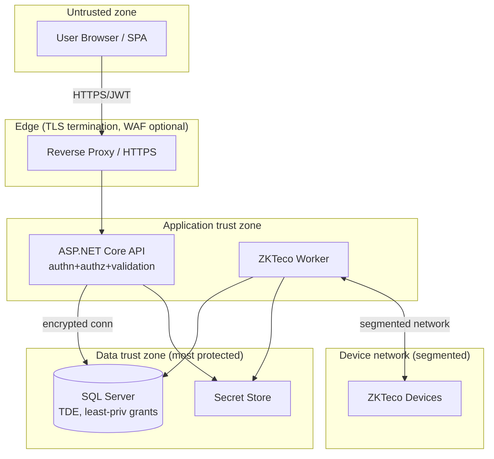

# 06 — Security Design & Controls

## Enterprise Time & Attendance Management System

| Field | Value |
|---|---|
| **Document Title** | Security Design & Controls |
| **Project** | Enterprise Time & Attendance Management System (TAMS) |
| **Document ID** | TAMS-SEC-006 |
| **Version** | 1.0 (Draft for Approval) |
| **Status** | Awaiting Approval |
| **Author** | Principal Software Architect (AI) |
| **Owner** | Security Lead / Solution Architect |
| **Date** | 2026-07-09 |
| **Classification** | Internal — Confidential (Security-Sensitive) |
| **Standards** | **OWASP Top 10 (2021)**, **OWASP ASVS**, **NIST SP 800-63B** (authentication), **STRIDE** (threat modelling), **12-Factor (III config/secrets)**, **ISO/IEC 27001** control themes |
| **Predecessor Docs** | `01`–`05` (all approved) |
| **Successor Docs** | `07_CODING_STANDARDS.md`, `11_DEPLOYMENT.md` |

> **Scope of this document.** This is the **authoritative security design** for TAMS: authentication, authorization, data protection, secrets, threat model, OWASP mitigations, logging/audit security, device-integration security, and the security testing/verification approach. It **owns** the controls that `04` and `05` deferred here (token lifetimes, key management, encryption/masking policy, CORS).
>
> **Boundary with other docs.** Security *policy and controls* are authoritative here. Their *code-level implementation conventions* are in `07_CODING_STANDARDS.md`; their *runtime/infra configuration* (TLS certs, firewall, secret store provisioning) is in `11_DEPLOYMENT.md`; ongoing *operational security* (patching, monitoring, incident response runbooks) is in `14_MAINTENANCE_GUIDE.md`. This document defines **what must be true**; those define **how it is wired and operated**.
>
> **Values pending stakeholder input**: the data-protection regime and retention periods (**OQ-05**) determine exact PII handling and log-retention numbers; where unresolved, this doc fixes the *control and its verification*, marking the numeric policy *(TBD — set before P6)*.

---

## Document Control

### Revision History

| Version | Date | Author | Description |
|---|---|---|---|
| 1.0 | 2026-07-09 | AI Architect | First complete security design derived from approved API spec v1.0 |

### Approval Sign-off

| Role | Name | Signature | Date |
|---|---|---|---|
| Security Lead | _TBD_ | | |
| Solution Architect | _TBD_ | | |
| Development Lead | _TBD_ | | |
| Data Protection Officer | _TBD_ | | |

---

## Table of Contents

1. [Security Objectives & Principles](#1-security-objectives--principles)
2. [Security Architecture Overview](#2-security-architecture-overview)
3. [Threat Model (STRIDE)](#3-threat-model-stride)
4. [Authentication](#4-authentication)
5. [Authorization (RBAC / Permissions)](#5-authorization-rbac--permissions)
6. [Session & Token Management](#6-session--token-management)
7. [Input Validation & Output Encoding](#7-input-validation--output-encoding)
8. [Data Protection (At Rest, In Transit, In Use)](#8-data-protection-at-rest-in-transit-in-use)
9. [Secrets & Key Management](#9-secrets--key-management)
10. [OWASP Top 10 (2021) Mitigation Matrix](#10-owasp-top-10-2021-mitigation-matrix)
11. [Logging, Audit & Monitoring Security](#11-logging-audit--monitoring-security)
12. [Device Integration Security (ZKTeco)](#12-device-integration-security-zkteco)
13. [API & Transport Security](#13-api--transport-security)
14. [Privacy & Compliance](#14-privacy--compliance)
15. [Security Testing & Verification](#15-security-testing--verification)
16. [Incident Response (Design Hooks)](#16-incident-response-design-hooks)
17. [Traceability (Requirements → Controls)](#17-traceability-requirements--controls)
18. [Glossary](#18-glossary)
19. [Documentation Review Checklist](#19-documentation-review-checklist)

---

# 1. Security Objectives & Principles

## 1.1 Objectives (CIA + accountability)

| Objective | Meaning for TAMS |
|---|---|
| **Confidentiality** | Employee PII and attendance data seen only by authorised roles |
| **Integrity** | Attendance facts, records and audit trail cannot be tampered with |
| **Availability** | Capture & core functions resilient (ties to reliability, `03 §13`) |
| **Accountability** | Every sensitive action attributable to an actor (audit) |
| **Non-repudiation** | Corrections/approvals provably tied to who did them |

## 1.2 Principles

| ID | Principle | Consequence |
|---|---|---|
| SP-01 | **Secure by Design** | Security decided in design (this doc), not bolted on |
| SP-02 | **Defense in Depth** | Controls layered: transport, app, data, DB grants |
| SP-03 | **Least Privilege** | Users, services, DB principals get the minimum |
| SP-04 | **Deny by Default** | Access denied unless explicitly granted (API-04) |
| SP-05 | **Fail Securely** | Errors deny access & leak nothing (RFC 9457, `05 §6`) |
| SP-06 | **Complete Mediation** | Every request re-checked server-side, no caching of decisions |
| SP-07 | **Minimise Attack Surface** | No unused endpoints; no mutation surface on audit/facts |
| SP-08 | **Zero Trust in Client** | Client claims never trusted for authorization |
| SP-09 | **Auditability** | Security-relevant events recorded immutably |
| SP-10 | **Data Minimisation** | Collect/expose only necessary data |

**Decision — Secure by Design is a phase-0 activity.** Because `00_PROJECT_CONTEXT.md` mandates OWASP and Secure-by-Design, security is specified *now*, before code (SP-01). Retrofitting security is the single most expensive and error-prone anti-pattern; deciding the model here means every later module inherits it.

---

# 2. Security Architecture Overview

## 2.1 Trust boundaries



**Decision — four trust zones with the data zone most protected.** Each boundary crossing is a control point: TLS at the edge, authn/authz/validation at the app, least-privilege grants + TDE at the data zone, network segmentation at the device zone. Placing the database and secret store in the innermost zone (reachable only from the app zone) means a compromised browser or device cannot reach data directly — defense in depth (SP-02).

---

# 3. Threat Model (STRIDE)

Applied to the key assets: **credentials, JWTs, attendance facts/records, audit trail, PII, device channel**.

| STRIDE | Threat | Asset | Mitigation | Trace |
|---|---|---|---|---|
| **S**poofing | Impersonate a user | Credentials/JWT | Strong hash, MFA-ready, signed JWT, lockout | §4, §6 |
| **S**poofing | Rogue device feeds fake punches | Device channel | Device allow-list, segmented network, enrolment mapping | §12 |
| **T**ampering | Alter attendance/audit | Records/Audit | Immutable facts, append-only audit, DB grants, ETag | §8, §11 |
| **T**ampering | Modify JWT claims | JWT | Signature verification; never trust client claims | §6, SP-08 |
| **R**epudiation | Deny making a correction | Audit | Mandatory reason + actor + timestamp (append-only) | §11 |
| **I**nfo disclosure | Leak PII / stack traces | PII/errors | RBAC, masking, RFC 9457 (no internals), TLS | §7, §8 |
| **I**nfo disclosure | Read data of other teams | Records | Server-side scope enforcement | §5 |
| **D**enial of service | Brute force / flood | Auth/API | Rate limiting, lockout, throttling | §4, §13 |
| **D**enial of service | Overload heavy reports | Reporting | Export throttle, pagination caps | §13, `05 §11` |
| **E**levation | Access beyond role | Authz | Deny-by-default, permission checks, no client trust | §5 |
| **E**levation | SQL injection → admin | DB | Parameterised queries (EF Core), least-priv grants | §7, §10 |

**Decision — STRIDE per asset, not per component.** Modelling threats against the *assets we must protect* (facts, audit, PII, tokens) rather than against components keeps the analysis outcome-focused: every mitigation traces to protecting something the business cares about, and the highest-value assets (attendance integrity, audit) get the most layered controls.

---

# 4. Authentication

## 4.1 Credential handling (NIST SP 800-63B aligned)

| Control | Specification | Trace |
|---|---|---|
| Password storage | One-way hash with a **memory-hard/adaptive algorithm** (e.g. PBKDF2/Argon2-class per platform support), per-user salt, work factor tuned | FR-AUTH-004 |
| No plaintext | Passwords never stored/logged/returned | SP-05, FR-AUD-004 |
| Password policy | Length-first (min length), block breached/common passwords; avoid forced arbitrary complexity | NIST 800-63B |
| Login response | Generic failure message (no user enumeration) | §3 Spoofing |
| Brute-force defence | Account lockout after N failures + per-IP throttle + exponential backoff | FR-AUTH-005 |
| MFA | **MFA-ready** design (extension point); enabling policy per stakeholder | future / OQ |
| Bootstrap admin | Seeded admin forced to change password on first login | `04 §12` |

**Decision — length-first password policy + breached-password blocking (NIST 800-63B).** Modern guidance favours longer passphrases and screening against known-breached lists over legacy "1 upper, 1 symbol, rotate every 90 days" rules, which push users toward predictable patterns. This is both more secure and more usable. The system is **MFA-ready** so a step-up can be enabled without redesign when stakeholders require it.

## 4.2 Authentication flow (security view)

```mermaid
sequenceDiagram
    participant SPA
    participant API
    participant DB
    SPA->>API: POST /auth/login (over TLS)
    API->>DB: fetch user by username (constant-time compare)
    API->>API: verify hash; check lockout
    alt success
      API->>DB: issue+store refresh token (hashed)
      API-->>SPA: access JWT (short-lived) + refresh token + audit
    else failure
      API->>DB: increment FailedLoginCount; maybe lockout
      API-->>SPA: 401 generic (audited)
    end
```

---

# 5. Authorization (RBAC / Permissions)

## 5.1 Model

Permission-based RBAC (User → Role → Permission), realising the SRS §4.1 capability matrix and the `04 Identity` schema. **Authorization policies check permission claims**, evaluated **server-side on every request** (SP-06, complete mediation).

## 5.2 Enforcement layers

| Layer | Check |
|---|---|
| Endpoint | Requires authenticated principal + specific permission (`05 §10`) |
| Data scope | Row-level scoping (e.g. manager → own team only) applied in query handlers |
| Domain | Aggregate invariants enforce business rules independent of caller |
| Database | Least-privilege grants per schema; audit/facts non-mutable |

## 5.3 Data-scope authorization (the subtle one)

Permission alone is insufficient: a Manager has `Report.Read` but only for **their team**. Scope is enforced by injecting the caller's allowed scope into every query (never by trusting a client-supplied `departmentId`).

**Decision — scope is server-derived, never client-supplied.** The classic broken-access-control bug (OWASP A01) is trusting a `departmentId`/`employeeId` from the request. TAMS derives the permitted scope from the authenticated principal and *intersects* it with any requested filter — a manager asking for another team's data gets `403`/empty, not the data. This is enforced in the application layer so no endpoint can bypass it.

---

# 6. Session & Token Management

## 6.1 JWT policy

| Parameter | Policy | Rationale |
|---|---|---|
| Access token lifetime | **Short** (≈ 15 min; *finalise before P6*) | Limits stolen-token window |
| Refresh token lifetime | Longer (≈ 7–30 days; policy TBD) | Balance UX vs risk |
| Signing | Asymmetric (RS256) or strong symmetric (HS256) with securely stored key | Integrity/non-forgeability |
| Claims | Minimal: subject, roles/permissions, expiry, issuer, audience | Data minimisation (SP-10) |
| Validation | Verify signature, issuer, audience, expiry on **every** request | SP-06 |
| Storage (client) | Access token in memory; refresh token in **HttpOnly, Secure, SameSite** cookie or secure store | Mitigate XSS token theft |
| Refresh rotation | One-time-use rotating refresh tokens; reuse detection → revoke family | Detect theft |
| Revocation | Refresh tokens stored **hashed**, revocable server-side (`04 RefreshToken`) | Logout/compromise response |

**Decision — short access token + rotating, revocable, hashed refresh token.** Pure stateless JWTs cannot be revoked; pure server sessions break statelessness (AP-06). The hybrid — short-lived access JWT (stateless, fast) plus a **hashed, rotating, server-revocable refresh token** — gives statelessness for the hot path *and* the ability to revoke on logout/compromise, with reuse-detection catching stolen refresh tokens. Storing only the **hash** of refresh tokens means a DB leak doesn't hand over usable tokens.

**Decision — refresh token in HttpOnly cookie, access token in memory.** Keeping the long-lived credential out of JavaScript reach (HttpOnly) blunts XSS token exfiltration; the short-lived access token in memory disappears on tab close. This split is the pragmatic OWASP-aligned choice for an SPA. (CSRF is then addressed via SameSite + anti-CSRF where cookies are used — §13.)

---

# 7. Input Validation & Output Encoding

| Control | Specification | Trace |
|---|---|---|
| Server-side validation | **All** inputs validated (FluentValidation) — never skipped; client validation is UX only | CONS-06, NAPI-03 |
| Allow-listing | Validate against expected type/range/format; reject unknown fields (no over-posting) | API-09 |
| SQL injection | Parameterised queries via EF Core; **no string-concatenated SQL** | A03 |
| XSS | React auto-escapes; API returns data not markup; encode any HTML contexts | A03 |
| File/report inputs | Validate export params; bound date ranges & page sizes | `05 §7` |
| Deserialization | Strict model binding; reject malformed JSON | A08 |
| Mass assignment | DTOs expose only permitted fields (no binding to entities) | `05 §1` |

**Decision — validation is a pipeline behaviour, not per-handler code.** Per ADR-007, FluentValidation runs as a MediatR pipeline behaviour so **every** command is validated before it reaches business logic — a developer physically cannot ship an unvalidated write path. This turns "never skip validation" (CONS-06) from a guideline into a structural guarantee.

---

# 8. Data Protection (At Rest, In Transit, In Use)

## 8.1 Classification

| Class | Examples | Handling |
|---|---|---|
| **Sensitive PII** | Employee name, email, national/identity ids, biometric enrolment refs | Encrypt/mask; strict RBAC; minimise |
| **Attendance data** | Punches, records | Integrity-protected; RBAC-scoped |
| **Secrets** | Password hashes, tokens, keys | Hash/encrypt; secret store; never logged |
| **Operational** | Diagnostic logs (scrubbed) | Retention-bounded; no PII beyond policy |

## 8.2 Controls by state

| State | Control | Trace |
|---|---|---|
| **In transit** | TLS 1.2+ everywhere (client↔API, API↔DB, worker↔DB); HSTS in prod | CM-01, NFR-14 |
| **At rest** | SQL Server **TDE** (whole-DB); column-level encryption for the most sensitive PII where OQ-05 requires | `04 §13`, DR-03 |
| **At rest (secrets)** | Password/token **hashes** only; keys in secret store | §9 |
| **In use** | RBAC + data-scope; masking in responses per role; data minimisation in DTOs | §5, §7 |
| **Backups** | Encrypted backups; same protection as primary | `11`, `14` |

**Decision — TDE for breadth, column encryption for depth (only where required).** TDE transparently protects the entire database against stolen files/backups with negligible app impact — the right default. Column-level encryption is heavier (breaks indexing/search on those columns) so it's applied **selectively** to the most sensitive PII only, and only where the data-protection regime (OQ-05) demands it. Applying it everywhere would be over-engineering that harms performance for little marginal gain (YAGNI + risk-based).

---

# 9. Secrets & Key Management

| Secret | Storage | Rotation |
|---|---|---|
| DB connection string | Secret store / environment (12-Factor III), **never** in source | On credential change |
| JWT signing key | Secret store; restricted access | Scheduled + on compromise |
| Device credentials | Secret store | Per policy |
| TLS certificates | Managed cert store | Before expiry (automated where possible) |
| Encryption keys (column/TDE) | DBMS key hierarchy / KMS | Per crypto policy |

**Decision — no secret ever in source or client (12-Factor III).** Every secret is injected from a secret store/environment at runtime; source control and client bundles contain **none**. This is enforceable in CI (secret scanning) and is the precondition for safe rotation — you cannot rotate a secret baked into a build. Config for dev/test/prod differs only in *values*, not code.

---

# 10. OWASP Top 10 (2021) Mitigation Matrix

| # | Risk | TAMS Mitigation | Where |
|---|---|---|---|
| **A01** | Broken Access Control | Deny-by-default, permission checks, **server-derived data scope**, no client trust, audit | §5, SP-04/06/08 |
| **A02** | Cryptographic Failures | TLS everywhere, TDE, hashed passwords/tokens, secret store, strong algorithms | §6, §8, §9 |
| **A03** | Injection | EF Core parameterisation, input validation, React output escaping | §7 |
| **A04** | Insecure Design | This document; STRIDE threat model; secure-by-design (SP-01) | all |
| **A05** | Security Misconfiguration | Hardened config, prod Swagger gated, no verbose errors, HSTS/headers | §13, `11` |
| **A06** | Vulnerable Components | Dependency scanning, patch cadence, pinned versions | §15, `14` |
| **A07** | Identification & Auth Failures | Lockout, throttling, strong hashing, token rotation, generic errors | §4, §6 |
| **A08** | Software & Data Integrity Failures | Signed JWTs, immutable facts, append-only audit, secure deserialization, CI integrity | §6, §11 |
| **A09** | Security Logging & Monitoring Failures | Structured security logs, immutable audit, monitoring/alerts | §11 |
| **A10** | Server-Side Request Forgery | No user-controlled outbound URLs; device targets from allow-list only | §12 |

**Decision — treat the OWASP Top 10 as an explicit acceptance checklist.** Each item maps to a concrete, testable control. `10_TESTING_STRATEGY.md` and the pre-release security review verify this matrix item-by-item, so "OWASP compliant" (BR-052) becomes an auditable pass/fail rather than an aspiration.

---

# 11. Logging, Audit & Monitoring Security

## 11.1 Two distinct streams (recap of `03 §9`, security lens)

| Stream | Purpose | Security properties |
|---|---|---|
| **Business audit** (`Audit.AuditEntry`) | Who changed what (compliance) | **Append-only**, DB-enforced immutability, actor+reason, correlation id |
| **Operational logs** (Serilog) | System diagnostics | Structured, scrubbed of secrets/PII, retention-bounded |

## 11.2 Controls

| Control | Specification | Trace |
|---|---|---|
| Audit immutability | App principal has **INSERT/SELECT only** on audit/facts (UPDATE/DELETE revoked) | FR-AUD-002, `04 §13` |
| Secret/PII scrubbing | Serilog destructuring policy masks passwords, tokens, sensitive PII | FR-AUD-004 |
| Security events logged | Login success/fail, lockout, authz denials, config/permission changes, exports | FR-AUTH-006, A09 |
| Correlation | Every log/audit entry carries correlation id | NAPI-05 |
| Tamper detection | Audit is append-only; optional periodic integrity hashing (deferred unless OQ-05 requires) | A08 |
| Monitoring | Alerts on repeated auth failures, device-down thresholds, error spikes | NFR-26 |

**Decision — log security events, but never log secrets/PII.** The dilemma: rich logs aid detection (A09) but logs themselves become a disclosure risk (A02). TAMS resolves this by logging *security-relevant events* (who tried what, outcomes) while a Serilog masking policy strips credentials/tokens/sensitive PII at serialization time — you get forensic value without turning the log sink into a breach target.

---

# 12. Device Integration Security (ZKTeco)

| Threat | Control | Trace |
|---|---|---|
| Rogue/spoofed device injecting punches | **Device allow-list** (only registered `SerialNo`); unknown devices rejected | §3, `04 Devices` |
| Punch attributed to wrong person | Strict `(DeviceId, DeviceUserId)` → single employee enrolment (unique) | BRULE-09 |
| Eavesdropping on device channel | **Network segmentation** of device VLAN; encrypted channel where SDK supports | §2 |
| Device credentials leaked | Stored in secret store; least privilege | §9 |
| Replayed/duplicated punches | Idempotency key → exactly-once (no security-relevant duplication) | `04 §11`, ADR-011 |
| SSRF via device address | Device targets come from **registered records only**, never request input | A10 |
| Worker over-privilege | Worker DB principal scoped to needed schemas only | SP-03 |

**Decision — devices are on a segmented network and allow-listed; the worker is the only bridge.** The device network is the least-trusted internal zone. By (a) segmenting it, (b) allow-listing device serials, and (c) making the **worker the sole component** that talks to devices (ADR-002), a compromised device cannot reach the database or API directly, and cannot impersonate an unregistered device. Enrolment uniqueness ensures a punch can never be silently attributed to the wrong employee — protecting both integrity and payroll fairness.

---

# 13. API & Transport Security

| Control | Specification | Trace |
|---|---|---|
| TLS | TLS 1.2+ enforced; HTTP→HTTPS redirect; HSTS in prod | CM-01 |
| Security headers | HSTS, `X-Content-Type-Options`, `X-Frame-Options`/CSP frame-ancestors, `Referrer-Policy`, CSP | A05 |
| CORS | Allow-list known SPA origin(s) only; no wildcard with credentials | NAPI-08 |
| CSRF | For cookie-based refresh: `SameSite` + anti-CSRF token; bearer APIs are not cookie-auth | §6 |
| Rate limiting | Tiered (auth strict, exports limited) → `429` | `05 §11`, A07 |
| Error hygiene | RFC 9457, no stack traces/internal details | `05 §6`, SP-05 |
| Swagger | Enabled non-prod; gated/removed or auth-protected in prod | A05 |
| Payload limits | Max body size, request timeouts | DoS |

**Decision — strict CORS + CSP as first-class, not defaults.** An internal SPA has exactly one (or few) known origins, so CORS is an **allow-list**, never `*`. A Content-Security-Policy limits script sources, hardening against XSS (which also protects the in-memory access token, §6). These headers cost nothing at runtime and close entire vulnerability classes — omitting them is the "security misconfiguration" (A05) we explicitly avoid.

---

# 14. Privacy & Compliance

| Aspect | Approach | Trace |
|---|---|---|
| Lawful basis / regime | Determined by **OQ-05** (data-protection regime) | BR-053 |
| Data minimisation | Collect/expose only what's needed (SP-10); DTO-limited responses | §7 |
| Purpose limitation | Attendance data used for attendance/payroll-feed only | BRD scope |
| Access rights | RBAC + audit supports subject-access/erasure handling where applicable | §5, §11 |
| Retention | Per OQ-05 (raw punches, records, audit) — see `04 §15` | DR-01/02 |
| Biometric data | System stores **enrolment references/ids**, not raw biometric templates (those remain on device) | privacy-by-design |

**Decision — store enrolment references, not raw biometrics.** Raw biometric templates are the most sensitive possible PII. TAMS deliberately keeps them **on the device** and stores only the mapping (`DeviceUserId` ↔ employee). This dramatically reduces breach impact and compliance burden (biometric special-category data) while fully satisfying the functional need — the system needs to know *who* punched, not their fingerprint template. Privacy by design (SP-01/SP-10). Final regime specifics pending OQ-05.

---

# 15. Security Testing & Verification

| Activity | Approach | When | Trace |
|---|---|---|---|
| **SAST** | Static analysis / analyzers in CI | Every build | A06/A03 |
| **Dependency scanning** | Vulnerable-package detection | Every build + scheduled | A06 |
| **Secret scanning** | Block secrets in commits | Every commit/PR | §9 |
| **Authn/Authz tests** | Automated tests for 401/403, scope, deny-by-default | CI (Doc 10) | §4, §5 |
| **Input-validation tests** | Injection/over-posting/malformed payloads | CI | §7 |
| **OWASP checklist review** | Verify §10 matrix item-by-item | Pre-release (P6) | §10 |
| **DAST / pen test** | Dynamic scan / manual test | Pre-release, then periodic | ASVS |
| **Fault-injection (security-relevant)** | Token tampering, replay, device spoof attempts | Pre-release | §3, §12 |

**Decision — security is tested continuously in CI, not only at a pre-release gate.** SAST, dependency and secret scanning run on every build so regressions are caught immediately (shift-left), while the heavier OWASP review and pen test happen at the P6 hardening gate. This layering means most issues are cheap to fix (caught early) and the release gate is a confirmation, not a first discovery. Verified per `10_TESTING_STRATEGY.md`.

---

# 16. Incident Response (Design Hooks)

This doc provides the **hooks**; the operational runbook lives in `14_MAINTENANCE_GUIDE.md`.

| Capability enabling response | Provided by |
|---|---|
| Revoke a user's access immediately | Refresh-token revocation + account deactivate (§6) |
| Trace what an actor did | Immutable audit trail (§11) |
| Detect ongoing attack | Monitoring/alerts on auth failures, anomalies (§11) |
| Contain compromised device | Disable device (`IsEnabled=false`), segmented network (§12) |
| Rotate leaked secret | Secret store rotation (§9) |
| Correlate an incident | Correlation ids across logs/audit (§11) |

**Decision — design for response, not just prevention.** Breaches are a *when*, not an *if*. Building revocation, immutable audit, device disablement and secret rotation in from the start means incident response is a matter of *using* existing controls, not scrambling to build them under pressure.

---

# 17. Traceability (Requirements → Controls)

| Requirement | Control(s) | Section |
|---|---|---|
| BR-050 / FR-AUTH-001…003 | JWT auth, permission RBAC, deny-by-default | §4, §5, §6 |
| FR-AUTH-004 | Strong password hashing, no plaintext | §4 |
| FR-AUTH-005 | Lockout + throttling | §4, §13 |
| BR-051 / FR-AUD-001/002 | Append-only audit, DB-enforced immutability | §11 |
| FR-AUD-004 | Secret/PII log scrubbing | §11 |
| BR-052 | OWASP Top 10 matrix | §10 |
| BR-053 / DR-03 | Data classification, encryption, masking, minimisation | §8, §14 |
| NFR-14 | TLS in transit, TDE at rest | §8, §13 |
| CONS-06 | Validation as pipeline behaviour | §7 |
| FR-ZK-* (security) | Device allow-list, segmentation, enrolment uniqueness | §12 |
| API-04 / SP-04/06/08 | Complete mediation, zero client trust | §5, §13 |
| G-05 (audit)/G-06 (security) | End-to-end accountability & least privilege | all |

---

# 18. Glossary

Inherits prior docs. Security-specific additions:

| Term | Definition |
|---|---|
| **STRIDE** | Threat categories: Spoofing, Tampering, Repudiation, Info-disclosure, DoS, Elevation. |
| **CIA** | Confidentiality, Integrity, Availability. |
| **ASVS** | OWASP Application Security Verification Standard. |
| **TDE** | Transparent Data Encryption (SQL Server, at-rest). |
| **HSTS** | HTTP Strict Transport Security. |
| **CSP** | Content Security Policy (browser header). |
| **CORS** | Cross-Origin Resource Sharing. |
| **CSRF** | Cross-Site Request Forgery. |
| **SAST / DAST** | Static / Dynamic Application Security Testing. |
| **Refresh token rotation** | Issuing a new refresh token on each use; reuse implies theft. |
| **Least privilege** | Minimum access needed to function. |
| **Complete mediation** | Re-authorising every access, every time. |

---

# 19. Documentation Review Checklist

**Reviewer instructions:** mark ✅ Pass / ⚠️ Needs change / ❌ Fail. Approved when all **Mandatory** items pass.

### 19.1 Completeness

| # | Check | Mandatory | Status |
|---|---|---|---|
| C-01 | Objectives & principles stated | ✔ | ☐ |
| C-02 | Trust boundaries / security architecture shown | ✔ | ☐ |
| C-03 | Threat model (STRIDE) present | ✔ | ☐ |
| C-04 | Authentication fully specified | ✔ | ☐ |
| C-05 | Authorization incl. data-scope specified | ✔ | ☐ |
| C-06 | Token/session management specified | ✔ | ☐ |
| C-07 | Input validation & output encoding covered | ✔ | ☐ |
| C-08 | Data protection (transit/rest/use) covered | ✔ | ☐ |
| C-09 | Secrets & key management covered | ✔ | ☐ |
| C-10 | OWASP Top 10 matrix complete | ✔ | ☐ |
| C-11 | Logging/audit/monitoring security covered | ✔ | ☐ |
| C-12 | Device integration security covered | ✔ | ☐ |
| C-13 | API/transport security covered | ✔ | ☐ |
| C-14 | Privacy & compliance addressed | ✔ | ☐ |
| C-15 | Security testing/verification defined | ✔ | ☐ |
| C-16 | Incident-response hooks defined | ✔ | ☐ |

### 19.2 Quality & Soundness

| # | Check | Mandatory | Status |
|---|---|---|---|
| Q-01 | Defense in depth (layered controls) | ✔ | ☐ |
| Q-02 | Zero trust in client for authorization | ✔ | ☐ |
| Q-03 | Facts & audit tamper-resistant (structural) | ✔ | ☐ |
| Q-04 | No secrets/PII in logs or client | ✔ | ☐ |
| Q-05 | Biometric templates not stored (privacy-by-design) | ✔ | ☐ |
| Q-06 | Every significant decision explained | ✔ | ☐ |
| Q-07 | Risk-based (no over-engineering, e.g. selective column encryption) | ✔ | ☐ |

### 19.3 Alignment & Traceability

| # | Check | Mandatory | Status |
|---|---|---|---|
| A-01 | Owns controls deferred by `04`/`05` (tokens, keys, masking, CORS) | ✔ | ☐ |
| A-02 | Consistent with architecture trust zones (`03`) | ✔ | ☐ |
| A-03 | OWASP/NIST/12-Factor standards applied | ✔ | ☐ |
| A-04 | OQ-05 dependencies flagged, not assumed | ✔ | ☐ |
| A-05 | Traceability table complete | ✔ | ☐ |

### 19.4 Governance

| # | Check | Mandatory | Status |
|---|---|---|---|
| G-01 | Document control & versioning present | ✔ | ☐ |
| G-02 | Approval sign-off present | ✔ | ☐ |
| G-03 | Ready to proceed to `07_CODING_STANDARDS.md` on approval | ✔ | ☐ |

---

### ✅ Approval Gate

> **This Security Design (v1.0) is submitted for your approval.** I will **not** begin `07_CODING_STANDARDS.md` until you approve or request changes.

**Please respond with one of:**
1. **Approved** → I proceed to `07_CODING_STANDARDS.md`.
2. **Approved with changes** → list changes; I revise then proceed.
3. **Changes required** → list changes; I revise and resubmit this document only.

*End of Document — TAMS-SEC-006 v1.0*
