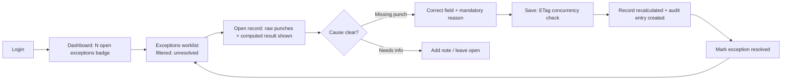
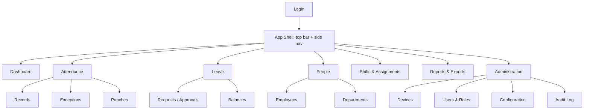

# 08 — UI / UX Design Specification

## Enterprise Time & Attendance Management System

| Field | Value |
|---|---|
| **Document Title** | UI / UX Design Specification |
| **Project** | Enterprise Time & Attendance Management System (TAMS) |
| **Document ID** | TAMS-UX-008 |
| **Version** | 1.0 (Draft for Approval) |
| **Status** | Awaiting Approval |
| **Author** | Principal Software Architect (AI) |
| **Owner** | Frontend Lead / UX Designer / Solution Architect |
| **Date** | 2026-07-09 |
| **Classification** | Internal — Confidential |
| **Standards** | **WCAG 2.1 AA** (accessibility), **Nielsen's 10 Usability Heuristics**, **ISO 9241-210** (human-centred design), responsive/mobile-friendly design, design-token / design-system approach |
| **Predecessor Docs** | `01`–`07` (all approved) |
| **Successor Docs** | `09_DEVELOPMENT_PLAN.md`, `10_TESTING_STRATEGY.md`, `12_USER_MANUAL.md` |

> **Scope of this document.** This defines the **user experience and interface design** for the React 19 SPA: personas & journeys, information architecture, navigation, layout patterns, key screens (as wireframes), interaction & state patterns, the design system (tokens/components), accessibility, responsiveness, and UX-specific NFRs. It realises the SRS UI requirements (`02 §3.1`) and role model (`02 §4.1`) against the API (`05`).
>
> **Boundary with other docs.** This owns *what the user sees and how it behaves*. It does **not** define component code conventions (→ `07 §8–9`), endpoint contracts (→ `05`), or step-by-step end-user instructions (→ `12_USER_MANUAL.md`). Wireframes here are **low-fidelity layout intent** (ASCII), not pixel-perfect visual design — final visual comps are a design-tool deliverable produced from these specs.
>
> **Design language note.** TAMS is an **enterprise data-dense productivity tool**, not a marketing site. The UX bias throughout is **clarity, speed, and error-prevention over visual flourish** — every decision below serves getting work done accurately and fast.

---

## Document Control

### Revision History

| Version | Date | Author | Description |
|---|---|---|---|
| 1.0 | 2026-07-09 | AI Architect | First complete UI/UX spec derived from approved Coding Standards v1.0 |

### Approval Sign-off

| Role | Name | Signature | Date |
|---|---|---|---|
| Frontend Lead | _TBD_ | | |
| UX Designer | _TBD_ | | |
| Business Owner (HR) | _TBD_ | | |
| Accessibility Reviewer | _TBD_ | | |

---

## Table of Contents

1. [UX Principles & Goals](#1-ux-principles--goals)
2. [Personas & Primary Journeys](#2-personas--primary-journeys)
3. [Information Architecture & Navigation](#3-information-architecture--navigation)
4. [Role-Based UI (what each role sees)](#4-role-based-ui-what-each-role-sees)
5. [Layout System & Responsive Strategy](#5-layout-system--responsive-strategy)
6. [Design System (Tokens & Components)](#6-design-system-tokens--components)
7. [Interaction & State Patterns](#7-interaction--state-patterns)
8. [Key Screens (Wireframes)](#8-key-screens-wireframes)
9. [Forms & Validation UX](#9-forms--validation-ux)
10. [Data Display: Tables, Filters, Dashboards](#10-data-display-tables-filters-dashboards)
11. [Feedback, Errors & Empty States](#11-feedback-errors--empty-states)
12. [Accessibility (WCAG 2.1 AA)](#12-accessibility-wcag-21-aa)
13. [Internationalisation & Formatting](#13-internationalisation--formatting)
14. [UX Non-Functional Requirements](#14-ux-non-functional-requirements)
15. [Usability Evaluation (Heuristics)](#15-usability-evaluation-heuristics)
16. [Traceability (Requirements → UX)](#16-traceability-requirements--ux)
17. [Glossary](#17-glossary)
18. [Documentation Review Checklist](#18-documentation-review-checklist)

---

# 1. UX Principles & Goals

| ID | Principle | Practical meaning |
|---|---|---|
| UX-P01 | **Clarity first** | Data-dense but scannable; no ambiguity in status/actions |
| UX-P02 | **Efficiency for power users** | HR/managers do repetitive tasks — minimise clicks, keyboard-friendly |
| UX-P03 | **Error prevention > error messages** | Constrain inputs, confirm destructive actions, show consequences |
| UX-P04 | **Show system status** | Loading, saving, syncing, offline-recovery states always visible |
| UX-P05 | **Role-appropriate surface** | Users see only what they can do (`02 §4.1`, `06`) |
| UX-P06 | **Trust through transparency** | Corrections, audit, sync status visible → confidence in data |
| UX-P07 | **Consistency** | Same patterns everywhere (matches code consistency, `07 CP-09`) |
| UX-P08 | **Accessible to all** | WCAG 2.1 AA; keyboard + screen-reader usable |
| UX-P09 | **Responsive** | Desktop-first, fully usable on tablet |
| UX-P10 | **Forgiving** | Undo where possible; confirm irreversible; never lose user input |

**Decision — optimise for the power user, not the first-time visitor.** TAMS's primary users (HR officers, managers) use it *daily* for repetitive, high-volume work (`02 §2.3`). Unlike a consumer app optimised for first-run delight, the right bias is **throughput and error-prevention for expert repeat use**: dense tables, bulk actions, keyboard support, and inline editing. This single stance drives most decisions below and directly serves the BRD's "reduce admin effort ≥70%" goal (G-02).

---

# 2. Personas & Primary Journeys

Personas carry over from `01_BRD.md §4.2`. Their **primary jobs-to-be-done** and journeys:

| Persona | Primary job | Journey (happy path) |
|---|---|---|
| **HR Officer (Nadia)** | Monthly close: fix exceptions, correct attendance | Login → Exceptions worklist → open record → correct (reason) → resolve → export |
| **Manager (Roshan)** | See team presence, approve leave | Login → Team dashboard → review present/absent/late → approve pending leave |
| **Administrator (Kasun)** | Keep system healthy: users, devices, rules | Login → Devices (check status) → resolve unreachable → manage users/roles |
| **Executive (Priya)** | Trustworthy KPIs | Login → Dashboard → filter by dept/date → read summary |
| **Employee** | Request leave, view own attendance (if enabled) | Login → My attendance → request leave → track status |

## 2.1 Critical journey — HR Officer resolves an attendance exception



**Decision — design the exception-resolution journey as the product's spine.** The BRD's whole value proposition is turning messy punches into trustworthy records with minimal manual effort. The exception worklist → correct-with-reason → resolve loop is *the* highest-frequency, highest-value workflow, so it gets first-class navigation (a dashboard badge, a dedicated worklist) and the tightest interaction design. Optimising this loop is optimising the business outcome (G-01/G-02).

---

# 3. Information Architecture & Navigation

## 3.1 Sitemap



## 3.2 Navigation model

| Element | Behaviour |
|---|---|
| **Top bar** | Product name, global search (where useful), current user + role, notifications (exceptions/devices), logout |
| **Side nav** | Primary sections; **only shows sections the role can access** (UX-P05) |
| **Breadcrumbs** | On detail pages for orientation & back-nav |
| **Contextual actions** | Primary action top-right of each page (e.g. "New Employee") |
| **Deep-linkable URLs** | Every list/detail has a shareable URL (React Router) |

**Decision — persistent left-nav + top bar shell, role-filtered.** Enterprise productivity tools with many sections are best served by a stable, always-visible left navigation (fast switching, spatial memory) rather than hidden hamburger menus (fine for mobile-first consumer apps). The nav is **filtered by permission** so an Employee never sees "Administration" at all — reducing clutter *and* reinforcing least-privilege (the UI never advertises what you can't do; server still enforces it, `06 §5`).

---

# 4. Role-Based UI (what each role sees)

| Section | Admin | HR Officer | Manager | Employee | Auditor |
|---|:--:|:--:|:--:|:--:|:--:|
| Dashboard | ✔ (all) | ✔ (all) | ✔ (team) | ✔ (self) | ✔ (read) |
| Attendance Records | ✔ | ✔ (edit) | ✔ (team, read) | ✔ (self) | ✔ (read) |
| Exceptions | ✔ | ✔ (resolve) | ✔ (team, view) | | ✔ (read) |
| Leave | ✔ | ✔ | ✔ (approve team) | ✔ (request) | ✔ (read) |
| People (Emp/Dept) | ✔ | ✔ | (view team) | | ✔ (read) |
| Shifts | ✔ | ✔ | (view) | | |
| Reports/Exports | ✔ | ✔ | ✔ (team) | | ✔ (read) |
| Devices | ✔ | | | | |
| Users & Roles | ✔ | | | | |
| Configuration | ✔ | | | | |
| Audit Log | ✔ | | | | ✔ |

> Mirrors the SRS §4.1 capability matrix. **UI visibility is a convenience; authorization is enforced server-side** (`06 §5`, UX-P05).

---

# 5. Layout System & Responsive Strategy

## 5.1 Grid & regions

| Region | Purpose |
|---|---|
| Header (fixed) | Brand, search, user, notifications |
| Sidebar (collapsible) | Primary nav |
| Content (fluid) | Page: title + primary action, filters, data, detail |
| Footer (minimal) | Version, environment indicator (non-prod) |

## 5.2 Breakpoints (Tailwind-aligned)

| Breakpoint | Target | Behaviour |
|---|---|---|
| `≥1280px` (xl) | Desktop (primary) | Full layout, dense tables, side nav expanded |
| `1024–1279px` (lg) | Small desktop | Side nav expanded/auto |
| `768–1023px` (md) | Tablet | Side nav collapses to icons/drawer; tables scroll or stack |
| `<768px` (sm) | Phone (best-effort) | Drawer nav; cards over wide tables; core tasks only |

**Decision — desktop-first, tablet-complete, phone-graceful.** Per the SRS (UI-01, desktop-first, usable on tablet) and the power-user stance (§1), the layout is engineered for large screens where the real work happens, remains **fully functional on tablet**, and **degrades gracefully** on phones (wide tables become cards; secondary actions move into menus). We deliberately do **not** invest in a full phone-optimised experience now — native mobile is explicitly out of scope (BRD OOS-03), so over-investing in small screens would violate YAGNI.

---

# 6. Design System (Tokens & Components)

## 6.1 Design tokens (semantic, theme-ready)

| Token group | Examples | Rationale |
|---|---|---|
| Color — semantic | `primary`, `success`, `warning`, `danger`, `info`, `surface`, `text`, `muted`, `border` | Semantic (not raw hex) → themeable, consistent |
| Status colors | present=success, absent=danger, late=warning, leave=info, exception=warning | Consistent status language everywhere |
| Spacing scale | 4-based scale (4/8/12/16/24/32…) | Rhythm & alignment |
| Typography | Font family, size scale, weight, line-height | Readable data density |
| Radius / elevation | sm/md/lg; subtle shadows | Enterprise-restrained |
| Breakpoints | sm/md/lg/xl (§5.2) | Responsive consistency |

**Decision — semantic design tokens, not hard-coded Tailwind colours in components.** Defining tokens like `danger`/`success`/`status-late` (mapped to Tailwind theme values) means status colour usage is consistent across every table, badge and chart, and a future re-theme or dark mode is a token change, not a codebase sweep (DRY, maintainability). It also enforces a **single visual language for attendance status** — critical when users scan dashboards for red/amber/green at a glance.

## 6.2 Core component library

| Component | Notes |
|---|---|
| Button (primary/secondary/danger/ghost) | Loading & disabled states; icon support |
| Data Table | Sort, paginate, filter, row actions, sticky header, empty/loading/error states |
| Form controls | Input, select, date/time picker, textarea — all with label, hint, error |
| Badge / Status pill | Semantic status colours |
| Modal / Drawer | Confirm dialogs, detail panels, forms |
| Toast / Notification | Success/error feedback |
| Filter bar | Standard dept/employee/date-range/status filters |
| Card / Stat tile | Dashboard KPIs |
| Tabs, Breadcrumbs, Pagination | Navigation aids |
| Skeleton / Spinner | Loading states |
| Empty state | Guidance + primary action |
| Audit/History panel | Show corrections & who/when |

**Decision — build a small, reusable component library up front.** A shared, documented component set (accessible by construction) guarantees visual and behavioural consistency (UX-P07), removes per-page reinvention (DRY, `07 §9`), and means accessibility is solved **once per component** rather than re-audited per screen. This is the UI parallel to the backend's "solve cross-cutting concerns in one place" (`03 §9`).

---

# 7. Interaction & State Patterns

Every data-bound view must handle **five states** consistently:

| State | Pattern |
|---|---|
| **Loading** | Skeleton (tables/cards) or spinner; never a blank flash |
| **Loaded** | Data with clear affordances |
| **Empty** | Friendly message + primary action (e.g. "No exceptions 🎉") |
| **Error** | Inline error + retry; parsed from RFC 9457 (`05 §6`) |
| **Partial/stale** | Show cached data + subtle "refreshing…" (React Query) |

| Interaction | Pattern |
|---|---|
| Save/submit | Disable button + spinner; success toast; keep context |
| Destructive action | Confirm dialog stating consequence (UX-P03/P10) |
| Concurrency conflict (412) | "This record changed since you opened it — reload to see latest" |
| Optimistic UI | Only where safe & reversible; otherwise wait for server |
| Bulk actions | Select rows → batch action with confirmation & progress |
| Keyboard | Tab order, Enter to submit, Esc to close, shortcuts for power tasks |
| Async device sync | Show status/last-sync; "Sync now" gives feedback, not a frozen screen |

**Decision — every view explicitly designs loading/empty/error/stale, not just the happy path.** The most common cause of a "janky" or confusing enterprise UI is unhandled non-happy states (blank screens, silent failures, spinners forever). Mandating all five states per view — and providing standard components for each (§6) — turns robustness into the default. The **concurrency-conflict message** is specifically designed around the API's `412` (`05 §8`) so a lost-update never silently discards a user's work (UX-P10).

---

# 8. Key Screens (Wireframes)

> Low-fidelity ASCII layout intent. Final visuals produced in the design tool from these.

## 8.1 App shell + Dashboard (HR/Admin view)

```text
┌───────────────────────────────────────────────────────────────────────┐
│ TAMS      🔍 search…                     🔔 3   Nadia (HR Officer) ▾    │
├──────────┬────────────────────────────────────────────────────────────┤
│ ▣ Dashboard  │  Dashboard                          [ Date: Today ▾ ]    │
│ ⤓ Attendance │  ┌──────────┐ ┌──────────┐ ┌──────────┐ ┌──────────┐    │
│   Records    │  │ Present  │ │ Absent   │ │ Late     │ │ Open     │    │
│   Exceptions │  │  842     │ │   37     │ │   19     │ │ Excep. 12│    │
│ 🗓 Leave     │  └──────────┘ └──────────┘ └──────────┘ └────▲─────┘    │
│ 👥 People    │  Attendance by Department        (click to filter)      │
│ ⏱ Shifts     │  ┌──────────────────────────────────────────────────┐  │
│ 📊 Reports   │  │  [bar/heat chart: present/absent/late per dept]   │  │
│ ⚙ Admin      │  └──────────────────────────────────────────────────┘  │
│              │  Recent exceptions ▸ (link to worklist)                 │
└──────────┴────────────────────────────────────────────────────────────┘
```

## 8.2 Attendance Exceptions worklist (the spine, §2.1)

```text
┌ Attendance ▸ Exceptions ─────────────────────────────────────────────┐
│ Filters: [Dept ▾] [Date range] [Type ▾] [☑ Unresolved only]  [Clear] │
├───────────────────────────────────────────────────────────────────────┤
│ Employee      Date        Type          Shift     Status     Action   │
│ Ann Silva     09 Jul      Missing Out   Day       Open       [Review] │
│ B. Perera     09 Jul      Out of Shift  Night     Open       [Review] │
│ …                                                                     │
│                                              ‹ 1 2 3 … ›  20 / page    │
└───────────────────────────────────────────────────────────────────────┘
```

## 8.3 Attendance Record detail + correction (drawer)

```text
┌ Record: Ann Silva — 09 Jul 2026 ─────────────────────────[ ✕ ]┐
│ Shift: Day (09:00–17:00, grace 10m)     Status: Exception       │
│                                                                 │
│ Raw punches (immutable):        Computed:                       │
│  08:05 IN  (Device A)            First In : 08:05               │
│  — no OUT —                      Last Out : —  ⚠ missing        │
│                                  Worked   : —                   │
│                                                                 │
│ Correction:                                                     │
│   Field: [ Last Out ▾ ]  New value: [ 17:02 ]                   │
│   Reason * : [ CCTV confirms left 17:02 ...................... ]│
│                                   [ Cancel ]   [ Save & Recalc ]│
│                                                                 │
│ ▸ History: (2 prior corrections — who / when / old→new)         │
└─────────────────────────────────────────────────────────────────┘
```

**Decision — show raw punches and computed result side-by-side, with mandatory reason and history.** This screen embodies the trust model of the whole system: the **immutable facts** (`04`) are shown next to the **derived result**, the correction requires a **reason** (BRULE-05), and the **history panel** shows prior corrections. The user (and any auditor) can *see* exactly why a number is what it is. Making the reason field mandatory in the UI mirrors the API rule (`05 §10.5`) — the user cannot save a correction without justification, so the audit trail is never empty (G-05).

## 8.4 Devices (Admin)

```text
┌ Admin ▸ Devices ───────────────────────────────────────────────────┐
│                                                    [ + Register ]   │
│ Name        Serial      Status        Last seen     Actions         │
│ Gate-A      ZK-1001     🟢 Online     2m ago        [Sync][Test][⋯] │
│ Floor-2     ZK-1002     🔴 Offline    3h ago ⚠      [Sync][Test][⋯] │
│ Warehouse   ZK-1003     🟢 Online     just now      [Sync][Test][⋯] │
└─────────────────────────────────────────────────────────────────────┘
```

**Decision — surface device health prominently with clear online/offline + last-seen.** The system's top business risk is lost captures from device/network outages (RK-01/02). Making device status a glanceable, colour-coded, always-current view — with a visible "last seen" and an offline warning — turns the resilience the backend provides (`03 §10.2`) into *operational visibility* for the admin, so an outage is noticed and acted on, not discovered at payroll time (UX-P04/P06).

## 8.5 Leave approval (Manager)

```text
┌ Leave ▸ Approvals ────────────────────────────────────────────────┐
│ Pending for my team                                                │
│ Employee    Type     Dates            Balance      Action          │
│ C. Fernando Annual   12–14 Jul (3d)   8d left      [Approve][Reject]│
│ D. Jayah    Sick     10 Jul (1d)      —            [Approve][Reject]│
│  ⓘ Approving checks balance; over-balance is blocked unless override│
└─────────────────────────────────────────────────────────────────────┘
```

---

# 9. Forms & Validation UX

| Rule | Pattern |
|---|---|
| Labels | Always visible (no placeholder-as-label) |
| Required fields | Marked `*`; validated on blur + submit |
| Inline errors | Message next to the field, clear remedy |
| Server errors | Map RFC 9457 field errors to the right fields (`05 §6`) |
| Preserve input | Never clear a form on error (UX-P10) |
| Disable-until-valid vs submit-then-validate | Prefer submit-then-highlight (don't hide why the button is dead) |
| Dangerous actions | Confirm with consequence text |
| Date/time | UTC handled internally; display & input in user's locale (§13) |
| Reason fields | Mandatory where audit requires (corrections, rejections) |

**Decision — validate with React Hook Form, mirror server rules, but treat the server as authoritative.** Client-side validation (RHF + schema) gives instant, friendly feedback (UX-P03), but it is a **usability layer only** — the server re-validates everything (`06 §7`, `07 §5.3`). When the server returns RFC 9457 field errors, the form maps them back onto the specific fields, so a rule only enforced server-side (e.g. duplicate `EmployeeNo`) still shows up exactly where the user expects. This gives fast feedback *and* correctness without duplicating the rule engine on the client.

---

# 10. Data Display: Tables, Filters, Dashboards

## 10.1 Tables (the workhorse)

| Feature | Standard |
|---|---|
| Server-side pagination | Matches API (`05 §7`); page size selector (cap 100) |
| Sorting | Server-driven; clear sort indicators |
| Filtering | Standard filter bar (dept/employee/date-range/status) |
| Row actions | Explicit buttons/menu; primary action obvious |
| Density | Compact rows for power users (UX-P02) |
| Sticky header | Header stays on scroll |
| Selection + bulk | Checkbox column → bulk actions where useful |
| Column overflow | Horizontal scroll container (never break page layout) |
| Status | Semantic status pills (§6.1) |

## 10.2 Dashboards

| Feature | Standard |
|---|---|
| KPI tiles | Present/absent/late/open-exceptions at a glance |
| Charts | Attendance by dept/time; accessible (not colour-only) |
| Freshness | Near-real-time (≤60s, NFR-03); "updated X ago" indicator |
| Drill-down | Click a tile/segment → filtered list |
| Role scope | Data limited to permitted scope (server-enforced) |

**Decision — dashboards are entry points to action, not just pretty numbers.** Every KPI tile and chart segment is **clickable and drills down** into the corresponding filtered list (e.g. "12 open exceptions" → the exceptions worklist pre-filtered). This turns the dashboard from a passive report into the fastest route into the day's work (UX-P02), and reinforces the exception-resolution spine (§2.1). Charts never rely on colour alone (accessibility, §12).

---

# 11. Feedback, Errors & Empty States

| Situation | UX |
|---|---|
| Success | Toast ("Employee created") + updated view |
| Validation error | Inline field errors (no data loss) |
| Auth expired (401) | Silent token refresh; if refresh fails → redirect to login preserving return URL |
| Forbidden (403) | Clear "You don't have permission" (no scary error) |
| Not found (404) | Friendly "not found" + back to list |
| Conflict (409/412) | Explain conflict + how to resolve (reload/retry) |
| Server/500 | Generic apology + correlation id shown for support (`05 §6`) |
| Network/offline (client) | Non-blocking banner; React Query retries |
| Empty list | Contextual empty state + primary action |

**Decision — show the correlation id on unexpected errors.** When a `500` happens, the UI shows a friendly message **plus the correlation id** (`05`/`06 §11`). The user can quote it to support, who can find the exact Serilog trace instantly. This small touch turns an opaque failure into a one-lookup diagnosis and is why correlation ids were threaded end-to-end in the earlier docs — the UI is where that investment pays off for the user.

---

# 12. Accessibility (WCAG 2.1 AA)

| Guideline | Implementation |
|---|---|
| Perceivable | Text alternatives; **status never by colour alone** (icon/label too); sufficient contrast (AA ratios) |
| Operable | Full keyboard operability; visible focus; skip-to-content; no keyboard traps |
| Understandable | Consistent nav & labels; clear errors; predictable behaviour |
| Robust | Semantic HTML; ARIA only where needed; works with screen readers |
| Forms | Labels programmatically associated; errors announced |
| Motion | Respect reduced-motion; no essential info in animation only |
| Targets | Adequate click/tap target sizes |

**Decision — WCAG 2.1 AA is a requirement, and "status never by colour alone" is a hard rule.** Accessibility is mandated (NFR-21) and is both an inclusion and often a legal obligation. The specific rule that attendance/leave/device **status must always carry a text label or icon, not just red/amber/green**, is critical: a colour-blind user (or a printed/greyscale report) must still distinguish present/absent/late. Solving accessibility in the shared component library (§6) means it's guaranteed once, not re-checked per screen.

---

# 13. Internationalisation & Formatting

| Aspect | Standard |
|---|---|
| Time zone | Store/transmit **UTC**; display in user's local zone (`05 §2`) |
| Date/number formats | Locale-aware formatting |
| Text externalisation | UI strings externalised (i18n-ready) even if single language now |
| Layout | Tolerant of longer translated strings (no fixed-width text) |
| RTL | Design not to preclude RTL (structural readiness) |

**Decision — i18n-ready structurally, not fully localised now.** We externalise strings and format dates/times/numbers locale-aware from the start (cheap if done early, expensive to retrofit), but we do **not** ship multiple languages unless required (BRD scope; multi-country payroll is OOS). This is YAGNI applied correctly: build the *seams* for i18n, defer the *content*. UTC-in/local-out also directly prevents the overnight-shift display bugs the backend guarded against (`04 DP-07`).

---

# 14. UX Non-Functional Requirements

| ID | Requirement | Trace |
|---|---|---|
| NUX-01 | Perceived responsiveness: skeletons/spinners; no blank flashes | UX-P04 |
| NUX-02 | Every data view handles loading/empty/error/stale states | §7 |
| NUX-03 | WCAG 2.1 AA conformance | §12, NFR-21 |
| NUX-04 | Fully keyboard-operable | §12 |
| NUX-05 | Responsive: complete on tablet, graceful on phone | §5 |
| NUX-06 | No user input lost on error/conflict | §9, §11 |
| NUX-07 | Role-appropriate UI (hide unauthorised) | §4, `06 §5` |
| NUX-08 | Consistent components/patterns (design system) | §6 |
| NUX-09 | Consistent RFC 9457 error presentation | §11 |
| NUX-10 | Near-real-time dashboards with freshness indicator | §10.2, NFR-03 |

---

# 15. Usability Evaluation (Nielsen's 10 Heuristics)

| Heuristic | How TAMS satisfies it |
|---|---|
| Visibility of system status | Loading/saving/sync states; device health; "updated X ago" (UX-P04) |
| Match to real world | HR/attendance terminology; familiar concepts |
| User control & freedom | Cancel, undo where safe, confirm destructive (UX-P10) |
| Consistency & standards | Design system; consistent patterns (§6) |
| Error prevention | Constrained inputs, confirmations, balance checks (UX-P03) |
| Recognition over recall | Visible actions, filters, breadcrumbs |
| Flexibility & efficiency | Keyboard shortcuts, bulk actions, saved filters (UX-P02) |
| Aesthetic & minimalist | Data-dense but uncluttered; no decorative noise |
| Error recovery | Clear errors + remedy + correlation id (§11) |
| Help & docs | Contextual hints; links to User Manual (`12`) |

**Decision — evaluate the design against a recognised heuristic set, not just opinion.** Scoring the design against Nielsen's heuristics gives a *repeatable, defensible* usability bar that reviewers and future changes can be measured against — the UX equivalent of the OWASP checklist for security (`06 §10`). Usability testing with real HR/manager users is scheduled in `10_TESTING_STRATEGY.md`.

---

# 16. Traceability (Requirements → UX)

| Requirement | UX realisation |
|---|---|
| UI-01 responsive | §5 responsive strategy |
| UI-02 role-appropriate | §4 role-based UI + filtered nav |
| UI-03 inline validation | §9 forms & validation UX |
| UI-04 dashboards/lists/exports | §8, §10 |
| UI-05 async/offline states | §7, §8.4 device status |
| FR-ATT-005/006 exceptions & correction | §2.1, §8.2, §8.3 (raw+computed+reason+history) |
| FR-ZK-011 device unreachable | §8.4 device health |
| FR-LV-002/004 approvals & balance | §8.5 leave approval |
| FR-RPT-001 dashboards | §8.1, §10.2 |
| NFR-21 usability/accessibility | §12, §15 |
| NFR-03 dashboard freshness | §10.2, NUX-10 |
| BR-050 (`06 §5`) authz | §4 (UI hides; server enforces) |
| G-02 reduce admin effort | §1 power-user bias, §2.1 spine, §10 tables/bulk |
| G-05 audit trust | §8.3 mandatory reason + history |

---

# 17. Glossary

Inherits prior docs. UX-specific additions:

| Term | Definition |
|---|---|
| **Design token** | Named, reusable design value (colour/spacing/type). |
| **App shell** | Persistent header + nav frame around page content. |
| **Worklist** | A filtered, actionable task list (e.g. open exceptions). |
| **Drill-down** | Clicking a summary to see its underlying detail. |
| **Empty state** | The view when there's no data, with guidance. |
| **Skeleton** | Placeholder UI shown while data loads. |
| **WCAG AA** | Web accessibility conformance level (target). |
| **Heuristic evaluation** | Usability review against known principles. |
| **Status pill** | Small labelled, coloured status indicator. |

---

# 18. Documentation Review Checklist

**Reviewer instructions:** mark ✅ Pass / ⚠️ Needs change / ❌ Fail. Approved when all **Mandatory** items pass.

### 18.1 Completeness

| # | Check | Mandatory | Status |
|---|---|---|---|
| C-01 | UX principles & goals stated | ✔ | ☐ |
| C-02 | Personas & primary journeys defined | ✔ | ☐ |
| C-03 | Information architecture & navigation defined | ✔ | ☐ |
| C-04 | Role-based UI mapped to capability matrix | ✔ | ☐ |
| C-05 | Layout & responsive strategy defined | ✔ | ☐ |
| C-06 | Design system (tokens + components) defined | ✔ | ☐ |
| C-07 | Interaction & state patterns defined | ✔ | ☐ |
| C-08 | Key screens wireframed | ✔ | ☐ |
| C-09 | Forms & validation UX defined | ✔ | ☐ |
| C-10 | Data display (tables/dashboards) defined | ✔ | ☐ |
| C-11 | Feedback/errors/empty states defined | ✔ | ☐ |
| C-12 | Accessibility (WCAG AA) addressed | ✔ | ☐ |
| C-13 | i18n/formatting addressed | ✔ | ☐ |
| C-14 | UX NFRs listed | ✔ | ☐ |
| C-15 | Usability heuristic evaluation included | ✔ | ☐ |

### 18.2 Quality & Soundness

| # | Check | Mandatory | Status |
|---|---|---|---|
| Q-01 | Power-user efficiency prioritised (fits users) | ✔ | ☐ |
| Q-02 | Exception-resolution spine designed first-class | ✔ | ☐ |
| Q-03 | All five view states designed (not just happy path) | ✔ | ☐ |
| Q-04 | Corrections show raw+computed+reason+history (trust) | ✔ | ☐ |
| Q-05 | Status never conveyed by colour alone | ✔ | ☐ |
| Q-06 | Client validation is UX only; server authoritative | ✔ | ☐ |
| Q-07 | Every significant decision explained | ✔ | ☐ |
| Q-08 | No over-investment (phone/i18n deferred with reason) | ✔ | ☐ |

### 18.3 Alignment & Traceability

| # | Check | Mandatory | Status |
|---|---|---|---|
| A-01 | Consistent with SRS UI reqs & role matrix (`02`) | ✔ | ☐ |
| A-02 | Consistent with API states/errors (`05`) | ✔ | ☐ |
| A-03 | UI visibility ≠ security (server enforces, `06`) | ✔ | ☐ |
| A-04 | Uses mandated stack (React/Tailwind/RQ/RHF, `07`) | ✔ | ☐ |
| A-05 | Surfaces device resilience visibility (`03`) | ✔ | ☐ |
| A-06 | Traceability table complete | ✔ | ☐ |

### 18.4 Governance

| # | Check | Mandatory | Status |
|---|---|---|---|
| G-01 | Document control & versioning present | ✔ | ☐ |
| G-02 | Approval sign-off present | ✔ | ☐ |
| G-03 | Ready to proceed to `09_DEVELOPMENT_PLAN.md` on approval | ✔ | ☐ |

---

### ✅ Approval Gate

> **This UI/UX Specification (v1.0) is submitted for your approval.** I will **not** begin `09_DEVELOPMENT_PLAN.md` until you approve or request changes.

**Please respond with one of:**
1. **Approved** → I proceed to `09_DEVELOPMENT_PLAN.md`.
2. **Approved with changes** → list changes; I revise then proceed.
3. **Changes required** → list changes; I revise and resubmit this document only.

*End of Document — TAMS-UX-008 v1.0*
