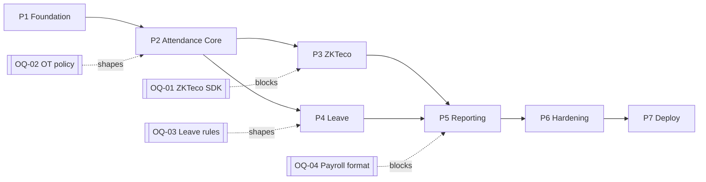

# 09 — Development Plan

## Enterprise Time & Attendance Management System

| Field | Value |
|---|---|
| **Document Title** | Development Plan |
| **Project** | Enterprise Time & Attendance Management System (TAMS) |
| **Document ID** | TAMS-PLAN-009 |
| **Version** | 1.0 (Draft for Approval) |
| **Status** | Awaiting Approval |
| **Author** | Principal Software Architect (AI) |
| **Owner** | Delivery Lead / Solution Architect |
| **Date** | 2026-07-09 |
| **Classification** | Internal — Confidential |
| **Standards** | **PMI/PMBOK** (planning concepts), **Agile/Scrum** (iterative delivery), **INVEST** (backlog quality), **DORA** metrics (delivery health), risk-driven sequencing |
| **Predecessor Docs** | `01`–`08` (all approved) |
| **Successor Docs** | `10_TESTING_STRATEGY.md`, `11_DEPLOYMENT.md` |

> **Scope of this document.** This is the **delivery plan**: methodology, team, phased roadmap, epics/features per phase, sprint cadence, dependencies, estimation approach, milestones, Definition of Ready/Done, risk-burndown, and governance. It sequences the *build* of everything specified in `01`–`08`.
>
> **Boundary with other docs.** This owns *when and in what order* we build, and *how the team works*. It does **not** define test cases/coverage (→ `10_TESTING_STRATEGY.md`), CI/CD pipeline and environments (→ `11_DEPLOYMENT.md`), or feature specs (already in `02`/`05`). It **consumes** the phase model seeded in `01 §14` and `02 §2.7` and makes it executable.
>
> **Estimation note.** Durations are expressed in **relative sizing (story points) and sprint counts**, not fixed calendar dates, because team size, velocity, and the unresolved open questions (OQ-01…08) materially affect calendar. A calendar schedule is produced once team capacity and OQ answers are fixed (§13). This is deliberate: committing to dates before knowns are known manufactures false precision.

---

## Document Control

### Revision History

| Version | Date | Author | Description |
|---|---|---|---|
| 1.0 | 2026-07-09 | AI Architect | First complete development plan derived from approved UI/UX v1.0 |

### Approval Sign-off

| Role | Name | Signature | Date |
|---|---|---|---|
| Delivery Lead / PM | _TBD_ | | |
| Solution Architect | _TBD_ | | |
| Development Lead | _TBD_ | | |
| Product Owner (HR) | _TBD_ | | |

---

## Table of Contents

1. [Delivery Methodology](#1-delivery-methodology)
2. [Team Structure & Roles](#2-team-structure--roles)
3. [Ways of Working (Ceremonies)](#3-ways-of-working-ceremonies)
4. [Estimation & Velocity Approach](#4-estimation--velocity-approach)
5. [Phased Roadmap Overview](#5-phased-roadmap-overview)
6. [Epics & Feature Backlog by Phase](#6-epics--feature-backlog-by-phase)
7. [Dependencies & Critical Path](#7-dependencies--critical-path)
8. [Risk-Driven Sequencing](#8-risk-driven-sequencing)
9. [Definition of Ready / Definition of Done](#9-definition-of-ready--definition-of-done)
10. [Milestones & Release Plan](#10-milestones--release-plan)
11. [Quality Gates per Phase](#11-quality-gates-per-phase)
12. [Environment & Branching Alignment](#12-environment--branching-alignment)
13. [Open Questions Impacting the Plan](#13-open-questions-impacting-the-plan)
14. [Governance, Reporting & Metrics](#14-governance-reporting--metrics)
15. [Resourcing & Capacity Assumptions](#15-resourcing--capacity-assumptions)
16. [Traceability (Requirements → Phases)](#16-traceability-requirements--phases)
17. [Glossary](#17-glossary)
18. [Documentation Review Checklist](#18-documentation-review-checklist)

---

# 1. Delivery Methodology

**Chosen approach: iterative, incremental delivery (Scrum-based) with risk-driven sequencing.**

| Aspect | Choice | Rationale |
|---|---|---|
| Framework | Scrum (2-week sprints) | Regular, inspectable increments; stakeholder feedback loop |
| Increment goal | Each phase ends in a demonstrable, potentially shippable slice | Reduces integration risk; builds confidence |
| Sequencing driver | **Risk + dependency**, not feature popularity | De-risk the hardest thing (ZKTeco) early against a known-good core |
| Backlog quality | INVEST stories, DoR/DoD gates | Prevents half-baked work entering sprints |
| Architecture | Established up front (`03`) then evolved | Avoid big-design-up-front *and* no-design; walking skeleton first |

**Decision — Scrum with risk-driven (not value-first) sequencing.** A pure "highest business value first" order would build reporting/dashboards early. But the project's dominant risk is ZKTeco resilience (RK-01/02). We therefore build the **attendance core against controlled/manual data first (P2), then wire the risky device integration (P3)** — so when we hit the hard part, we're validating it against a proven calculation engine, not debugging two unknowns at once. This is the delivery-level expression of the architecture decision in `03 §14`.

---

# 2. Team Structure & Roles

| Role | Responsibility | Count (indicative) |
|---|---|---|
| Product Owner (HR) | Backlog priorities, acceptance, resolve OQs | 1 |
| Scrum Master / Delivery Lead | Facilitation, impediment removal, reporting | 1 |
| Solution Architect | Architecture integrity, ADRs, review | 1 (shared) |
| Backend Engineers (.NET) | API, domain, worker, integration | 2–3 |
| Frontend Engineers (React) | SPA, components, UX | 1–2 |
| QA Engineer | Test strategy execution, automation | 1 |
| DevOps Engineer | CI/CD, environments, monitoring | 1 (shared) |
| Security reviewer | Security gates, review | shared |

**Decision — small cross-functional team, shared specialist roles.** Given the modest sizing (OQ-06) and modular monolith (`03` ADR-001), a single small cross-functional team avoids the coordination overhead of multiple teams. Specialist roles (architect, DevOps, security) are *shared* rather than dedicated headcount — right-sized to the project, avoiding over-staffing (a cost-control that supports the BRD ROI case).

---

# 3. Ways of Working (Ceremonies)

| Ceremony | Cadence | Purpose |
|---|---|---|
| Sprint Planning | Start of sprint | Commit to sprint backlog against DoR |
| Daily Stand-up | Daily | Sync, surface impediments |
| Backlog Refinement | Mid-sprint | Keep 1–2 sprints of ready stories ahead |
| Sprint Review/Demo | End of sprint | Show increment to stakeholders |
| Retrospective | End of sprint | Continuous improvement |
| Architecture sync | As needed | ADR decisions, boundary integrity |
| Security review | Per phase + pre-release | `06 §15` gates |

**Decision — keep a 1–2 sprint "ready" buffer via refinement.** The most common Scrum failure is starting a sprint with vague stories. Continuous refinement keeps a buffer of INVEST-compliant, DoR-passing stories ahead of the team, so planning is fast and sprints aren't derailed by mid-sprint discovery — especially important while OQs are being resolved (§13).

---

# 4. Estimation & Velocity Approach

| Element | Approach |
|---|---|
| Sizing | Story points (Fibonacci) via planning poker |
| Reference story | A calibrated baseline story per layer |
| Velocity | Established over first 2–3 sprints; used for forecasting |
| Forecasting | Points ÷ velocity → sprint count → calendar (once velocity known) |
| Spikes | Time-boxed investigation for unknowns (esp. ZKTeco, OQ-01) |
| Buffer | Capacity reserve for support/unknowns per sprint |

**Decision — points now, dates after velocity is measured.** Estimating in points decouples effort from a not-yet-known velocity and avoids the anti-pattern of promising calendar dates on day one. After 2–3 sprints, observed velocity converts the point backlog into a credible date forecast (§10). Time-boxed **spikes** handle the biggest unknown (ZKTeco/OQ-01) without letting it balloon a sprint.

## 4.1 Indicative epic sizing (relative)

| Epic | Relative size |
|---|---|
| Foundation (solution, CI, auth, arch skeleton) | L |
| Employee & Department | M |
| Shift management | M |
| Attendance core (calc engine) | **XL** (core domain, most valuable) |
| ZKTeco integration | **XL** (highest risk/unknown) |
| Leave management | M |
| Reporting & dashboards | L |
| Hardening (security/perf/UAT) | L–XL |

---

# 5. Phased Roadmap Overview

Consumes the phase model from `01 §14` / `02 §2.7`.

```mermaid
gantt
    title TAMS Delivery Phases (relative, sprint-based)
    dateFormat  X
    axisFormat  S%s

    section Foundation
    P1 Foundation (Auth, Emp, Dept, skeleton)   :p1, 0, 3
    section Core
    P2 Shift + Attendance Core                    :p2, 3, 3
    section Integration
    P3 ZKTeco Integration (risk)                  :p3, 6, 3
    section Value
    P4 Leave Management                           :p4, 9, 2
    P5 Reporting & Dashboards                     :p5, 11, 2
    section Release
    P6 Hardening + UAT                            :p6, 13, 2
    P7 Deployment & Handover                      :p7, 15, 1
```

| Phase | Goal | Exit criterion | Approx sprints |
|---|---|---|---|
| **P0** | Documentation & design (this phase) | Docs `01`–`14` approved | — |
| **P1** | Secure foundation + master data | Login works; Employee/Dept CRUD; arch skeleton + CI green | ~3 |
| **P2** | Attendance computable from controlled data | Shift rules + attendance calc verified on manual data | ~3 |
| **P3** | Resilient device capture | Punches flow ZKTeco→records; offline recovery proven | ~3 |
| **P4** | Leave integrated | Leave requests/approvals affect attendance | ~2 |
| **P5** | Visibility & payroll feed | Dashboards + reports + payroll export | ~2 |
| **P6** | Production-ready | Security/perf/UAT pass; NFR targets met | ~2 |
| **P7** | Live & supported | Deployed; handover complete | ~1 |

**Decision — a "walking skeleton" in P1.** P1 delivers a thin but *end-to-end* slice: React login → JWT → API → EF → SQL → audit → CI pipeline green, plus the Clean-Architecture project skeleton and architecture tests. This proves every layer and the whole toolchain integrate *before* feature volume grows, so later phases add features to a working spine rather than discovering integration problems late (aligns with `03 §14`, `07 §12`).

---

# 6. Epics & Feature Backlog by Phase

> Each feature is an epic broken into INVEST stories during refinement. **SRS trace** links every item to a requirement — nothing is built that isn't specified.

## P1 — Foundation

| Epic | Key stories | SRS/Doc trace |
|---|---|---|
| Solution & CI skeleton | Clean-Arch projects; arch tests; CI gates; editorconfig/analyzers | `03 §14`, `07 §12` |
| Authentication | Login, JWT issue/refresh, lockout, hashing | FR-AUTH-001…006 |
| Authorization | Permission RBAC, deny-by-default, capability seed | FR-AUTH-003, `04 §12` |
| Employee mgmt | CRUD (soft), validation, status history, enrolment link | FR-EMP-001…007 |
| Department mgmt | CRUD (soft), hierarchy, guard | FR-DEP-001…004 |
| Audit/logging framework | SaveChanges interceptor, Serilog, correlation id | FR-AUD-001…004 |
| App shell (UI) | Shell, role-filtered nav, auth flow, Axios instance | `08 §3`, `07 §9` |

## P2 — Shift & Attendance Core

| Epic | Key stories | Trace |
|---|---|---|
| Shift management | Define shifts (overnight, grace), OT rules-as-data | FR-SFT-001/002/005 |
| Shift assignment | Effective-dated assign, overlap guard | FR-SFT-003 |
| Attendance calc engine | `AttendanceCalculator` (pure), worked/late/early/OT | FR-ATT-002/003/004, `03 ADR-006` |
| Punch model | Immutable raw punch, manual entry, idempotency | FR-ATT-001/008 |
| Exceptions | Detect/classify anomalies | FR-ATT-005 |
| Corrections | Correct-with-reason, preserve original, recalc | FR-ATT-006/009 |
| Attendance UI | Records list, exception worklist, correction drawer | `08 §8.2/8.3` |

## P3 — ZKTeco Integration (risk phase)

| Epic | Key stories | Trace |
|---|---|---|
| Device management | Register/edit/enable/disable, test-connection | FR-ZK-010, `05 §10.4` |
| Worker service | Hosted background service, scheduling | `03 ADR-002` |
| Incremental download | Watermark-gated, per-device | FR-ZK-002 |
| Idempotent ingestion | De-dup key, exactly-once | FR-ZK-008, ADR-011 |
| Employee sync | Enrolment sync to/from device | FR-ZK-003 |
| Resilience | Retry/backoff, buffering, **offline recovery** | FR-ZK-005/006 |
| Reconciliation & alerts | Device-vs-stored reconcile, unreachable alert | FR-ZK-007/011 |
| Realtime (optional) | Realtime events where supported | FR-ZK-004 |
| Device UI | Device health view | `08 §8.4` |

## P4 — Leave Management

| Epic | Key stories | Trace |
|---|---|---|
| Leave types & balances | Types (config), balances per type/year | FR-LV, `04 Leave` |
| Requests & approvals | Submit, approve/reject, cancel, state machine | FR-LV-001/002 |
| Balance enforcement | Block over-balance unless override | FR-LV-004, BRULE-07 |
| Attendance integration | Approved leave overrides absence | FR-LV-005, FR-ATT-007 |
| Self-service (if in scope) | Employee submit/view | FR-LV-006 (OQ-07) |
| Leave UI | Requests, approvals, balances | `08 §8.5` |

## P5 — Reporting & Dashboards

| Epic | Key stories | Trace |
|---|---|---|
| Dashboards | KPI tiles, by-dept, drill-down, freshness | FR-RPT-001, `08 §10.2` |
| Operational reports | Daily attendance, exceptions, corrections | FR-RPT-002/003 |
| Exports | CSV/Excel/PDF, audited | FR-RPT-004/007 |
| Payroll export | Agreed contract file | FR-RPT-005 (OQ-04) |
| Role-scoped reporting | Server-derived scope | FR-RPT-006, `06 §5` |

## P6 — Hardening

| Epic | Key stories | Trace |
|---|---|---|
| Security hardening | OWASP checklist, pen test, headers/CORS | `06 §10/§15` |
| Performance/scale | Load/soak tests vs NFR targets | `02 §6`, `10` |
| Reliability | Fault-injection (device/network) proves zero loss | NFR-08, KPI-04 |
| UAT | Business acceptance vs `01` KPIs | `01 §12` |
| Accessibility | WCAG AA audit | `08 §12` |

## P7 — Deployment & Handover

| Epic | Key stories | Trace |
|---|---|---|
| Production deploy | Per `11_DEPLOYMENT.md` | `11` |
| Runbooks & training | Admin/user guides, training | `12`,`13`,`14` |
| Support handover | Monitoring, on-call, warranty period | `14` |

---

# 7. Dependencies & Critical Path

**Critical path:** P1 → P2 → P3 → P5 → P6 → P7. **Leave (P4) runs partly in parallel** with P3 since it depends on the attendance core (P2), not on device integration.

**Decision — parallelise Leave (P4) with ZKTeco (P3).** Leave depends only on the attendance core (P2), not on devices. Running P4 alongside the risky P3 keeps the frontend/one backend engineer productive on lower-risk work while integration specialists tackle ZKTeco — improving throughput without adding critical-path risk. This is only safe because the bounded contexts are decoupled (`03 §8`).

---

# 8. Risk-Driven Sequencing

| Risk (from `01 §11`) | Sequencing response |
|---|---|
| RK-01/02 ZKTeco/outage data loss | **Spike in P1/early**, full build P3 against proven P2 core; fault-injection in P6 |
| RK-03 rules misinterpreted | Validate calc engine (P2) with business + representative data before devices |
| RK-04 security breach | Security built-in from P1; checklist/pen test P6 |
| RK-06 payroll mismatch | Define export contract (OQ-04) before P5; validate with Payroll |
| RK-07 poor employee data | Data validation P1; cleanup step before P3 sync |
| RK-08 stakeholder availability | OQ resolution tracked (§13); refinement buffer (§3) |

**Decision — a ZKTeco spike happens early, even though the full integration is P3.** The single biggest unknown is the ZKTeco SDK/protocol (OQ-01, RK-01). A time-boxed spike in P1/early proves connectivity and the `IDeviceGateway` shape *before* P3 commits to it — so P3 is implementation, not discovery. Finding a nasty SDK surprise in a P1 spike costs a few days; finding it mid-P3 costs a phase.

---

# 9. Definition of Ready / Definition of Done

## 9.1 Definition of Ready (story may enter a sprint)

- [ ] Traces to a specific requirement (`02`/`05`)
- [ ] Acceptance criteria written & testable
- [ ] Dependencies known & unblocked (no blocking OQ)
- [ ] Sized by the team (INVEST-compliant)
- [ ] UX reference where UI is involved (`08`)
- [ ] Security implications considered (`06`)

## 9.2 Definition of Done (story is complete)

- [ ] Code meets standards (`07`); analyzers/lint/format pass
- [ ] Validation, logging, exception handling present (no skips)
- [ ] Unit/integration tests written & passing (`10`)
- [ ] Architecture tests pass (Dependency Rule intact)
- [ ] Security rules satisfied; scans clean (`06 §15`)
- [ ] Acceptance criteria demonstrably met
- [ ] Audit entries produced where required
- [ ] Reviewed & approved (PR); CI green
- [ ] Docs/OpenAPI updated where relevant
- [ ] Merged to main; deployable

**Decision — DoD encodes the project's hard mandates as a checklist.** The `00_PROJECT_CONTEXT` rules ("never skip validation/logging/exception handling", tests, security) are baked directly into the Definition of Done. A story literally cannot be "done" without them. This converts principles into an enforced, per-story gate rather than aspirations — the planning-level partner to the tooling gates in `07 §12`.

---

# 10. Milestones & Release Plan

| Milestone | Marks | Depends on |
|---|---|---|
| **M0** — Design approved | Docs `01`–`14` signed off | P0 |
| **M1** — Walking skeleton | End-to-end auth + CI green | P1 |
| **M2** — Master data live | Employee/Dept usable | P1 |
| **M3** — Attendance core verified | Calc engine proven on controlled data | P2 |
| **M4** — Device capture proven | Offline recovery demonstrated (KPI-04) | P3 |
| **M5** — Leave integrated | Leave affects attendance | P4 |
| **M6** — Reporting & payroll feed | Dashboards + export | P5 |
| **M7** — UAT passed | Business acceptance vs KPIs | P6 |
| **M8** — Go-live | Production deploy + handover | P7 |

## 10.1 Release strategy

| Aspect | Approach |
|---|---|
| Internal releases | Every sprint → Test/Staging |
| Business milestone demos | End of each phase |
| Production release | Single go-live at M8 (phased internal builds precede it) |
| Post go-live | Warranty/hypercare period (`14`) |

**Decision — continuous internal releases, one business go-live.** The team integrates and deploys to internal environments every sprint (keeping `main` releasable, `07 §11`), but there is a **single production go-live (M8)** after UAT. For an attendance system feeding payroll, a big-bang-into-a-known-good-state at go-live is safer than incrementally exposing a half-complete attendance engine to real payroll — the internal cadence gives agility, the single go-live gives payroll safety.

---

# 11. Quality Gates per Phase

| Gate | Must pass to exit phase |
|---|---|
| Every phase | CI green (build/tests/lint/analyzers/scans); DoD on all stories; arch tests pass |
| P1 | Auth security review; walking skeleton demo |
| P2 | Attendance calc validated against representative cases + business sign-off |
| P3 | **Fault-injection: zero permanent punch loss proven** (KPI-04) |
| P4 | Leave↔attendance integration verified |
| P5 | Payroll export reconciles to records; role-scope verified |
| P6 | OWASP checklist pass; pen test; perf vs NFR; WCAG AA; UAT sign-off |
| P7 | Deployment runbook executed in staging; handover complete |

**Decision — make "zero punch loss" an explicit P3 exit gate.** KPI-04 (zero permanent loss) is a business acceptance criterion (`01 §12`). Rather than hoping it holds, P3 cannot be declared complete until **fault-injection testing** (kill device/network mid-sync, restart worker) demonstrably proves no loss and no duplicates. This makes the architecture's central guarantee (ADR-011) a verified fact before the project moves on.

---

# 12. Environment & Branching Alignment

| Aspect | Alignment |
|---|---|
| Branching | Short-lived feature branches; PR to main; green CI required (`07 §11`) |
| Environments | Dev → Test → Staging → Prod (detailed in `11`) |
| Migrations | Applied via controlled deploy step, not app startup (`04 §14`) |
| Feature flags | Used to merge incomplete features safely where useful |

> Full CI/CD pipeline mechanics and environment provisioning are owned by `11_DEPLOYMENT.md`; this section only aligns the plan to them.

---

# 13. Open Questions Impacting the Plan

| OQ | Impact on plan | Needed by (latest) |
|---|---|---|
| OQ-01 ZKTeco SDK | Shapes P3; drives early spike | Before P3 start |
| OQ-02 OT/tolerance policy | Config values for P2 calc | Before P2 completion |
| OQ-03 Leave rules | P4 config | Before P4 start |
| OQ-04 Payroll export format | P5 export | Before P5 start |
| OQ-05 Data-protection/retention | Security/retention hardening | Before P6 |
| OQ-06 Sizing | NFR targets, capacity, calendar | Before P6 (targets); earlier for capacity |
| OQ-07 Self-service scope | P4 backlog size | Before P4 start |
| OQ-08 KPI thresholds | UAT acceptance | Before P6 UAT |

**Decision — track OQ resolution as first-class backlog with drop-dead dates.** Each open question has a "needed-by" phase. Treating OQ resolution as tracked work (owned by the Product Owner) — rather than assuming answers appear — means the plan surfaces a blocking risk *before* it stalls a sprint. Crucially, **no OQ blocks the current build**: the architecture isolated each behind config/adapters (`04`,`05`,`06`), so the team proceeds and slots answers in as data.

---

# 14. Governance, Reporting & Metrics

| Metric | Purpose |
|---|---|
| Velocity & burndown | Forecast & sprint health |
| DORA (deploy freq, lead time, change-fail rate, MTTR) | Delivery health |
| Test pass rate & coverage trend | Quality (`10`) |
| Open exceptions/defects by severity | Quality & readiness |
| OQ resolution status | Unblock risk |
| Risk burndown | Are top risks shrinking? |
| Security scan status | Continuous security (`06 §15`) |

| Report | Audience | Cadence |
|---|---|---|
| Sprint review/demo | Stakeholders | Per sprint |
| Phase exit report | Sponsor/PO | Per phase |
| Risk & OQ status | Sponsor | Ongoing |

**Decision — track risk burndown, not just work burndown.** A project can be "on schedule" while its biggest risks remain untouched. Reporting **risk burndown** (are RK-01/02 shrinking?) alongside velocity keeps attention on de-risking, which — given the ZKTeco exposure — matters more than raw feature throughput for actual success.

---

# 15. Resourcing & Capacity Assumptions

| Assumption | Note |
|---|---|
| Team size | Per §2 (indicative); calendar depends on final capacity (OQ-06 sizing informs infra, not team) |
| Availability | Product Owner available for refinement/acceptance & OQ resolution (AS-04) |
| Environments | Provisioned before dependent phases (`11`) |
| ZKTeco access | Test device/SDK access available for P3 spike (DEP-01) |
| Capacity buffer | ~10–20% reserved for support/unknowns per sprint |

---

# 16. Traceability (Requirements → Phases)

| Requirement group | Phase(s) |
|---|---|
| FR-AUTH-* / RBAC | P1 |
| FR-EMP-* / FR-DEP-* | P1 |
| FR-AUD-* framework | P1 (then all) |
| FR-SFT-* | P2 |
| FR-ATT-* (core) | P2 |
| FR-ZK-* | P3 |
| FR-LV-* | P4 |
| FR-RPT-* | P5 |
| NFR-* (perf/sec/reliability) | P6 (built-in from P1) |
| KPI-04 zero loss | P3 gate + P6 fault-injection |
| Business KPIs (`01 §12`) | P6 UAT |
| Deployment/handover | P7 |

---

# 17. Glossary

Inherits prior docs. Plan-specific additions:

| Term | Definition |
|---|---|
| **Epic** | Large body of work broken into stories. |
| **Story (INVEST)** | Independent, Negotiable, Valuable, Estimable, Small, Testable unit. |
| **Spike** | Time-boxed investigation to reduce an unknown. |
| **DoR / DoD** | Definition of Ready / Definition of Done. |
| **Velocity** | Story points completed per sprint. |
| **Walking skeleton** | Thin end-to-end slice proving all layers integrate. |
| **Critical path** | Longest dependent chain determining minimum duration. |
| **DORA metrics** | Delivery-health metrics (deploy freq, lead time, CFR, MTTR). |
| **Risk burndown** | Tracking reduction of project risk over time. |
| **Hypercare** | Intensive post-go-live support period. |

---

# 18. Documentation Review Checklist

**Reviewer instructions:** mark ✅ Pass / ⚠️ Needs change / ❌ Fail. Approved when all **Mandatory** items pass.

### 18.1 Completeness

| # | Check | Mandatory | Status |
|---|---|---|---|
| C-01 | Methodology defined & justified | ✔ | ☐ |
| C-02 | Team & roles defined | ✔ | ☐ |
| C-03 | Ceremonies/ways of working defined | ✔ | ☐ |
| C-04 | Estimation approach defined | ✔ | ☐ |
| C-05 | Phased roadmap present | ✔ | ☐ |
| C-06 | Epics/backlog per phase, traced to requirements | ✔ | ☐ |
| C-07 | Dependencies & critical path defined | ✔ | ☐ |
| C-08 | Risk-driven sequencing explained | ✔ | ☐ |
| C-09 | DoR/DoD defined | ✔ | ☐ |
| C-10 | Milestones & release plan defined | ✔ | ☐ |
| C-11 | Quality gates per phase defined | ✔ | ☐ |
| C-12 | Environment/branching alignment stated | ✔ | ☐ |
| C-13 | Open-question impacts tracked | ✔ | ☐ |
| C-14 | Governance/metrics defined | ✔ | ☐ |

### 18.2 Quality & Soundness

| # | Check | Mandatory | Status |
|---|---|---|---|
| Q-01 | Sequencing de-risks ZKTeco (core before devices) | ✔ | ☐ |
| Q-02 | Walking skeleton proves integration early | ✔ | ☐ |
| Q-03 | Zero-punch-loss is an explicit exit gate | ✔ | ☐ |
| Q-04 | DoD encodes hard mandates (validation/logging/tests/security) | ✔ | ☐ |
| Q-05 | No OQ blocks current build (isolated by design) | ✔ | ☐ |
| Q-06 | Estimation avoids false calendar precision | ✔ | ☐ |
| Q-07 | Every significant decision explained | ✔ | ☐ |

### 18.3 Alignment & Traceability

| # | Check | Mandatory | Status |
|---|---|---|---|
| A-01 | Consumes phase model from `01`/`02` | ✔ | ☐ |
| A-02 | Every epic traces to a requirement | ✔ | ☐ |
| A-03 | Aligned with architecture decoupling (`03`) | ✔ | ☐ |
| A-04 | Defers testing/CI/deploy detail to `10`/`11` | ✔ | ☐ |
| A-05 | OQs mapped to needed-by phases | ✔ | ☐ |
| A-06 | Traceability table complete | ✔ | ☐ |

### 18.4 Governance

| # | Check | Mandatory | Status |
|---|---|---|---|
| G-01 | Document control & versioning present | ✔ | ☐ |
| G-02 | Approval sign-off present | ✔ | ☐ |
| G-03 | Ready to proceed to `10_TESTING_STRATEGY.md` on approval | ✔ | ☐ |

---

### ✅ Approval Gate

> **This Development Plan (v1.0) is submitted for your approval.** I will **not** begin `10_TESTING_STRATEGY.md` until you approve or request changes.

**Please respond with one of:**
1. **Approved** → I proceed to `10_TESTING_STRATEGY.md`.
2. **Approved with changes** → list changes; I revise then proceed.
3. **Changes required** → list changes; I revise and resubmit this document only.

*End of Document — TAMS-PLAN-009 v1.0*
