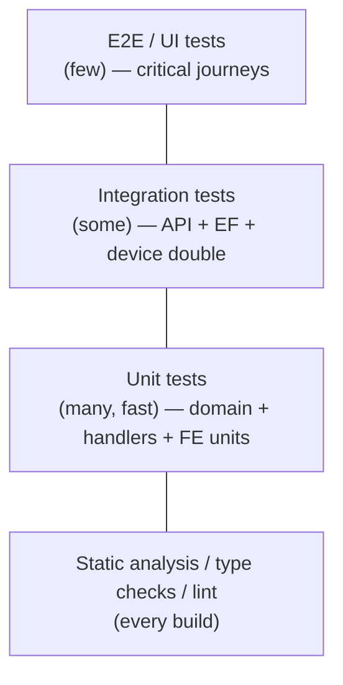

# 10 — Testing Strategy & Quality Assurance Plan

## Enterprise Time & Attendance Management System

| Field | Value |
|---|---|
| **Document Title** | Testing Strategy & Quality Assurance Plan |
| **Project** | Enterprise Time & Attendance Management System (TAMS) |
| **Document ID** | TAMS-TEST-010 |
| **Version** | 1.0 (Draft for Approval) |
| **Status** | Awaiting Approval |
| **Author** | Principal Software Architect (AI) |
| **Owner** | QA Lead / Solution Architect |
| **Date** | 2026-07-09 |
| **Classification** | Internal — Confidential |
| **Standards** | **ISO/IEC/IEEE 29119** (software testing), **IEEE 829** (test documentation), **Test Pyramid**, **ISTQB** concepts, **OWASP ASVS** (security testing) |
| **Predecessor Docs** | `01`–`09` (all approved) |
| **Successor Docs** | `11_DEPLOYMENT.md` |

> **Scope of this document.** This defines **how quality is verified** across TAMS: test levels, types, the test pyramid, coverage targets, test data strategy, environment needs, automation, the specific high-risk test scenarios (attendance calculation, ZKTeco resilience, security), UAT, defect management, entry/exit criteria, and traceability from requirements to tests.
>
> **Boundary with other docs.** This owns *what/how we test and the coverage bar*. Test **code conventions** are in `07 §10`; **CI/CD execution mechanics and environments** are in `11_DEPLOYMENT.md` (this doc states *what must run in the pipeline*, not how the pipeline is built); **security controls** being tested are defined in `06` (this doc verifies them). Acceptance targets trace to `01 §12` KPIs and `02 §6` NFRs.
>
> **Values pending stakeholder input.** Numeric NFR targets and KPI thresholds depend on **OQ-06/OQ-08**. Where unresolved, each test fixes the *scenario and pass condition structure*, marking the numeric threshold *(TBD — set before P6 UAT)*.

---

## Document Control

### Revision History

| Version | Date | Author | Description |
|---|---|---|---|
| 1.0 | 2026-07-09 | AI Architect | First complete testing strategy derived from approved Development Plan v1.0 |

### Approval Sign-off

| Role | Name | Signature | Date |
|---|---|---|---|
| QA Lead | _TBD_ | | |
| Solution Architect | _TBD_ | | |
| Development Lead | _TBD_ | | |
| Product Owner (HR) | _TBD_ | | |
| Security Lead | _TBD_ | | |

---

## Table of Contents

1. [Testing Objectives & Principles](#1-testing-objectives--principles)
2. [Test Strategy Overview & Pyramid](#2-test-strategy-overview--pyramid)
3. [Test Levels](#3-test-levels)
4. [Test Types (Functional & Non-Functional)](#4-test-types-functional--non-functional)
5. [Coverage Targets & Quality Metrics](#5-coverage-targets--quality-metrics)
6. [Test Data Strategy](#6-test-data-strategy)
7. [Test Environments](#7-test-environments)
8. [Automation Strategy & CI Integration](#8-automation-strategy--ci-integration)
9. [High-Risk Test Scenarios (Critical)](#9-high-risk-test-scenarios-critical)
10. [Security Testing](#10-security-testing)
11. [Performance & Reliability Testing](#11-performance--reliability-testing)
12. [Accessibility & Usability Testing](#12-accessibility--usability-testing)
13. [User Acceptance Testing (UAT)](#13-user-acceptance-testing-uat)
14. [Defect Management](#14-defect-management)
15. [Entry / Exit Criteria per Phase](#15-entry--exit-criteria-per-phase)
16. [Roles, Responsibilities & Deliverables](#16-roles-responsibilities--deliverables)
17. [Traceability (Requirements → Tests)](#17-traceability-requirements--tests)
18. [Glossary](#18-glossary)
19. [Documentation Review Checklist](#19-documentation-review-checklist)

---

# 1. Testing Objectives & Principles

## 1.1 Objectives

| ID | Objective |
|---|---|
| TO-01 | Verify every requirement (`02`/`05`) is met (traceable coverage) |
| TO-02 | Prove the attendance calculation is accurate (G-01, dispute-proof) |
| TO-03 | Prove zero permanent punch loss under failure (KPI-04, RK-01/02) |
| TO-04 | Verify security controls (OWASP, RBAC, audit) (`06`) |
| TO-05 | Verify NFR targets (performance, reliability, accessibility) |
| TO-06 | Catch regressions early & cheaply (shift-left) |
| TO-07 | Give the business confidence to accept (UAT vs KPIs) |

## 1.2 Principles

| ID | Principle | Meaning |
|---|---|---|
| TP-01 | **Shift-left** | Test early; most tests run per-commit in CI |
| TP-02 | **Test pyramid** | Many fast unit tests; fewer integration; fewest E2E |
| TP-03 | **Risk-based** | Most test effort on highest-risk areas (attendance, ZKTeco, security) |
| TP-04 | **Deterministic** | No flaky tests; inject time/randomness (`07 §10`) |
| TP-05 | **Traceable** | Every requirement maps to test(s) |
| TP-06 | **Automated first** | Automate anything run more than twice |
| TP-07 | **Independent** | Tests isolated; no ordering/shared-state coupling |
| TP-08 | **Fail the build** | Test/quality-gate failure blocks merge (`07 §12`) |

**Decision — risk-based effort allocation, not uniform coverage.** Testing effort is deliberately **concentrated** on the attendance calculation engine, ZKTeco resilience, and security — the three areas where a defect is most costly (wrong pay, lost data, breach). Low-risk CRUD gets solid-but-lean coverage. Spreading effort uniformly would waste it on low-risk code while under-testing the parts that actually threaten the business (TP-03). This mirrors the architecture's investment priorities (`03 §13`).

---

# 2. Test Strategy Overview & Pyramid

| Layer | Volume | Speed | What it catches |
|---|---|---|---|
| Static (analyzers, `strict` TS, arch tests) | Every build | Instant | Style, null, layer violations, async misuse |
| Unit | Most | ms | Logic correctness (esp. calc engine) |
| Integration | Moderate | s | Wiring: API↔EF↔DB, worker↔device double |
| E2E/UI | Few | slow | Critical user journeys end-to-end |
| Manual/exploratory | Targeted | — | UX, edge discovery, UAT |

**Decision — a genuine pyramid, enabled by the pure domain design.** Because the domain (especially `AttendanceCalculator`) is pure and I/O-free (`03 ADR-006`), the most business-critical logic is testable at the *fast, cheap unit level* rather than only through slow E2E paths. This is why the architecture decision pays off here: we get exhaustive coverage of attendance math in milliseconds. E2E tests are reserved for a *small* set of critical journeys (login, correct-an-exception, approve-leave) — enough to prove the system holds together, not a slow, brittle re-test of logic already covered below.

---

# 3. Test Levels

| Level | Scope | Tooling (indicative) | Owner |
|---|---|---|---|
| **Unit** | Single class/function in isolation | xUnit + FluentAssertions + Moq/NSubstitute (BE); Vitest/Jest + Testing Library (FE) | Devs |
| **Integration** | Multiple components together | ASP.NET `WebApplicationFactory`, EF with test DB, device **test double** | Devs/QA |
| **Contract** | API vs OpenAPI (`05 §13`) | OpenAPI validation / schema tests | Devs |
| **System / E2E** | Whole app via UI | Playwright (browser) | QA |
| **Acceptance (UAT)** | Business validation | Manual + scripted, by business users | PO/HR |

**Decision — the ZKTeco device is a test double, not real hardware, in CI.** All automated integration tests use an `IDeviceGateway` **fake** that can simulate punches, delays, disconnects, and duplicate records on demand. This makes device-integration tests fast, deterministic, and able to reproduce outage scenarios (§9) that would be impossible to trigger reliably against real hardware. Real-hardware validation happens as a **targeted manual/spike activity** (P3, `09 §8`), not in the per-commit pipeline. This is the only way to test resilience repeatably.

---

# 4. Test Types (Functional & Non-Functional)

| Type | Purpose | Level(s) |
|---|---|---|
| Functional | Requirement behaviour correct | Unit/Integration/E2E |
| Boundary/edge | Overnight shifts, midnight, month/year rollovers, empty data | Unit/Integration |
| Negative | Invalid input, unauthorised, malformed | Unit/Integration |
| Regression | No re-breakage | All (automated) |
| Contract | API stable vs consumers | Contract |
| Security | OWASP, authn/authz, injection | Integration + specialist (`§10`) |
| Performance | Latency/throughput vs NFR | System (`§11`) |
| Reliability/resilience | Fault tolerance, zero loss | Integration/System (`§9`,`§11`) |
| Accessibility | WCAG AA | FE/System (`§12`) |
| Usability | Task success with real users | UAT (`§13`) |
| Data integrity | Constraints/immutability enforced | Integration (DB) |

---

# 5. Coverage Targets & Quality Metrics

> Coverage is a **floor and a signal**, never the sole goal — a green coverage number on weak assertions is worthless. Targets are differentiated by risk (TP-03).

| Area | Line/branch coverage target | Rationale |
|---|---|---|
| **Domain (calc engine, policies)** | **≥ 90%** (branch-focused) | Highest-risk, pure, cheap to test → aim high |
| Application (handlers/validators) | ≥ 80% | Orchestration + validation paths |
| Infrastructure (adapters) | Meaningful integration coverage (not % chased) | Behaviour matters more than line % |
| Frontend (logic/hooks/components) | ≥ 70–80% | Focus on stateful logic & critical components |
| Critical journeys (E2E) | 100% of the defined critical set | Must always pass |

| Quality metric | Target |
|---|---|
| Flaky-test rate | ~0 (quarantine & fix) |
| Build/test pass rate on main | 100% (red main blocks) |
| Escaped-defect rate (post-UAT) | Trend to minimal |
| Critical/High open defects at release | 0 (exit criterion) |
| Requirement test-coverage (RTM) | 100% of Must requirements |

**Decision — 90% *branch* coverage on the domain, but explicitly reject coverage-chasing elsewhere.** The attendance/leave domain logic is where correctness translates directly to money and trust, so it earns a high **branch** target (every rule path exercised). Elsewhere — especially infrastructure adapters — chasing a line-% produces brittle, low-value tests; we instead require *meaningful behavioural* integration tests. Naming this distinction prevents the classic anti-pattern of teams writing empty tests to hit a number (TP-03/TO-02).

---

# 6. Test Data Strategy

| Concern | Approach |
|---|---|
| Unit test data | In-code **builders/factories** (Object Mother); no shared mutable fixtures |
| Deterministic time | Injected `IClock` — fixed clocks per test (`07 §10`) |
| Integration DB | Ephemeral/seeded test database per run; reset between suites |
| Reference data | Seed roles/permissions/leave types as in `04 §12` |
| Realistic scenarios | Curated datasets: overnight shifts, missing punches, leave overlaps, DST edge |
| PII in test data | **Synthetic only** — never real employee PII (`06`, privacy) |
| Payroll export fixtures | Golden-file comparison once OQ-04 format known |

**Decision — synthetic data only, generated by builders; never production PII in tests.** Two reasons: (1) using real employee data in test/CI environments is a privacy/compliance breach waiting to happen (`06 §14`); (2) builders produce *precise, intention-revealing* scenarios ("employee with a missing OUT punch on an overnight shift") that random/prod data can't guarantee. Curated edge-case datasets (midnight crossings, DST, leave overlaps) are first-class assets because that's exactly where attendance bugs hide.

---

# 7. Test Environments

| Environment | Purpose | Notes |
|---|---|---|
| **Local/Dev** | Fast feedback | Unit + light integration; device double |
| **CI** | Automated gate on every push/PR | Full unit+integration+contract+static; device double |
| **Test/QA** | System & manual testing | Deployed build; seeded data; device double or lab device |
| **Staging** | Prod-like; perf/security/UAT | Mirrors prod config; **real ZKTeco lab device**; TDE/TLS on |
| **Prod** | Live | Smoke tests post-deploy only |

> Provisioning and configuration of these environments are owned by `11_DEPLOYMENT.md`; this section states the *testing purpose* of each.

**Decision — resilience & performance validated on Staging with a real lab device; CI uses doubles.** CI must be fast and deterministic, so it uses the device double. But the *final* proof of zero-loss (KPI-04) and performance must occur against a **prod-like Staging with a real ZKTeco device**, because SDK/network quirks (OQ-01) only manifest against real hardware. Splitting responsibilities — CI for breadth/speed, Staging for real-world fidelity — gives both fast feedback and trustworthy final validation.

---

# 8. Automation Strategy & CI Integration

| Stage | Runs | Gate |
|---|---|---|
| Pre-commit (local hooks) | Format, lint, secret scan | Local |
| On PR / push | Build; unit; integration; contract; arch tests; static analysis; SAST/dependency/secret scan | **Merge blocked on failure** |
| On merge to main | Full suite + deploy to Test | Red main = stop-the-line |
| Nightly/scheduled | Longer suites: performance smoke, extended fault-injection, dependency audit | Report + alert |
| Pre-release (P6) | Full regression + perf + security + accessibility + UAT | Release gate |
| Post-deploy | Smoke/health checks (`05 §10.9`) | Rollback trigger |

**Decision — the pipeline is the enforcer; anything run more than twice is automated.** Every quality gate defined in `07 §12` and `06 §15` is wired into CI so failures **block the merge**, not just annotate a PR. Heavy, slower suites (full performance, extended fault-injection) run nightly and pre-release rather than per-commit, keeping the per-commit loop fast (TP-01/TP-06). Manual effort is reserved for genuinely human tasks — exploratory testing, UX judgement, UAT.

---

# 9. High-Risk Test Scenarios (Critical)

> These are the scenarios that most threaten the business. Each is a **mandatory, first-class** test suite.

## 9.1 Attendance calculation correctness (TO-02, G-01)

| Scenario | Expected |
|---|---|
| Normal in/out within shift | Correct worked minutes; no late/early |
| Late arrival beyond grace | Correct late minutes |
| Early departure | Correct early-leave minutes |
| **Overnight shift crossing midnight** | Worked hours correct across the date boundary |
| Overtime beyond shift | OT computed per policy (OQ-02) |
| Missing IN / missing OUT | Correct exception raised (no silent zero) |
| Duplicate punches | De-duplicated; single result |
| Multiple in/out pairs | First-in/last-out (or policy) resolved correctly |
| Approved leave on a day | Day not marked absent (BRULE-06) |
| Shift changed effective-dated | Historical day uses shift in force *then* |
| Recalculation after correction | Deterministic, consistent, audited |
| DST / timezone boundary | No off-by-one-hour error |

**Decision — treat the calculation engine like a safety-critical component.** Because a calc error becomes a payroll error and a dispute, the `AttendanceCalculator` gets an exhaustive, table-driven unit suite covering every rule, edge and boundary above. Overnight/DST/effective-dated cases are explicitly enumerated because they are the classic sources of silent attendance bugs. This suite is the concrete verification of accuracy goal G-01.

## 9.2 ZKTeco resilience & zero-loss (TO-03, KPI-04, RK-01/02)

| Scenario (via device double / lab device) | Expected |
|---|---|
| Device unreachable during poll | Retry/backoff; **watermark not advanced**; no loss |
| Network drop mid-download | Partial handled safely; re-sync completes set |
| Worker crash/restart mid-sync | Resume from watermark; exactly-once; no dup/loss |
| Duplicate records returned by device | Idempotency key → single stored punch |
| Outage then recovery (offline recovery) | All buffered/missed punches ingested exactly once |
| Reconciliation detects a gap | Gap surfaced/cleared |
| Prolonged outage past threshold | Alert raised (FR-ZK-011) |
| Realtime + poll overlap | No double-count |

**Decision — prove zero-loss by actively injecting failure, not by observing happy paths.** The device double is built specifically to *fail on command* — disconnect mid-stream, kill the worker, replay duplicates. A resilience claim is only credible if we've tried hard to break it. Passing this suite is the **P3 exit gate** (`09 §11`) and is what lets us assert KPI-04 (zero permanent loss) as a fact rather than a hope. Final confirmation runs against a real lab device on Staging (§7).

## 9.3 Security-critical (TO-04)

| Scenario | Expected |
|---|---|
| Access without token | 401 |
| Access without permission | 403 |
| Manager requests other team's data | 403/empty (server-derived scope) |
| Tampered/expired JWT | Rejected |
| SQL injection attempt in inputs | Neutralised (parameterised) |
| Over-posting extra fields | Ignored/rejected |
| Attempt to mutate raw punch/audit | No endpoint; denied |
| Brute-force login | Lockout/throttle (429/423) |

## 9.4 Data-integrity (DB)

| Scenario | Expected |
|---|---|
| Duplicate EmployeeNo/idempotency key | Rejected (unique constraint) |
| Two records same employee/day | Prevented |
| Delete department with active employees | Blocked (`04 §7`) |
| Cascade rules | Only owned children cascade; facts/audit never |

---

# 10. Security Testing

Verifies every item in the `06 §10` OWASP matrix and `06 §15` plan.

| Activity | Cadence | Trace |
|---|---|---|
| SAST | Every build | A03/A06 |
| Dependency scanning | Every build + nightly | A06 |
| Secret scanning | Every commit | `06 §9` |
| AuthN/AuthZ automated tests | CI | §9.3, A01/A07 |
| Injection/over-posting tests | CI | A03 |
| OWASP Top 10 checklist review | Pre-release (P6) | `06 §10` |
| DAST / penetration test | Pre-release + periodic | ASVS |
| Security-focused fault injection | Pre-release | token/replay/spoof |

**Decision — the OWASP matrix is an executable checklist, item-by-item.** Each of the ten `06 §10` rows has at least one concrete automated test or a documented pre-release verification. "OWASP compliant" (BR-052) thus becomes a **pass/fail report**, not an assertion — closing the gap between claiming security and proving it.

---

# 11. Performance & Reliability Testing

| Test | Measures | Target | Trace |
|---|---|---|---|
| Load test (API) | P95 latency under normal load | ≤ 500 ms *(confirm OQ-06)* | NFR-01/NAPI-02 |
| Stress test | Behaviour beyond expected load | Graceful degradation | NFR |
| Soak test | Stability over time; leaks | Stable | NFR |
| Report/export perf | Generation time | ≤ target *(TBD)* | NFR-02 |
| Device poll throughput | Cycle within interval, no backlog | No overlap | NFR-04 |
| Dashboard freshness | Latency to reflect data | ≤ 60 s | NFR-03 |
| Fault-injection reliability | Zero permanent loss | 0 lost | NFR-08/KPI-04 |
| Failover/recovery | Recover from transient faults | Recovers | NFR-09/11 |

**Decision — performance targets are structured now, numbers confirmed at OQ-06.** Each performance test has a defined method and pass-condition shape today; the exact numeric target is bound to sizing (OQ-06) and locked before P6. This lets the team build the harness early and run it continuously (catching regressions), while avoiding fabricated thresholds. Reliability (zero-loss) has a *fixed* target (0) because it's a business absolute, not a tunable number.

---

# 12. Accessibility & Usability Testing

| Activity | Approach | Trace |
|---|---|---|
| Automated a11y checks | axe-core in component/E2E tests | `08 §12` |
| Keyboard-only pass | Manual: full task completion without mouse | NUX-04 |
| Screen-reader pass | Manual: key journeys | WCAG AA |
| Contrast / status-not-colour-only | Automated + manual review | `08 §12` |
| Usability testing | Real HR/managers complete key tasks; measure success/time/errors | `08 §15`, G-02 |

**Decision — accessibility is both automated and manually verified; usability is tested with real users.** Automated checks (axe) catch mechanical violations cheaply on every build, but true accessibility (screen-reader flow, keyboard completion) and usability (can Nadia actually close the month faster?) require **real human testing**. Usability sessions measure task success/time/error against the "reduce admin effort" goal (G-02) — turning a UX aspiration into evidence.

---

# 13. User Acceptance Testing (UAT)

| Aspect | Approach |
|---|---|
| Who | Product Owner + representative HR officers, managers, admin |
| When | P6, on Staging (prod-like, real lab device) |
| Basis | Business scenarios mapped to `01` KPIs & `02` acceptance criteria |
| Scripts | Scenario-based UAT scripts per persona journey (`08 §2`) |
| Data | Realistic synthetic dataset + representative device punches |
| Sign-off | Formal acceptance against exit criteria (§15) |

## 13.1 Sample UAT acceptance scenarios

| ID | Scenario | Pass condition | KPI |
|---|---|---|---|
| UAT-01 | HR resolves a month of exceptions | Faster than baseline; all audited | G-02/G-05 |
| UAT-02 | Punches survive a simulated device outage | No missing attendance after recovery | KPI-04 |
| UAT-03 | Manager approves team leave; reflected in attendance | Correct integration | FR-LV-005 |
| UAT-04 | Payroll export matches records | Reconciles exactly | G-08 |
| UAT-05 | Unauthorised access blocked | 0 unauthorised access | KPI-06 |
| UAT-06 | Dashboard shows accurate near-real-time status | Within freshness target | G-03 |

**Decision — UAT is scenario-based against KPIs, run on Staging with a real device.** UAT validates *business outcomes*, not features in isolation — each scenario maps to a BRD KPI (`01 §12`) so acceptance literally measures whether the project delivered its promised value. Running it on prod-like Staging with a real ZKTeco device ensures no nasty surprise between "accepted" and "live." Exact numeric thresholds come from OQ-08.

---

# 14. Defect Management

| Severity | Definition | Target handling |
|---|---|---|
| **Critical** | Data loss, security breach, payroll-wrong, system down | Stop-the-line; fix immediately |
| **High** | Major function broken; no workaround | Fix within sprint |
| **Medium** | Function impaired; workaround exists | Prioritised in backlog |
| **Low** | Minor/cosmetic | Backlog |

| Aspect | Approach |
|---|---|
| Tracking | Issue tracker; linked to requirement & test |
| Triage | Regular; severity + priority assigned |
| Reproduction | Steps + correlation id (`05 §6`) |
| Regression guard | Every fixed defect gets an automated test |
| Release rule | **0 Critical/High open** at release (exit criterion) |

**Decision — every fixed defect becomes a regression test.** A bug that recurs is a process failure. Requiring an automated test for each fix means the defect can never silently return, and the regression suite grows to encode real-world failure modes — a compounding quality asset. Critical defects (data loss, security, wrong pay) trigger stop-the-line, reflecting their business severity.

---

# 15. Entry / Exit Criteria per Phase

| Phase | Entry | Exit (test gate) |
|---|---|---|
| Any sprint | Stories meet DoR (`09 §9`) | DoD met; CI green; new tests pass |
| P1 | Skeleton ready | Auth/RBAC tests pass; security review; CI gates live |
| P2 | Calc engine built | **Attendance calc suite (§9.1) passes + business validation** |
| P3 | Worker + core ready | **Zero-loss fault-injection (§9.2) passes** |
| P4 | Leave built | Leave↔attendance integration tests pass |
| P5 | Reporting built | Payroll export reconciles; role-scope tests pass |
| P6 | Feature-complete | Full regression + perf(NFR) + security(OWASP/pen) + a11y + **UAT sign-off**; 0 Critical/High |
| P7 | Release candidate | Staging deploy validated; smoke tests pass |

**Decision — phase exits are test-gated, and P2/P3/P6 gates are non-negotiable.** A phase is not "done" because features exist; it's done when the **evidence** (passing critical suites) exists. The three hardest guarantees — calculation accuracy (P2), zero-loss (P3), and secure+accepted (P6) — are explicit, mandatory gates. This makes quality a checkpoint, not an afterthought, and directly enforces the development plan's gates (`09 §11`).

---

# 16. Roles, Responsibilities & Deliverables

| Role | Responsibility |
|---|---|
| Developers | Unit/integration/contract tests; fix defects; keep CI green |
| QA Engineer | Test plan/cases, E2E automation, exploratory, defect triage, coverage reporting |
| Solution Architect | Architecture/arch-test integrity; review high-risk suites |
| Security reviewer | Security test oversight; OWASP/pen coordination |
| Product Owner / HR | UAT scenarios & sign-off |
| DevOps | CI/CD wiring of test stages (`11`) |

| Deliverable | Owner |
|---|---|
| Test plan (this doc) | QA Lead |
| Automated test suites | Devs/QA |
| RTM (requirement→test) | QA |
| Coverage & quality reports | QA/CI |
| UAT scripts & sign-off | PO/QA |
| Defect reports | All |

---

# 17. Traceability (Requirements → Tests)

| Requirement group | Test coverage |
|---|---|
| FR-AUTH-*/RBAC | §9.3 authn/authz suites; security tests (§10) |
| FR-EMP-*/DEP-* | Unit + integration CRUD/validation; §9.4 integrity |
| FR-SFT-* | Shift/effective-dating unit + integration |
| FR-ATT-* (calc) | **§9.1 exhaustive calc suite** (unit) + integration |
| FR-ATT-005/006/009 | Exception/correction/recalc tests + audit checks |
| FR-ZK-* (resilience) | **§9.2 fault-injection suite** (double + lab device) |
| FR-LV-* | Leave flow + attendance-integration tests |
| FR-RPT-* | Report/export + reconcile + role-scope tests |
| FR-AUD-* | Audit immutability & append-only tests (§9.3/9.4) |
| NFR perf/reliability | §11 performance & fault-injection |
| NFR security | §10 |
| NFR usability/a11y | §12 |
| Business KPIs (`01 §12`) | §13 UAT |
| Every Must requirement | RTM 100% (§5) |

---

# 18. Glossary

Inherits prior docs. Testing-specific additions:

| Term | Definition |
|---|---|
| **Test pyramid** | Many unit, fewer integration, fewest E2E tests. |
| **Shift-left** | Testing early in the lifecycle. |
| **Device double / fake** | Simulated `IDeviceGateway` for deterministic device tests. |
| **Fault injection** | Deliberately inducing failures to test resilience. |
| **Table-driven test** | One test body, many input/expected rows. |
| **Golden file** | Reference output compared against (e.g. export). |
| **Object Mother / builder** | Factory producing test entities. |
| **Contract test** | Verifies API conforms to its OpenAPI contract. |
| **UAT** | User Acceptance Testing. |
| **RTM** | Requirements Traceability Matrix. |
| **Flaky test** | Non-deterministic pass/fail; prohibited. |
| **Soak test** | Long-duration stability test. |

---

# 19. Documentation Review Checklist

**Reviewer instructions:** mark ✅ Pass / ⚠️ Needs change / ❌ Fail. Approved when all **Mandatory** items pass.

### 19.1 Completeness

| # | Check | Mandatory | Status |
|---|---|---|---|
| C-01 | Objectives & principles stated | ✔ | ☐ |
| C-02 | Test pyramid/strategy defined | ✔ | ☐ |
| C-03 | Test levels defined | ✔ | ☐ |
| C-04 | Test types (func + non-func) defined | ✔ | ☐ |
| C-05 | Coverage targets & metrics defined | ✔ | ☐ |
| C-06 | Test data strategy defined | ✔ | ☐ |
| C-07 | Test environments defined | ✔ | ☐ |
| C-08 | Automation & CI integration defined | ✔ | ☐ |
| C-09 | High-risk scenarios (calc, ZKTeco, security, integrity) defined | ✔ | ☐ |
| C-10 | Security testing defined | ✔ | ☐ |
| C-11 | Performance & reliability testing defined | ✔ | ☐ |
| C-12 | Accessibility & usability testing defined | ✔ | ☐ |
| C-13 | UAT defined | ✔ | ☐ |
| C-14 | Defect management defined | ✔ | ☐ |
| C-15 | Entry/exit criteria per phase defined | ✔ | ☐ |

### 19.2 Quality & Soundness

| # | Check | Mandatory | Status |
|---|---|---|---|
| Q-01 | Risk-based effort (calc/ZKTeco/security emphasised) | ✔ | ☐ |
| Q-02 | Zero-loss proven by fault injection, gated at P3 | ✔ | ☐ |
| Q-03 | Calc engine tested exhaustively (edges/overnight/DST) | ✔ | ☐ |
| Q-04 | Coverage is risk-differentiated, not blindly chased | ✔ | ☐ |
| Q-05 | Deterministic tests (IClock, device double) | ✔ | ☐ |
| Q-06 | Synthetic-only test data (no prod PII) | ✔ | ☐ |
| Q-07 | Security = executable OWASP checklist | ✔ | ☐ |
| Q-08 | Every significant decision explained | ✔ | ☐ |

### 19.3 Alignment & Traceability

| # | Check | Mandatory | Status |
|---|---|---|---|
| A-01 | Enforces dev-plan phase gates (`09 §11`) | ✔ | ☐ |
| A-02 | Verifies security controls (`06`) | ✔ | ☐ |
| A-03 | Verifies NFR targets (`02 §6`) | ✔ | ☐ |
| A-04 | UAT maps to BRD KPIs (`01 §12`) | ✔ | ☐ |
| A-05 | Defers CI mechanics to `11`, test conventions to `07` | ✔ | ☐ |
| A-06 | OQ-dependent thresholds flagged, not fabricated | ✔ | ☐ |
| A-07 | Traceability table complete | ✔ | ☐ |

### 19.4 Governance

| # | Check | Mandatory | Status |
|---|---|---|---|
| G-01 | Document control & versioning present | ✔ | ☐ |
| G-02 | Approval sign-off present | ✔ | ☐ |
| G-03 | Ready to proceed to `11_DEPLOYMENT.md` on approval | ✔ | ☐ |

---

### ✅ Approval Gate

> **This Testing Strategy (v1.0) is submitted for your approval.** I will **not** begin `11_DEPLOYMENT.md` until you approve or request changes.

**Please respond with one of:**
1. **Approved** → I proceed to `11_DEPLOYMENT.md`.
2. **Approved with changes** → list changes; I revise then proceed.
3. **Changes required** → list changes; I revise and resubmit this document only.

*End of Document — TAMS-TEST-010 v1.0*
