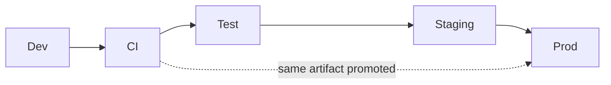
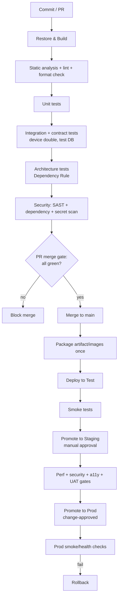
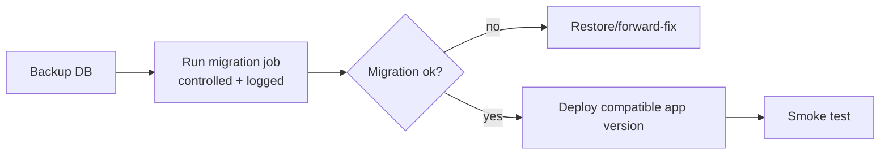

# 11 — Deployment & DevOps Guide

## Enterprise Time & Attendance Management System

| Field | Value |
|---|---|
| **Document Title** | Deployment & DevOps Guide |
| **Project** | Enterprise Time & Attendance Management System (TAMS) |
| **Document ID** | TAMS-DEPLOY-011 |
| **Version** | 1.0 (Draft for Approval) |
| **Status** | Awaiting Approval |
| **Author** | Principal Software Architect (AI) |
| **Owner** | DevOps Lead / Solution Architect |
| **Date** | 2026-07-09 |
| **Classification** | Internal — Confidential |
| **Standards** | **12-Factor App**, **CI/CD best practice**, **Infrastructure as Code (IaC)**, **OWASP secure deployment**, **ITIL change management** concepts |
| **Predecessor Docs** | `01`–`10` (all approved) |
| **Successor Docs** | `12_USER_MANUAL.md`, `13_ADMIN_GUIDE.md`, `14_MAINTENANCE_GUIDE.md` |

> **Scope of this document.** This defines **how TAMS is built, packaged, configured, deployed, released, monitored, backed up, and rolled back** — the CI/CD pipeline, environments, configuration & secrets wiring, database-migration execution, the API + Worker deployment topology, observability, and the initial on-premises deployment with the documented cloud-migration path.
>
> **Boundary with other docs.** This owns *build → release → run* mechanics. It does **not** redefine the architecture (→ `03`), security *controls* (→ `06`, here we *wire* them), test *content* (→ `10`, here we *run* it in CI), or day-2 operations/runbooks (→ `14_MAINTENANCE_GUIDE.md`). This is where the `07 §12` quality gates and `06 §15` security scans become concrete pipeline stages.
>
> **Environment note.** Initial target is **on-premises / single-region** (BRD AS-05); the cloud path is documented (from `03 §11.2`) so migration is a re-hosting exercise, not a redesign. Concrete host names, IPs, and vendor products are **deployment-time parameters (IaC variables)**, not hard-coded here — this keeps the guide reusable across environments and the future cloud target.

---

## Document Control

### Revision History

| Version | Date | Author | Description |
|---|---|---|---|
| 1.0 | 2026-07-09 | AI Architect | First complete deployment guide derived from approved Testing Strategy v1.0 |

### Approval Sign-off

| Role | Name | Signature | Date |
|---|---|---|---|
| DevOps Lead | _TBD_ | | |
| Solution Architect | _TBD_ | | |
| IT Operations Lead | _TBD_ | | |
| Security Lead | _TBD_ | | |

---

## Table of Contents

1. [Deployment Principles](#1-deployment-principles)
2. [Environment Topology](#2-environment-topology)
3. [Build & Package Strategy](#3-build--package-strategy)
4. [CI/CD Pipeline](#4-cicd-pipeline)
5. [Configuration & Secrets Management](#5-configuration--secrets-management)
6. [Database Migration Deployment](#6-database-migration-deployment)
7. [Deployment Topology (API + Worker + DB)](#7-deployment-topology-api--worker--db)
8. [Release Strategy & Rollback](#8-release-strategy--rollback)
9. [Observability (Logging, Metrics, Health, Alerting)](#9-observability-logging-metrics-health-alerting)
10. [Backup & Disaster Recovery](#10-backup--disaster-recovery)
11. [Security Hardening at Deploy](#11-security-hardening-at-deploy)
12. [Scaling Strategy](#12-scaling-strategy)
13. [Cloud Migration Path](#13-cloud-migration-path)
14. [Deployment Runbook (Go-Live)](#14-deployment-runbook-go-live)
15. [Traceability (Requirements → Deployment)](#15-traceability-requirements--deployment)
16. [Glossary](#16-glossary)
17. [Documentation Review Checklist](#17-documentation-review-checklist)

---

# 1. Deployment Principles

| ID | Principle | Consequence |
|---|---|---|
| DP-01 | **12-Factor** | Config from environment; stateless processes; logs as streams |
| DP-02 | **Build once, promote the same artifact** | Identical binary Dev→…→Prod; no per-env rebuild |
| DP-03 | **Infrastructure as Code** | Environments reproducible, versioned, reviewable |
| DP-04 | **Automated, gated pipeline** | No manual/ad-hoc production changes |
| DP-05 | **Migrations are explicit & controlled** | Never auto-migrate on prod app startup (`04 §14`) |
| DP-06 | **Secure by deployment** | TLS, secrets in store, hardened config, least privilege |
| DP-07 | **Observable** | Health, metrics, structured logs from day one |
| DP-08 | **Reversible** | Every release has a rollback path |
| DP-09 | **Parity across environments** | Staging mirrors Prod to make tests meaningful |
| DP-10 | **No cloud lock-in in core** | Platform specifics only in infra/adapters (`03 ADR-008`) |

**Decision — build once, promote the same artifact (DP-02).** The exact binary/image tested in CI and Staging is the one that reaches Production — no rebuild per environment. Rebuilding risks "works in test, breaks in prod" from toolchain drift. Environments differ **only in injected configuration** (DP-01), so a passing Staging test is genuine evidence about Production. This is the deployment counterpart of the deterministic-testing principle (`10 TP-04`).

---

# 2. Environment Topology

| Environment | Purpose | Parity | Data | Devices |
|---|---|---|---|---|
| **Dev** | Local development | Low | Synthetic | Device double |
| **CI** | Automated build/test gate | Build parity | Ephemeral | Device double |
| **Test/QA** | System & manual testing | Medium | Seeded synthetic | Double or lab |
| **Staging** | Prod-like: perf/security/UAT | **High (mirrors Prod)** | Realistic synthetic | **Real lab ZKTeco** |
| **Production** | Live | — | Real | Real ZKTeco fleet |



**Decision — Staging is a true prod mirror, and it is where release confidence is earned.** Staging matches Production in configuration shape, TLS/TDE, topology, and uses a **real lab ZKTeco device** — because the biggest unknowns (device/SDK behaviour OQ-01, real performance) only surface against realistic infrastructure (`10 §7`). Investing in genuine Staging parity (DP-09) is what makes "it passed Staging" a trustworthy predictor of Production, and is where UAT and the P6 gates run.

---

# 3. Build & Package Strategy

| Component | Build output | Notes |
|---|---|---|
| **API** (`TAMS.Api`) | Self-contained/framework-dependent .NET publish; **container image** | Stateless; horizontally scalable |
| **Worker** (`TAMS.Worker`) | .NET publish; **container image** | Separate deployable (ADR-002) |
| **Frontend** (`client`) | Static build (Vite/CRA output) | Served by API host or static host/CDN |
| **DB migrations** | EF Core migrations bundle / SQL script | Applied as controlled step (§6) |
| **IaC** | Environment definitions (declarative) | Versioned with code |

**Decision — containerise the API and Worker; ship the SPA as static assets.** Containers give identical runtime across on-prem and future cloud (DP-02/DP-10) and cleanly separate the two backend processes (`03 ADR-002/003`). The React SPA is just static files — served initially by the API host/reverse proxy, and trivially movable to a CDN later. This packaging is deliberately cloud-portable: the same images run on-prem now and on a container platform after migration (§13), with no code change.

---

# 4. CI/CD Pipeline

Realises `07 §12` (quality gates) and `06 §15` (security scans) as concrete stages. **A failing stage blocks promotion.**



| Stage | Gate | Trace |
|---|---|---|
| Build/lint/analyzers | Must pass | `07 §12` |
| Unit/integration/contract | Must pass | `10 §8` |
| Architecture tests | Dependency Rule intact | `03`, `07` |
| SAST/dependency/secret scan | No high findings/secrets | `06 §15` |
| PR merge | All above green + review | `07 §11` |
| Test deploy + smoke | Healthy | `05 §10.9` |
| Staging promotion | Manual approval | change control |
| P6 gates (perf/sec/a11y/UAT) | Pass before Prod | `09 §11`,`10 §15` |
| Prod promotion | Change-approved | §8 |
| Post-deploy smoke | Healthy or rollback | §8 |

**Decision — the pipeline enforces every prior document's gates; promotion is gated, not scheduled.** Rather than "deploy on Fridays," artifacts promote **when they pass the gates for the next environment**. Merge to `main` requires all CI/quality/security stages green (`07`/`06`); Staging→Prod requires the P6 gates (`09`/`10`) plus change approval. This makes the pipeline the single, auditable enforcement point for the whole quality regime — nothing reaches Production that hasn't provably passed everything.

---

# 5. Configuration & Secrets Management

| Concern | Approach | Trace |
|---|---|---|
| Config source | **Environment variables / config provider per env** (12-Factor III) | DP-01 |
| No secrets in source/images | Enforced by secret scanning; images contain none | `06 §9` |
| Secret store | DB creds, JWT signing key, device creds, cert refs in a secret manager/vault | `06 §9` |
| Per-env values | Connection strings, URLs, log levels, feature flags — injected, not baked | DP-02 |
| Config validation | App validates required config at startup; fail fast if missing | `07 §5` |
| Rules-as-data config | Business config (`Config.ConfigurationItem`) in DB, not deploy config | `04`, `05 §10.8` |

**Decision — separate *deployment* config from *business* config.** Deployment config (connection strings, keys, URLs) is injected per environment via the secret store/environment (12-Factor). **Business** config (shift tolerances, OT policy, leave types) lives in the database as rules-as-data (`04 §12`, FR-ADM-003) and is changed by admins at runtime — *not* via redeploy. Conflating them would force a deployment for every policy tweak; separating them means OQ-02/OQ-03 answers are data updates, and secrets never touch source or images.

---

# 6. Database Migration Deployment

| Aspect | Approach |
|---|---|
| Tooling | EF Core migrations (code-first, `04 §14`) |
| Execution | **Explicit, controlled deploy step** — a migration job/command, gated & logged |
| **Not** on app startup | Prod app does **not** auto-migrate | 
| Ordering | Migrate DB, then deploy compatible app version |
| Backward compatibility | Prefer expand→migrate→contract for zero-downtime schema change |
| Verification | Post-migration checks; smoke tests |
| Rollback | Forward-fix preferred; reversible down-migrations where safe; backup taken first (§10) |



**Decision — migrations run as a deliberate, gated step with a backup first; never auto-migrate in Production.** Auto-migrating on app startup means any accidental deploy can mutate the production schema, and a failed migration can leave the app crash-looping. Running migrations as an **explicit job** (backup → migrate → verify → deploy app) makes schema change reviewable, reversible, and decoupled from app rollout — and the **expand→contract** pattern enables zero-downtime changes. This operationalises `04 §14`.

---

# 7. Deployment Topology (API + Worker + DB)

## 7.1 Initial on-premises topology

```mermaid
flowchart TB
    subgraph Client Network
      U[User Browsers]
    end
    subgraph Edge
      RP[Reverse Proxy / TLS<br/>+ static SPA + security headers]
    end
    subgraph App Tier
      API1[API instance 1]
      API2[API instance 2]
      WK[Worker instance]
    end
    subgraph Data Tier
      DB[(SQL Server<br/>TDE + backups)]
      SEC[Secret Store]
    end
    subgraph Device Network (segmented)
      ZK[ZKTeco Fleet]
    end
    LOG[(Log / Metrics store)]

    U -->|HTTPS| RP --> API1 & API2
    API1 & API2 --> DB
    API1 & API2 --> SEC
    WK --> DB
    WK --> SEC
    WK <-->|segmented| ZK
    API1 & API2 --> LOG
    WK --> LOG
```

| Element | Deployment notes |
|---|---|
| Reverse proxy | TLS termination, security headers (`06 §13`), routes to API, serves SPA |
| API | ≥2 instances behind proxy for availability/scale (stateless, AP-06) |
| Worker | Single active instance initially; partition per device set when scaling (§12) |
| SQL Server | Single instance now; HA option later; TDE + backups |
| Secret store | Reachable only from app tier |
| Device network | **Segmented VLAN**; only Worker bridges to it (`06 §12`) |

**Decision — API scales horizontally; the Worker is deployed as a distinct, single active instance initially.** The stateless API runs ≥2 instances for availability and load spread. The Worker, which owns device I/O, starts as **one active instance** to avoid two workers double-polling the same device; when the device fleet grows, it scales by **partitioning devices across worker instances** (§12) rather than duplicating work. This topology directly reflects `03`'s process separation (ADR-002/003) and statelessness (AP-06).

---

# 8. Release Strategy & Rollback

| Aspect | Approach |
|---|---|
| Production release | Single go-live at M8 (`09 §10`), then controlled incremental releases |
| Change control | Prod releases are change-approved & scheduled (ITIL-style) |
| Deployment technique | Rolling (API instances one at a time) for zero/low downtime; Worker restart resumes via watermark |
| Feature flags | Ship dormant features safely; enable via config |
| Post-deploy validation | Smoke/health checks (`05 §10.9`) |
| **Rollback** | Redeploy previous known-good artifact; DB via forward-fix/restore (§6) |
| Rollback trigger | Failed smoke tests, health degradation, critical defect |

**Decision — rolling API deploys + watermark-safe Worker restarts give low-downtime releases without complex tooling.** Because the API is stateless, instances can be replaced one at a time behind the proxy (rolling) — users see no outage. The Worker can simply be stopped and restarted on the new version; it **resumes from its per-device watermark** (`04`, ADR-011) with no lost or duplicated punches. This means releases don't require blue-green infrastructure to be safe — the architecture already made restarts safe. Rollback is "promote the previous artifact," made trivial by build-once (DP-02/DP-08).

---

# 9. Observability (Logging, Metrics, Health, Alerting)

| Pillar | Implementation | Trace |
|---|---|---|
| **Structured logs** | Serilog → central sink; correlation id on every entry; secrets/PII masked | `06 §11`, NFR-25 |
| **Metrics** | Request rates/latency, error rates, DB, worker sync success/failure, device reachability | NFR-26 |
| **Health checks** | `/health/live`, `/health/ready` (DB + worker/device subsystem) | `05 §10.9` |
| **Dashboards (ops)** | Operational dashboards for the above | `14` |
| **Alerting** | Auth-failure spikes, device unreachable > threshold, error spikes, failed migrations/deploys | `06 §11`, FR-ZK-011 |
| **Tracing** | Correlation id end-to-end (client→API→worker→logs) | `05`,`06` |

**Decision — device reachability and sync success are first-class operational metrics with alerts.** General app metrics matter, but the business's top risk is silent capture loss (RK-01/02). So the ops stack explicitly monitors **per-device last-seen, sync success/failure, and consecutive-failure counts** (from `04 DeviceSyncState`) and **alerts** when a device is unreachable past threshold (FR-ZK-011). This turns the backend's resilience into *actionable operational awareness* — an outage pages someone, rather than being discovered at payroll close.

---

# 10. Backup & Disaster Recovery

| Aspect | Approach |
|---|---|
| DB backups | Regular full + differential + transaction-log backups; **encrypted** (`06 §8`) |
| Backup testing | Periodic restore drills (a backup is unverified until restored) |
| Retention | Per data-retention policy (OQ-05) |
| RPO / RTO | Targets set with stakeholders *(TBD — OQ-05/business)* |
| Config/secrets | Secret store backed up per its policy |
| DR plan | Documented restore procedure; alternate host readiness | 
| Immutable data | Raw punches & audit included in backups (integrity evidence) |

**Decision — backups are encrypted and restore-tested; RPO/RTO are set with the business.** An untested backup is a liability, not an asset — so periodic **restore drills** are mandatory. Backups are encrypted to match at-rest protection (`06 §8`) so a stolen backup isn't a breach. RPO/RTO (how much data loss / downtime is tolerable) are **business decisions** tied to the retention regime (OQ-05); the guide fixes the *mechanism* now and the *targets* are confirmed with stakeholders before go-live. Detailed DR runbook lives in `14`.

---

# 11. Security Hardening at Deploy

Wires the `06` controls into the running system.

| Control | Deploy-time action | Trace |
|---|---|---|
| TLS | Certs installed; HTTP→HTTPS redirect; HSTS | `06 §13` |
| Security headers | CSP, X-Content-Type-Options, frame-ancestors, Referrer-Policy at proxy | `06 §13` |
| CORS | Allow-list SPA origin(s) only | `06 §13` |
| Secrets | Injected from store; none in images/config files | `06 §9` |
| DB | TDE on; least-privilege app principal; audit grants (INSERT/SELECT only) | `04 §13`,`06 §11` |
| Swagger | Disabled or auth-gated in Prod | `06 §13` |
| Least privilege | Service accounts/DB principals minimally scoped | `06 §5` |
| Network | Device VLAN segmented; data tier reachable only from app tier | `06 §2/§12` |
| Patch baseline | Hosts/images patched before go-live | `06 §10 A06` |

**Decision — deployment is a security control point, not just a copy step.** Many breaches come from *misconfiguration* (OWASP A05), not code flaws. So the deploy process explicitly applies TLS/headers/CORS, verifies secrets come only from the store, confirms DB grants (including audit immutability), and gates Swagger — turning the `06` design into an enforced runtime posture. These are checklist items in the go-live runbook (§14), not assumptions.

---

# 12. Scaling Strategy

| Dimension | Strategy | Trace |
|---|---|---|
| API load | Add stateless API instances behind proxy | AP-06 |
| DB | Vertical scale first; read replicas/HA if needed (evidence-driven) | `03` |
| Worker / many devices | **Partition devices across worker instances** (each owns a device subset) | `03 AR-04` |
| Reporting load | Read-optimised queries; read models only if measured | `03 §13` |
| Hot data growth | Partition/archive punches & audit when sizing warrants (OQ-06) | `04 §15` |

**Decision — scale by partitioning devices across workers, not by running duplicate full workers.** Two workers polling the *same* device would double-count/contend. The scaling unit for capture is therefore a **device partition**: each worker instance owns a distinct subset of devices, so adding workers adds capacity linearly without duplication. Everything else scales on the stateless API. All scaling beyond the baseline is **evidence-driven** (measured need, OQ-06), honouring YAGNI rather than pre-scaling speculatively.

---

# 13. Cloud Migration Path

From `03 §11.2` — migration is **re-hosting**, enabled by 12-Factor + no core lock-in (ADR-008/DP-10).

| On-prem (now) | Cloud target (later, illustrative) | Change required |
|---|---|---|
| API container behind proxy | Managed container/app service (auto-scale) | Hosting config only |
| Worker container | Container instance / scheduled worker | Hosting config only |
| SQL Server | Managed SQL | Connection string |
| Secret store | Managed secret/KMS service | Adapter config |
| Log sink | Managed observability service | Sink config |
| File exports | Object storage | Adapter/config |
| Reverse proxy | Managed gateway/ingress | Infra config |

**Decision — migration touches infrastructure and configuration, never domain/application code.** Because the same container images run anywhere and all platform specifics live in Infrastructure adapters + injected config (`03 ADR-008`), moving to cloud is swapping *where* things run and *what* config they get — not rewriting business logic. This is the concrete cash-out of the "cloud-ready without rewrite" promise (G-07): a re-hosting project, low-risk and incremental (e.g. DB first, then app tier).

---

# 14. Deployment Runbook (Go-Live)

> A repeatable, auditable checklist. Day-2 operational runbooks are in `14_MAINTENANCE_GUIDE.md`.

## 14.1 Pre-deployment

- [ ] All P6 gates passed (perf/security/a11y/UAT) — `10 §15`
- [ ] Change request approved & scheduled
- [ ] Target artifact/images identified (the Staging-validated ones — DP-02)
- [ ] Config & secrets present in Prod store; startup config validated
- [ ] DB backup taken & verified
- [ ] Rollback plan confirmed (previous artifact available)
- [ ] Device network/firewall to ZKTeco fleet confirmed
- [ ] TLS certs valid; security headers/CORS configured (§11)
- [ ] Monitoring/alerting live (§9)

## 14.2 Deployment

- [ ] Run DB migration job (backup→migrate→verify) — §6
- [ ] Deploy API (rolling) — §8
- [ ] Deploy Worker (starts, resumes via watermark) — §8
- [ ] Deploy/serve SPA build
- [ ] Apply hardening checklist (§11)

## 14.3 Post-deployment

- [ ] `/health/ready` green (DB + worker/device) — `05 §10.9`
- [ ] Smoke tests: login, load dashboard, device sync, create record, export
- [ ] Verify a real punch flows device→record (with a lab/known device)
- [ ] Verify audit entries produced
- [ ] Confirm logs/metrics flowing; no error spike
- [ ] Sign-off; enter hypercare (`09 §10`, `14`)

## 14.4 Rollback (if triggered)

- [ ] Re-deploy previous known-good artifact
- [ ] Restore/forward-fix DB if migration involved (§6)
- [ ] Re-run smoke tests; confirm health
- [ ] Incident note + correlation ids for analysis (`06 §16`)

**Decision — go-live is a signed checklist ending in a *proven punch flow*, not just green health checks.** The final post-deploy step verifies an actual punch travels device→record and produces an audit entry — because for an attendance system, "the API is up" is not the same as "capture works." Ending the runbook on the business-critical path (and only then entering hypercare) ensures go-live means the system does its core job, not merely that it started.

---

# 15. Traceability (Requirements → Deployment)

| Requirement / Decision | Deployment realisation |
|---|---|
| 12-Factor / cloud-ready (NFR-23/24, ADR-008) | §1, §5, §13 |
| API stateless scale (AP-06, NFR-05/07) | §7, §12 |
| Worker isolation (ADR-002/003) | §3, §7, §8 |
| Zero-loss safe restarts (ADR-011, KPI-04) | §8 (watermark resume), §9 (alerts) |
| Controlled migrations (`04 §14`) | §6 |
| Security controls (`06`) | §5, §11 |
| Quality/security gates (`07 §12`,`06 §15`) | §4 pipeline |
| Test execution (`10`) | §4 (CI stages), §2 (Staging real device) |
| Observability (NFR-25/26, FR-ZK-011) | §9 |
| Device segmentation (`06 §12`) | §7, §11 |
| Retention/backup (DR-01/02, OQ-05) | §10 |
| Phase gates & go-live (M8, `09`) | §4, §14 |

---

# 16. Glossary

Inherits prior docs. Deployment-specific additions:

| Term | Definition |
|---|---|
| **CI/CD** | Continuous Integration / Continuous Delivery. |
| **Artifact / image** | The built, promotable package (e.g. container image). |
| **IaC** | Infrastructure as Code. |
| **Rolling deployment** | Replace instances gradually for low downtime. |
| **Blue-green** | Two environments swapped at release (alternative technique). |
| **Feature flag** | Runtime toggle to enable/disable a feature. |
| **RPO / RTO** | Recovery Point / Time Objective (data loss / downtime tolerance). |
| **TDE** | Transparent Data Encryption. |
| **Smoke test** | Quick post-deploy sanity check. |
| **Hypercare** | Intensive post-go-live support period. |
| **Watermark resume** | Worker continues from last-ingested pointer after restart. |
| **Expand→contract** | Zero-downtime schema migration pattern. |

---

# 17. Documentation Review Checklist

**Reviewer instructions:** mark ✅ Pass / ⚠️ Needs change / ❌ Fail. Approved when all **Mandatory** items pass.

### 17.1 Completeness

| # | Check | Mandatory | Status |
|---|---|---|---|
| C-01 | Deployment principles stated | ✔ | ☐ |
| C-02 | Environment topology defined | ✔ | ☐ |
| C-03 | Build & package strategy defined | ✔ | ☐ |
| C-04 | CI/CD pipeline defined with gates | ✔ | ☐ |
| C-05 | Config & secrets management defined | ✔ | ☐ |
| C-06 | DB migration deployment defined | ✔ | ☐ |
| C-07 | Deployment topology (API/Worker/DB) defined | ✔ | ☐ |
| C-08 | Release strategy & rollback defined | ✔ | ☐ |
| C-09 | Observability defined | ✔ | ☐ |
| C-10 | Backup & DR defined | ✔ | ☐ |
| C-11 | Security hardening at deploy defined | ✔ | ☐ |
| C-12 | Scaling strategy defined | ✔ | ☐ |
| C-13 | Cloud migration path defined | ✔ | ☐ |
| C-14 | Go-live runbook provided | ✔ | ☐ |

### 17.2 Quality & Soundness

| # | Check | Mandatory | Status |
|---|---|---|---|
| Q-01 | Build-once/promote-same-artifact | ✔ | ☐ |
| Q-02 | Migrations controlled, never auto on prod | ✔ | ☐ |
| Q-03 | Worker restarts are loss-safe (watermark) | ✔ | ☐ |
| Q-04 | Deploy is a security control point (no misconfig) | ✔ | ☐ |
| Q-05 | Device reachability monitored & alerted | ✔ | ☐ |
| Q-06 | Backups encrypted & restore-tested | ✔ | ☐ |
| Q-07 | Scaling avoids duplicate device polling | ✔ | ☐ |
| Q-08 | Cloud migration = re-host, no core rewrite | ✔ | ☐ |
| Q-09 | Every significant decision explained | ✔ | ☐ |

### 17.3 Alignment & Traceability

| # | Check | Mandatory | Status |
|---|---|---|---|
| A-01 | Pipeline enforces `07`/`06` gates | ✔ | ☐ |
| A-02 | Runs `10` tests; Staging uses real device | ✔ | ☐ |
| A-03 | Reflects architecture topology (`03`) | ✔ | ☐ |
| A-04 | Wires security controls (`06`) at deploy | ✔ | ☐ |
| A-05 | Defers day-2 ops/runbooks to `14` | ✔ | ☐ |
| A-06 | OQ-05 (retention/RPO/RTO) flagged, not fabricated | ✔ | ☐ |
| A-07 | Traceability table complete | ✔ | ☐ |

### 17.4 Governance

| # | Check | Mandatory | Status |
|---|---|---|---|
| G-01 | Document control & versioning present | ✔ | ☐ |
| G-02 | Approval sign-off present | ✔ | ☐ |
| G-03 | Ready to proceed to `12_USER_MANUAL.md` on approval | ✔ | ☐ |

---

### ✅ Approval Gate

> **This Deployment & DevOps Guide (v1.0) is submitted for your approval.** I will **not** begin `12_USER_MANUAL.md` until you approve or request changes.

**Please respond with one of:**
1. **Approved** → I proceed to `12_USER_MANUAL.md`.
2. **Approved with changes** → list changes; I revise then proceed.
3. **Changes required** → list changes; I revise and resubmit this document only.

*End of Document — TAMS-DEPLOY-011 v1.0*
