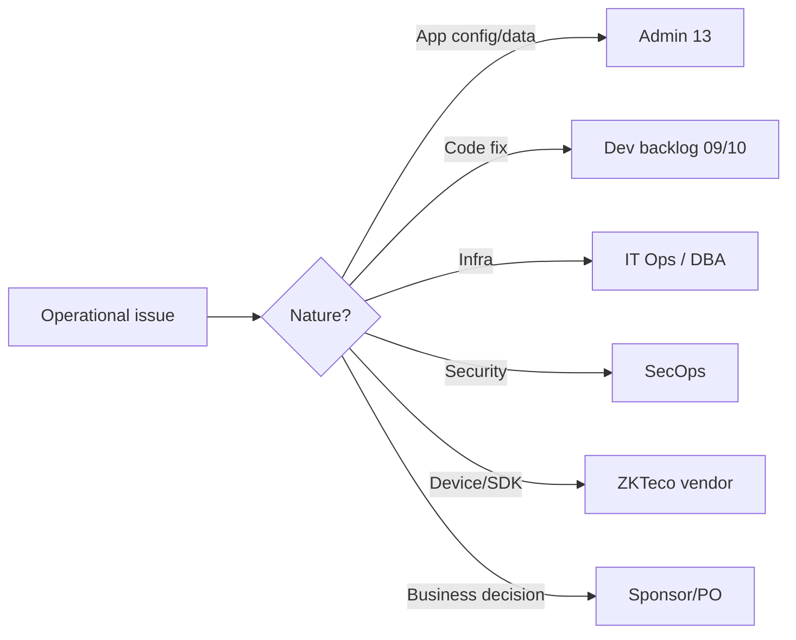

# 14 — Maintenance & Operations Guide

## Enterprise Time & Attendance Management System

| Field | Value |
|---|---|
| **Document Title** | Maintenance & Operations Guide (Run Book) |
| **Project** | Enterprise Time & Attendance Management System (TAMS) |
| **Document ID** | TAMS-OPS-014 |
| **Version** | 1.0 (Draft for Approval) |
| **Status** | Awaiting Approval |
| **Author** | Principal Software Architect (AI) |
| **Owner** | IT Operations / SRE |
| **Date** | 2026-07-09 |
| **Classification** | Internal — Confidential |
| **Audience** | **IT Operations / SRE / DBA / Security Operations** (technical) |
| **Standards** | **ITIL** (service operation), **SRE** (SLI/SLO, on-call), **ISO/IEC 20000** concepts, OWASP secure operations, 12-Factor operability |
| **Predecessor Docs** | `01`–`13` (all approved) |
| **Successor Docs** | — (final document in the sequence) |

> **Scope of this document.** This is the **operations run book** for running TAMS in production day-2: monitoring & SLOs, routine maintenance, patching, backups & restore, disaster recovery, incident response, ZKTeco device operations, log/audit management, performance & capacity, database maintenance, security operations, and escalation. It is the operator's companion to the deployment guide (`11`).
>
> **Boundary with other docs.** This owns **run/operate/recover**. It does **not** cover application administration inside TAMS (users, roles, devices-in-app, rules → `13_ADMIN_GUIDE.md`), how the system is built/released (→ `11_DEPLOYMENT.md`), or security *design* (→ `06`; here we *operate* those controls). Where an issue is application-level, it hands off to `13`; where it needs a code change, it feeds the backlog (`09`).
>
> **Values pending stakeholder input.** SLO targets, RPO/RTO, and retention periods depend on **OQ-05/OQ-06/OQ-08**. Where unresolved, this guide fixes the *procedure and metric*, marking the numeric target *(TBD — confirm before go-live)*.

---

## Document Control

### Revision History

| Version | Date | Author | Description |
|---|---|---|---|
| 1.0 | 2026-07-09 | AI Architect | First complete operations guide; completes the `01`–`14` documentation set |

### Approval Sign-off

| Role | Name | Signature | Date |
|---|---|---|---|
| IT Operations Lead | _TBD_ | | |
| DBA | _TBD_ | | |
| Security Operations | _TBD_ | | |
| Solution Architect | _TBD_ | | |

---

## Table of Contents

1. [Operations Overview & Principles](#1-operations-overview--principles)
2. [Service Level Objectives (SLIs/SLOs)](#2-service-level-objectives-slisslos)
3. [Monitoring & Alerting](#3-monitoring--alerting)
4. [Routine Maintenance Schedule](#4-routine-maintenance-schedule)
5. [Patching & Dependency Management](#5-patching--dependency-management)
6. [Backup & Restore Operations](#6-backup--restore-operations)
7. [Disaster Recovery (DR)](#7-disaster-recovery-dr)
8. [Incident Response & On-Call](#8-incident-response--on-call)
9. [ZKTeco Device Operations](#9-zkteco-device-operations)
10. [Log & Audit Management](#10-log--audit-management)
11. [Database Maintenance](#11-database-maintenance)
12. [Performance & Capacity Management](#12-performance--capacity-management)
13. [Security Operations](#13-security-operations)
14. [Common Operational Runbooks](#14-common-operational-runbooks)
15. [Escalation & Handoff](#15-escalation--handoff)
16. [Traceability (Requirements → Operations)](#16-traceability-requirements--operations)
17. [Glossary](#17-glossary)
18. [Documentation Review Checklist](#18-documentation-review-checklist)

---

# 1. Operations Overview & Principles

TAMS runs as: a **stateless API** (≥2 instances), a **ZKTeco Worker** (device I/O), a **SQL Server** database, behind a **reverse proxy**, with a **secret store** and **log/metrics** sinks (`11 §7`). Operations keeps this **available, secure, performant, and recoverable**.

| ID | Operating principle | Consequence |
|---|---|---|
| OP-01 | **Observe before you act** | Diagnose from metrics/logs/correlation ids, not guesswork |
| OP-02 | **Automate routine ops** | Backups, health checks, alerts run without manual steps |
| OP-03 | **Protect the data first** | Attendance facts & audit are the crown jewels |
| OP-04 | **Recover, don't improvise** | Follow runbooks; every recovery path is pre-defined |
| OP-05 | **Least privilege in ops too** | Operator access scoped & audited |
| OP-06 | **Change is controlled** | Prod changes are approved, logged, reversible (`11`) |
| OP-07 | **Restore is tested** | A backup is unverified until restored |
| OP-08 | **Capture must never silently fail** | Device/sync health is a first-class signal |

**Decision — operations is diagnosis-first and runbook-driven, not heroics.** The two failure modes of ops are *guessing* (acting without evidence) and *improvising* (inventing a recovery under pressure). This guide counters both: every issue starts from observability (OP-01, enabled by the correlation ids and metrics designed in `05`/`06`/`11`), and every recovery is a **pre-written runbook** (§14, OP-04). Under incident stress, following a tested procedure beats clever improvisation every time.

---

# 2. Service Level Objectives (SLIs/SLOs)

**SLIs** (what we measure) and **SLOs** (targets). Exact numbers depend on OQ-06/OQ-08; the *metrics* are fixed now.

| SLI | SLO target | Source |
|---|---|---|
| API availability | *(TBD, e.g. 99.5%)* | health checks/uptime |
| API P95 latency | ≤ 500 ms *(confirm OQ-06)* | metrics (`05 NAPI-02`) |
| **Attendance capture completeness** | **100% (zero permanent loss)** | reconciliation (KPI-04) |
| Device sync success rate | ≥ target; alert on failures | worker metrics |
| Dashboard freshness | ≤ 60 s | metrics (NFR-03) |
| Error rate (5xx) | ≤ target | metrics |
| Backup success | 100% + restore-tested | backup job (OP-07) |
| Time to detect device outage | ≤ threshold | alerting (FR-ZK-011) |

**Decision — "zero permanent loss" is a hard SLO, not a percentage.** Every other SLI is a tunable target set once sizing is known (OQ-06). **Capture completeness is different: the target is absolute (100%)** because a lost punch is a wrong paycheck — a business-unacceptable outcome (KPI-04). Operations therefore treats *any* reconciliation gap as an incident, not a statistic. This elevates the architecture's central guarantee (ADR-011) into an operational commitment.

---

# 3. Monitoring & Alerting

## 3.1 What to monitor

| Layer | Signals |
|---|---|
| API | Availability, latency (P50/P95), error rate, throughput, `/health` |
| Worker | Sync cycle success/failure, duration, queue/backlog, per-device last-seen |
| Devices | Online/offline, consecutive failures, unresolved punches |
| Database | Connections, query latency, deadlocks, storage, backup status |
| Host/infra | CPU, memory, disk, network |
| Security | Auth-failure spikes, authz denials, secret-scan/scan alerts |
| Business | Open exceptions trend, reconciliation gaps |

## 3.2 Alerting policy

| Alert | Severity | Response |
|---|---|---|
| **Reconciliation gap / potential punch loss** | Critical | Immediate — §14.4 |
| API down / health failing | Critical | Immediate — §14.1 |
| Device unreachable > threshold | High | Investigate — §9/§14.3 |
| Migration/deploy failure | High | Rollback — §14.6 |
| Auth-failure spike (possible attack) | High | §13/§14.5 |
| Disk/storage nearing limit | High | §11/§12 |
| Latency/error SLO breach | Medium | Investigate |
| Backup failure | High | §6 |

**Decision — the loudest alert is potential punch loss, above even "API down."** A brief API outage is recoverable and visible; **silent capture loss is invisible and irreversible** if undetected. So reconciliation-gap alerts are the highest-priority signal, wired from the reconciliation process (`03 §10.2`) and `DeviceSyncState` (`04`). This inverts the naive "uptime is everything" stance: for an attendance system, *data completeness* outranks momentary availability.

---

# 4. Routine Maintenance Schedule

| Frequency | Task |
|---|---|
| **Continuous/automated** | Health checks, monitoring, alerting, backups |
| **Daily** | Review alerts & error trends; confirm backup success; check device health & unresolved punches; verify reconciliation clean |
| **Weekly** | Review SLO adherence; dependency-vulnerability report; log-storage check; capacity trend |
| **Monthly** | Restore drill (test a backup); access review (with admin, `13 §15`); patch review; DR readiness check |
| **Quarterly** | DR failover test; security review cadence (`06 §15`); key/cert rotation check; capacity forecast |
| **As needed** | Patching, scaling, incident response, releases (`11`) |

**Decision — schedule the "boring" tasks explicitly, especially the monthly restore drill.** Operations fails quietly when routine tasks are assumed rather than scheduled. Fixing a cadence — and treating the **monthly restore drill** as non-negotiable (OP-07) — ensures the recovery capability is real, not theoretical. Most catastrophic outages are worsened by a backup that was never test-restored; a scheduled drill removes that risk.

---

# 5. Patching & Dependency Management

| Aspect | Approach |
|---|---|
| OS/runtime patches | Applied on cadence + emergency for critical CVEs |
| .NET / framework | Track supported versions; upgrade proactively before EOL |
| NuGet / npm dependencies | Continuous vulnerability scanning (`06 §15`); patch high/critical promptly |
| Database engine | DBA-managed patching; test in Staging first |
| ZKTeco firmware | Coordinate with vendor guidance; test on a lab device first |
| Process | Patch **Staging → validate → Prod** (`11 §2`); change-controlled |
| Emergency (critical CVE) | Expedited but still Staging-validated where feasible |

**Decision — patch through Staging first, even under CVE pressure.** The temptation during a critical vulnerability is to patch Production directly. But an untested patch can break capture — trading a *potential* exploit for a *certain* outage. Wherever feasible, patches go **Staging → validate → Prod** (matching `11`'s promotion model), with only genuinely unavoidable emergencies expedited. Dependency scanning (`06 §15`) surfaces what to patch; the promotion discipline keeps patching safe.

---

# 6. Backup & Restore Operations

## 6.1 Backup

| Item | Policy |
|---|---|
| Full backup | Regular (e.g. daily) |
| Differential | Between fulls |
| Transaction log | Frequent (supports point-in-time recovery) |
| Encryption | All backups encrypted (`06 §8`) |
| Offsite/second copy | Kept per policy (survive site loss) |
| Retention | Per data-retention policy (OQ-05) |
| Scope | Includes immutable punches & audit (integrity evidence) |
| Secrets/config | Secret store backed up per its own policy |

## 6.2 Restore (runbook)

```mermaid
flowchart LR
    A[Identify restore point<br/>(full+diff+logs)] --> B[Provision/target instance]
    B --> C[Restore full → diff → logs]
    C --> D[Verify integrity + row counts]
    D --> E[Point app at restored DB]
    E --> F[Smoke test + reconcile]
```

**Decision — back up the immutable data too, and prove restores monthly.** Punches and audit are the system's evidentiary record (G-05); a backup that omitted them would be worthless for compliance. Backups are **encrypted** (a stolen backup must not be a breach, `06 §8`) and **restore-tested monthly** (§4) because an unverified backup is a false sense of security (OP-07). Point-in-time recovery (via log backups) lets ops rewind to just before an incident.

---

# 7. Disaster Recovery (DR)

| Element | Definition |
|---|---|
| **RPO** (max data loss) | *(TBD — OQ-05/business)* |
| **RTO** (max downtime) | *(TBD — business)* |
| DR trigger | Site/host loss, unrecoverable corruption |
| DR strategy | Restore from encrypted backups to alternate host; redeploy the promoted artifact (`11 §3`) |
| DR runbook | §14.7 |
| DR testing | Quarterly failover test (§4) |
| Communication | Stakeholder comms plan during DR |

**Decision — DR reuses the normal deploy artifact and normal restore procedure.** DR is not a separate, exotic system — it is **restore-a-backup + redeploy-the-same-image** (`11 §3/§10`) on alternate infrastructure. Because the build is portable (containers, 12-Factor) and the restore is already a tested runbook (§6), DR is an *extension* of routine capability, not a bespoke plan that rots. RPO/RTO are business decisions (OQ-05); the *mechanism* is defined and testable now, and quarterly failover tests keep it real.

---

# 8. Incident Response & On-Call

## 8.1 Severity & response

| Severity | Examples | Response |
|---|---|---|
| **SEV-1 Critical** | Potential punch loss; system down; security breach; payroll-blocking | Immediate; on-call paged; incident bridge |
| **SEV-2 High** | Major function degraded; device fleet down; SLO breach | Prompt, within defined window |
| **SEV-3 Medium** | Partial/isolated issue with workaround | Business hours |
| **SEV-4 Low** | Minor/cosmetic | Backlog |

## 8.2 Incident lifecycle

```mermaid
flowchart LR
    D[Detect (alert/report)] --> T[Triage & severity]
    T --> C[Contain] --> M[Mitigate/Restore]
    M --> V[Verify service + data integrity]
    V --> Cl[Close] --> P[Post-incident review]
```

## 8.3 Response tools (built in by design)

| Need | Capability | Source |
|---|---|---|
| Trace what happened | Correlation ids across logs/audit | `05`,`06 §11` |
| Revoke access fast | Deactivate user / revoke tokens | `06 §6`,`13 §3` |
| Contain a device | Disable device; segmented network | `06 §12`,`13 §7` |
| Rotate a leaked secret | Secret store rotation | `06 §9` |
| Recover lost data | Restore + reconciliation | §6, §9 |

**Decision — incidents are handled with capabilities designed in from day one.** Because earlier documents built revocation, immutable audit, device disablement, correlation ids, and secret rotation *into the system* (`06 §16`), incident response is **using existing levers**, not building tools mid-crisis. The post-incident review (blameless) feeds fixes back to the backlog (`09`) — so each incident makes the system more resilient. Every SEV-1 gets a review; recurring issues get a regression test (`10 §14`).

---

# 9. ZKTeco Device Operations

The operational heart of reliability. Ops ensures devices stay connected and every punch is accounted for.

## 9.1 Routine

- Monitor **per-device online/offline & last-seen** (§3, `04 DeviceSyncState`).
- Watch **consecutive-failure counts** and **unresolved-punch** counts.
- Confirm **reconciliation** runs clean (device log vs stored).

## 9.2 Handling a device outage (runbook → §14.3)

```mermaid
flowchart TD
    A[Alert: device unreachable > threshold] --> B[Check power + network + reachability]
    B --> C{Reachable now?}
    C -- Yes --> D[Worker resumes; buffered/missed punches recovered]
    D --> E[Reconcile: confirm no gap]
    C -- No --> F[Network/firewall/hardware fix]
    F -->|app-side config| G[Admin (13)]
    F -->|network/hardware| H[Network/facilities]
    E --> I[Close]
```

## 9.3 Key operational facts

| Fact | Implication |
|---|---|
| Watermark-gated, idempotent ingestion | Restarting the worker never loses/dupes punches (`03` ADR-011) |
| Offline recovery | Missed punches ingest exactly once on reconnect |
| Reconciliation | Ops can *prove* completeness, not just assume it |
| Only registered devices trusted | Rogue devices ignored (`06 §12`) |

**Decision — during a device outage, ops restores connectivity and then *verifies via reconciliation* — it does not manually re-import punches.** The system recovers missed punches automatically on reconnect (ADR-011); an operator manually importing data risks duplicates or errors and fights the idempotency design. The correct operational action is: **fix the connection, let recovery run, then confirm reconciliation shows no gap.** If reconciliation *does* show a gap, that is a SEV-1 (§8) — the one case that escalates. This keeps humans doing what they're good at (fixing hardware/network) and lets the system do what it's good at (exactly-once capture).

---

# 10. Log & Audit Management

| Item | Operations |
|---|---|
| **Operational logs** (Serilog) | Central sink; rotate/retain per policy; **never contain secrets/PII** (`06 §11`) |
| Log-based diagnosis | Search by correlation id (`05 §6`) |
| Log storage | Monitor capacity; archive/purge per retention |
| **Business audit** (`AuditEntry`) | **Append-only; never purged by ops within the compliance window** (`04`,`06`) |
| Audit vs logs | Distinct lifecycles — do not conflate |
| Retention | Per policy (OQ-05) |

**Decision — operational logs may rotate; audit records may not (within the compliance window).** These two streams have **opposite** operational treatment. Diagnostic logs are high-volume and rotate/purge on a storage-driven schedule. The business audit trail is **compliance evidence** — ops must **never** purge it inside its mandated retention (`06 §11`), and it's protected by DB grants so ops *can't* alter it anyway. Conflating the two — e.g. applying a log-rotation policy to audit — would destroy evidence. Keeping their lifecycles separate is an operational safety rule.

---

# 11. Database Maintenance

| Task | Cadence | Note |
|---|---|---|
| Index maintenance | Regular | Rebuild/reorganise per fragmentation (esp. hot punch/audit tables) |
| Statistics update | Regular | Keeps query plans good |
| Integrity checks | Regular | `DBCC`-style consistency checks |
| Storage/growth | Monitor | Punches & audit grow fastest (`04 §15`) |
| Archival/partition | When sizing warrants (OQ-06) | Partition-ready by design (`04`) |
| Connection/deadlock watch | Continuous | Alert on anomalies |
| TDE/keys | Verify enabled; rotate per policy | (`06 §8`) |

**Decision — proactively maintain the hot tables (punches, audit) and archive only when data justifies it.** `PunchTransaction` and `AuditEntry` are the highest-volume, most index-sensitive tables (`04 §8`), so their index/statistics maintenance is prioritised to protect query performance (dashboards, reports). Archival/partitioning is **deferred until real volume warrants it** (OQ-06, YAGNI) — the schema is already partition-ready (`04 §15`), so ops enables it as a data-driven decision, not a premature complexity.

---

# 12. Performance & Capacity Management

| Activity | Approach |
|---|---|
| Baseline | Establish normal latency/throughput from metrics |
| Trend | Watch growth in employees/devices/data → forecast |
| Scale API | Add stateless instances behind proxy (`11 §12`) |
| Scale Worker | Partition devices across workers (never duplicate) (`11 §12`) |
| DB scale | Vertical first; HA/read paths if evidence shows need |
| Regression watch | Compare against SLOs; investigate drift |
| Load re-test | Before major growth/onboarding waves |

**Decision — scale on evidence, and never duplicate the Worker per device set.** Capacity is managed by **observed trend**, not speculation (YAGNI) — add API instances when metrics show sustained load, forecast from real growth. The one hard rule: scaling the Worker means **partitioning devices** across instances, because two workers polling the same device would double-count (`11 §12`). Ops scales the stateless tier freely and the capture tier carefully.

---

# 13. Security Operations

| Activity | Approach | Trace |
|---|---|---|
| Monitor security signals | Auth-failure spikes, authz denials, anomalies | `06 §11` |
| Vulnerability management | Continuous scans; patch high/critical (§5) | `06 §15` |
| Secret/key rotation | Per policy + on suspicion of compromise | `06 §9` |
| Certificate management | Renew before expiry (automate) | `06 §13` |
| Access review | Periodic operator + app-role review (with admin) | `06 §5`,`13 §15` |
| Incident (security) | Contain→revoke→rotate→restore→review (§8) | `06 §16` |
| Audit oversight | Ensure audit integrity & retention preserved | §10 |
| Pen-test/DAST cadence | Periodic (post major change) | `06 §15` |

**Decision — security is a continuous operational activity, not a launch checkbox.** The `06` design is only as good as its ongoing operation: unrotated certs expire, unpatched dependencies become exploitable, unreviewed access creeps. SecOps runs these as **recurring operations** (scan, rotate, review, monitor) so the security posture is maintained over the system's life. A security incident reuses the same contain→revoke→rotate→restore levers built in by design (§8).

---

# 14. Common Operational Runbooks

> Each runbook: **Symptom → Diagnose → Act → Verify.** Start every diagnosis from observability (OP-01) and a correlation id where available.

## 14.1 API down / unhealthy
1. **Diagnose:** check `/health`, instance status, recent deploy, logs, DB reachability.
2. **Act:** restart/replace unhealthy instance; if recent deploy → rollback (§14.6); if DB → §14.2.
3. **Verify:** health green; smoke test (login, dashboard).

## 14.2 Database unreachable/degraded
1. **Diagnose:** connectivity, DB status, storage, deadlocks, backup status.
2. **Act:** resolve storage/connection; failover if HA; engage DBA.
3. **Verify:** app healthy; reconcile capture (§14.4).

## 14.3 Device offline (see §9)
1. **Diagnose:** last-seen, failure count, test connection; power/network.
2. **Act:** restore connectivity (network/hardware → escalate; app config → `13`). Let recovery run.
3. **Verify:** reconciliation shows no gap.

## 14.4 Reconciliation gap / potential punch loss (SEV-1)
1. **Diagnose:** which device/period; check worker logs, watermark, device log.
2. **Act:** trigger re-sync/recovery; if data recoverable from device, let idempotent ingestion recover it; if not, point-in-time considerations (§6).
3. **Verify:** reconciliation clean; **confirm no duplicates and no missing**; post-incident review.

## 14.5 Suspected attack (auth spike) (SEV-1/2)
1. **Diagnose:** logs for source/pattern; affected accounts.
2. **Act:** rely on lockout/throttle; deactivate/revoke affected accounts (`13 §3`); rotate secrets if compromise suspected (§13).
3. **Verify:** activity normalised; review; strengthen controls.

## 14.6 Bad release rollback
1. **Diagnose:** confirm failure tied to release (smoke/health/errors).
2. **Act:** redeploy previous artifact (`11 §8`); DB forward-fix/restore if migration involved (§6).
3. **Verify:** health + smoke; monitor.

## 14.7 Disaster recovery
1. **Diagnose:** confirm DR trigger (site/host loss).
2. **Act:** provision alternate host; restore encrypted backups (§6); redeploy artifact (`11 §3`); apply config/secrets.
3. **Verify:** health, smoke, **punch-flow test**, reconciliation; communicate status.

**Decision — every high-severity scenario has a Symptom→Diagnose→Act→Verify runbook ending in a data-integrity check.** Under pressure, a checklist prevents skipped steps and improvisation (OP-04). Crucially, the recovery-related runbooks **don't end at "service is up" — they end at "reconciliation is clean"** (or a punch-flow test), because for TAMS restoring the *service* without confirming the *data* is incomplete. This closes the loop between the reliability guarantee and its operational proof.

---

# 15. Escalation & Handoff

| Situation | Route to |
|---|---|
| App config/data (users, roles, devices-in-app, rules) | **Administrator** (`13`) |
| Code defect / behaviour change needed | **Dev backlog** (`09`), via defect process (`10 §14`) |
| Infrastructure (host/network/DB engine) | **IT Ops / DBA / Network** (this guide) |
| Security incident | **Security Operations** (§8, §13) |
| Vendor device/SDK issue | **ZKTeco vendor** (with lab reproduction) |
| Business decision (RPO/RTO, retention, policy) | **Sponsor/PO** (resolve OQ-05/06/08) |



**Decision — a clear routing map so issues reach the right owner the first time.** Cross-boundary confusion (ops fixing what's really an admin task, or an admin escalating a firewall issue to a developer) wastes time and worsens incidents. The routing map makes ownership unambiguous and completes the boundary set across `13` (admin), `09`/`10` (dev), this guide (ops/infra/security), and the sponsor (business decisions/OQs) — so nothing falls between the cracks.

---

# 16. Traceability (Requirements → Operations)

| Requirement / Decision | Operations realisation |
|---|---|
| KPI-04 zero loss (ADR-011) | §2 hard SLO, §3 top alert, §9/§14.4 reconciliation |
| NFR-08/09/11 reliability | §7 DR, §8 incident, §9 device ops |
| NFR-25/26 observability | §3 monitoring, §10 logs |
| FR-ZK-011 device alerts | §3, §9 |
| FR-AUD-001/002 audit integrity | §10 (never purged), §13 |
| `06 §16` incident hooks | §8 response tools |
| `06 §8/§9` crypto/secrets | §6 encrypted backups, §13 rotation |
| DR-01/02 retention (OQ-05) | §6, §7, §10 |
| NFR-01/05 perf/scale | §2 SLO, §12 capacity |
| `04 §8/§15` DB hot tables | §11 maintenance |
| `11` deploy/rollback | §5, §14.6, §14.7 |
| Boundaries (`13`/`09`) | §15 escalation |

---

# 17. Glossary

Inherits prior docs. Operations-specific additions:

| Term | Definition |
|---|---|
| **SLI / SLO** | Service Level Indicator (measured) / Objective (target). |
| **RPO / RTO** | Recovery Point / Time Objective. |
| **DR** | Disaster Recovery. |
| **Runbook** | Step-by-step procedure for a specific operational scenario. |
| **On-call** | Rota responsible for responding to alerts. |
| **SEV-1…4** | Incident severity levels. |
| **Reconciliation** | Comparing device logs vs stored punches to prove completeness. |
| **Watermark** | Per-device last-ingested pointer (crash-safe resume). |
| **Point-in-time recovery** | Restoring the DB to a specific moment via log backups. |
| **Blameless post-incident review** | Learning-focused incident retrospective. |
| **TDE** | Transparent Data Encryption. |

---

# 18. Documentation Review Checklist

**Reviewer instructions:** mark ✅ Pass / ⚠️ Needs change / ❌ Fail. Approved when all **Mandatory** items pass.

### 18.1 Completeness

| # | Check | Mandatory | Status |
|---|---|---|---|
| C-01 | Operations overview & principles stated | ✔ | ☐ |
| C-02 | SLIs/SLOs defined | ✔ | ☐ |
| C-03 | Monitoring & alerting defined | ✔ | ☐ |
| C-04 | Routine maintenance schedule provided | ✔ | ☐ |
| C-05 | Patching/dependency management defined | ✔ | ☐ |
| C-06 | Backup & restore defined | ✔ | ☐ |
| C-07 | Disaster recovery defined | ✔ | ☐ |
| C-08 | Incident response & on-call defined | ✔ | ☐ |
| C-09 | ZKTeco device operations defined | ✔ | ☐ |
| C-10 | Log & audit management defined | ✔ | ☐ |
| C-11 | Database maintenance defined | ✔ | ☐ |
| C-12 | Performance & capacity defined | ✔ | ☐ |
| C-13 | Security operations defined | ✔ | ☐ |
| C-14 | Operational runbooks provided | ✔ | ☐ |
| C-15 | Escalation/handoff defined | ✔ | ☐ |

### 18.2 Quality & Soundness

| # | Check | Mandatory | Status |
|---|---|---|---|
| Q-01 | Diagnosis-first, runbook-driven ops | ✔ | ☐ |
| Q-02 | Zero-loss is a hard SLO & top alert | ✔ | ☐ |
| Q-03 | Restores are test-drilled (not assumed) | ✔ | ☐ |
| Q-04 | Device recovery via reconciliation, not manual re-import | ✔ | ☐ |
| Q-05 | Audit never purged in compliance window (distinct from logs) | ✔ | ☐ |
| Q-06 | Patching goes through Staging | ✔ | ☐ |
| Q-07 | Recovery runbooks end in data-integrity check | ✔ | ☐ |
| Q-08 | Scale avoids duplicate device polling | ✔ | ☐ |
| Q-09 | Every significant decision explained | ✔ | ☐ |

### 18.3 Alignment & Traceability

| # | Check | Mandatory | Status |
|---|---|---|---|
| A-01 | Operates security controls from `06` | ✔ | ☐ |
| A-02 | Uses deploy/rollback from `11` | ✔ | ☐ |
| A-03 | Reflects device resilience design (`03`/`04`) | ✔ | ☐ |
| A-04 | Clear handoff to `13` (admin) & `09`/`10` (dev) | ✔ | ☐ |
| A-05 | OQ-05/06/08 flagged, not fabricated | ✔ | ☐ |
| A-06 | Traceability table complete | ✔ | ☐ |

### 18.4 Governance

| # | Check | Mandatory | Status |
|---|---|---|---|
| G-01 | Document control & versioning present | ✔ | ☐ |
| G-02 | Approval sign-off present | ✔ | ☐ |
| G-03 | Completes the `01`–`14` documentation set | ✔ | ☐ |

---

### ✅ Approval Gate — Final Document

> **This Maintenance & Operations Guide (v1.0) is submitted for your approval.** It is the **final document (`14`)** in the planned sequence.

**Please respond with one of:**
1. **Approved** → the full `01`–`14` documentation set is complete and approved.
2. **Approved with changes** → list changes; I revise.
3. **Changes required** → list changes; I revise and resubmit this document only.

*End of Document — TAMS-OPS-014 v1.0*
